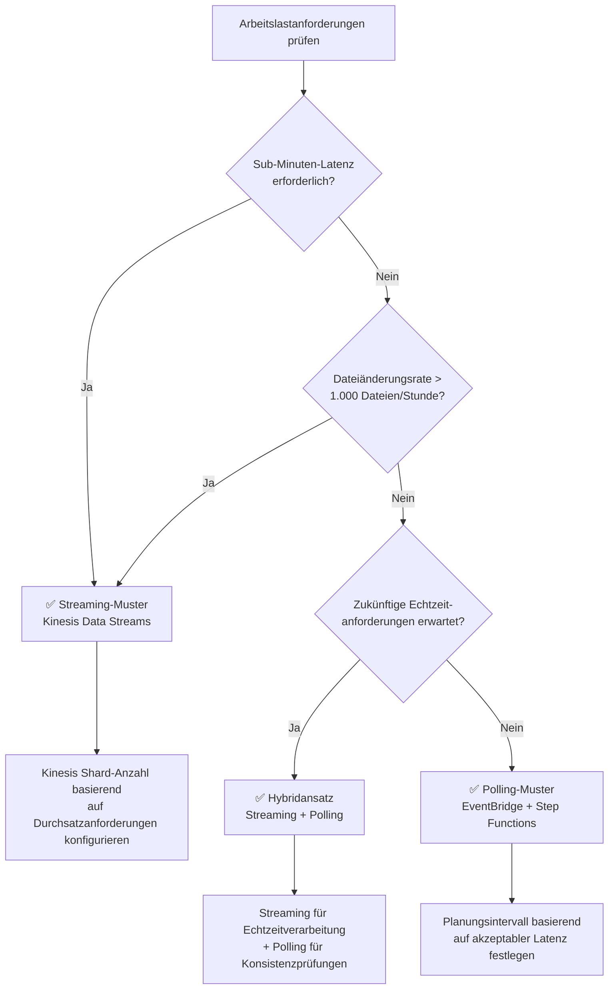

# Streaming vs Polling Auswahlhilfe

Dieser Leitfaden vergleicht zwei Architekturmuster für die serverlose Automatisierung mit FSx for ONTAP S3 Access Points — **EventBridge Polling** und **Kinesis Streaming** — und bietet Entscheidungskriterien zur Auswahl des optimalen Musters für Ihre Arbeitslast.

## Überblick

### EventBridge Polling-Muster (Phase 1/2 Standard)

EventBridge Scheduler löst periodisch einen Step Functions Workflow aus, wobei ein Discovery Lambda S3 AP ListObjectsV2 verwendet, um die aktuelle Objektliste abzurufen und Verarbeitungsziele zu bestimmen.

```
EventBridge Scheduler (rate/cron) → Step Functions → Discovery Lambda → Processing
```

### Kinesis Streaming-Muster (Phase 3 Ergänzung)

Hochfrequentes Polling (1-Minuten-Intervall) erkennt Änderungen und verarbeitet sie nahezu in Echtzeit über Kinesis Data Streams.

```
EventBridge (rate(1 min)) → Stream Producer → Kinesis Data Stream → Stream Consumer → Processing
```

## Vergleichstabelle

| Dimension | Polling (EventBridge + Step Functions) | Streaming (Kinesis + DynamoDB + Lambda) |
|-----------|---------------------------------------|----------------------------------------|
| **Latenz** | Minimum 1 Minute (EventBridge Scheduler Mindestintervall) | Sekundenbereich (Kinesis Event Source Mapping) |
| **Kosten** | EventBridge + Step Functions Ausführungsgebühren | Kinesis Shard-Stunden + DynamoDB + Lambda Ausführungsgebühren |
| **Betriebskomplexität** | Niedrig (Kombination verwalteter Dienste) | Mittel (Shard-Verwaltung, DLQ-Überwachung, Zustandstabellenverwaltung) |
| **Fehlerbehandlung** | Step Functions Retry/Catch (deklarativ) | bisect-on-error + Dead-Letter-Tabelle |
| **Skalierbarkeit** | Map State Parallelität (max. 40 parallel) | Proportional zur Shard-Anzahl (1 Shard = 1 MB/s Schreiben, 2 MB/s Lesen) |

## Kostenschätzungen

Kostenvergleich für drei repräsentative Arbeitslastgrößen (Basis ap-northeast-1, monatliche Schätzungen).

| Arbeitslastgröße | Polling | Streaming | Empfehlung |
|-----------------|---------|-----------|------------|
| **100 Dateien/Stunde** | ~5 $/Monat | ~15 $/Monat | ✅ Polling |
| **1.000 Dateien/Stunde** | ~15 $/Monat | ~25 $/Monat | Beide geeignet |
| **10.000 Dateien/Stunde** | ~50 $/Monat | ~40 $/Monat | ✅ Streaming |

## Entscheidungsflussdiagramm



### Zusammenfassung der Entscheidungskriterien

| Bedingung | Empfohlenes Muster |
|-----------|-------------------|
| Sub-Minuten (Sekundenbereich) Latenz erforderlich | Streaming |
| Dateiänderungsrate > 1.000/Stunde | Streaming |
| Kostenminimierung hat höchste Priorität | Polling |
| Betriebliche Einfachheit hat höchste Priorität | Polling |
| Echtzeit und Konsistenz gleichzeitig erforderlich | Hybrid |

## Hybridansatz (Empfohlen)

Für Produktionsumgebungen empfehlen wir den **Hybridansatz: Streaming für Echtzeitverarbeitung + Polling für Konsistenzabgleich**.

### Design

```mermaid
graph TB
    subgraph "Echtzeitpfad (Streaming)"
        SP[Stream Producer<br/>rate(1 min)]
        KDS[Kinesis Data Stream]
        SC[Stream Consumer]
    end

    subgraph "Konsistenzpfad (Polling)"
        EBS[EventBridge Scheduler<br/>rate(1 hour)]
        SFN[Step Functions]
        DL[Discovery Lambda]
    end

    subgraph "Gemeinsame Verarbeitung"
        PROC[Verarbeitungspipeline]
        OUT[S3 Output]
    end

    SP --> KDS --> SC --> PROC
    EBS --> SFN --> DL --> PROC
    PROC --> OUT
```

### Vorteile

1. **Echtzeit**: Neue Dateien beginnen die Verarbeitung innerhalb von Sekunden
2. **Konsistenzgarantie**: Stündliches Polling erkennt und stellt fehlende Elemente wieder her
3. **Fehlertoleranz**: Polling deckt automatisch Streaming-Ausfälle ab
4. **Schrittweise Migration**: Inkrementelle Migration von nur Polling → Hybrid → nur Streaming

### Implementierungshinweise

- **Idempotente Verarbeitung**: DynamoDB Conditional Writes verhindern doppelte Verarbeitung
- **Gemeinsame Zustandstabelle**: Stream Producer und Discovery Lambda referenzieren dieselbe DynamoDB-Zustandstabelle
- **Verarbeitungsstatusverwaltung**: Feld `processing_status` verfolgt den verarbeiteten/unverarbeiteten Zustand

## Regionale Kostenunterschiede

Die Kinesis Data Streams Shard-Preise variieren je nach Region.

| Region | Shard-Stunden-Preis | Monatlich (1 Shard) |
|--------|--------------------|--------------------|
| us-east-1 | 0,015 $/Stunde | ~10,80 $ |
| ap-northeast-1 | 0,0195 $/Stunde | ~14,04 $ |
| eu-west-1 | 0,015 $/Stunde | ~10,80 $ |

> **Hinweis**: Preise können sich ändern. Aktuelle Tarife finden Sie auf der [Amazon Kinesis Data Streams Preisseite](https://aws.amazon.com/kinesis/data-streams/pricing/).

## Referenzlinks

- [Amazon Kinesis Data Streams Preise](https://aws.amazon.com/kinesis/data-streams/pricing/)
- [Amazon Kinesis Data Streams Entwicklerhandbuch](https://docs.aws.amazon.com/streams/latest/dev/introduction.html)
- [AWS Step Functions Preise](https://aws.amazon.com/step-functions/pricing/)
- [Amazon EventBridge Scheduler](https://docs.aws.amazon.com/scheduler/latest/UserGuide/what-is-scheduler.html)
- [AWS Lambda Ereignisquellenzuordnung (Kinesis)](https://docs.aws.amazon.com/lambda/latest/dg/with-kinesis.html)
- [DynamoDB On-Demand-Kapazitätspreise](https://aws.amazon.com/dynamodb/pricing/on-demand/)
