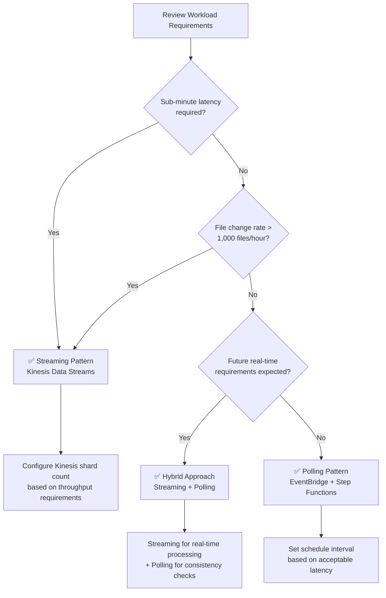

# Streaming vs Polling Selection Guide

This guide compares two architecture patterns for serverless automation with FSx for ONTAP S3 Access Points — **EventBridge Polling** and **Kinesis Streaming** — and provides decision criteria for selecting the optimal pattern for your workload.

## Overview

### EventBridge Polling Pattern (Phase 1/2 Standard)

EventBridge Scheduler periodically triggers a Step Functions workflow, where a Discovery Lambda uses S3 AP ListObjectsV2 to retrieve the current object listing and determine processing targets.

```
EventBridge Scheduler (rate/cron) → Step Functions → Discovery Lambda → Processing
```

### Kinesis Streaming Pattern (Phase 3 Addition)

High-frequency polling (1-minute interval) detects changes and processes them in near-real-time via Kinesis Data Streams.

```
EventBridge (rate(1 min)) → Stream Producer → Kinesis Data Stream → Stream Consumer → Processing
```

## Comparison Table

| Dimension | Polling (EventBridge + Step Functions) | Streaming (Kinesis + DynamoDB + Lambda) |
|-----------|---------------------------------------|----------------------------------------|
| **Latency** | Minimum 1 minute (EventBridge Scheduler minimum interval) | Seconds-level (Kinesis Event Source Mapping) |
| **Cost** | EventBridge + Step Functions execution charges | Kinesis shard-hours + DynamoDB + Lambda execution charges |
| **Operational Complexity** | Low (combination of managed services) | Medium (shard management, DLQ monitoring, state table management) |
| **Failure Handling** | Step Functions Retry/Catch (declarative) | bisect-on-error + dead-letter table |
| **Scalability** | Map State concurrency (max 40 parallel) | Proportional to shard count (1 shard = 1 MB/s write, 2 MB/s read) |

### Detailed Comparison

#### Latency

- **Polling**: EventBridge Scheduler minimum interval is `rate(1 minute)`. Actual processing latency = schedule interval + Discovery execution time + processing time
- **Streaming**: Kinesis Event Source Mapping batch window (default: 0 seconds) + processing time. Seconds to tens of seconds from change detection to processing completion

#### Cost

- **Polling**: EventBridge Scheduler (free tier available) + Step Functions (state transition charges) + Lambda execution charges
- **Streaming**: Kinesis shard-hours ($0.015/shard/hour, varies by region) + DynamoDB (state table + DLQ table) + Lambda execution charges

#### Operational Complexity

- **Polling**: Only Step Functions visualization, CloudWatch Logs, and EventBridge schedule management
- **Streaming**: Additional shard count optimization, Iterator Age monitoring, DLQ record reprocessing, and DynamoDB state table consistency management required

#### Failure Handling

- **Polling**: Declarative error handling with Step Functions Retry/Catch. Automatic recovery on next schedule execution upon failure
- **Streaming**: bisect-on-error identifies failed records within a batch. Unprocessable records are moved to a DynamoDB dead-letter table. Manual or batch reprocessing required

#### Scalability

- **Polling**: Parallelism controlled by Map State MaxConcurrency. Pagination in Map State handles large file counts
- **Streaming**: Write/read throughput scales linearly by increasing shard count. Enhanced Fan-Out enables parallel processing by multiple consumers

## Cost Estimates

Cost comparison for three representative workload scales (ap-northeast-1 baseline, monthly estimates).

| Workload Scale | Polling | Streaming | Recommendation |
|---------------|---------|-----------|----------------|
| **100 files/hour** | ~$5/month | ~$15/month | ✅ Polling |
| **1,000 files/hour** | ~$15/month | ~$25/month | Either works |
| **10,000 files/hour** | ~$50/month | ~$40/month | ✅ Streaming |

### Breakdown

#### 100 files/hour (Polling Recommended)

| Item | Polling | Streaming |
|------|---------|-----------|
| Scheduling | EventBridge: ~$0 | EventBridge: ~$0 |
| Orchestration | Step Functions: ~$2 | — |
| Stream | — | Kinesis (1 shard): ~$11 |
| State Management | — | DynamoDB: ~$1 |
| Lambda | ~$3 | ~$3 |
| **Total** | **~$5** | **~$15** |

#### 1,000 files/hour (Either Works)

| Item | Polling | Streaming |
|------|---------|-----------|
| Scheduling | EventBridge: ~$0 | EventBridge: ~$0 |
| Orchestration | Step Functions: ~$8 | — |
| Stream | — | Kinesis (1 shard): ~$11 |
| State Management | — | DynamoDB: ~$5 |
| Lambda | ~$7 | ~$9 |
| **Total** | **~$15** | **~$25** |

#### 10,000 files/hour (Streaming Recommended)

| Item | Polling | Streaming |
|------|---------|-----------|
| Scheduling | EventBridge: ~$0 | EventBridge: ~$0 |
| Orchestration | Step Functions: ~$30 | — |
| Stream | — | Kinesis (2 shards): ~$22 |
| State Management | — | DynamoDB: ~$8 |
| Lambda | ~$20 | ~$10 |
| **Total** | **~$50** | **~$40** |

> **Note**: These are approximate values. Actual costs vary based on request patterns, Lambda memory settings, and DynamoDB capacity mode.

## Decision Flowchart



### Decision Criteria Summary

| Condition | Recommended Pattern |
|-----------|-------------------|
| Sub-minute (seconds-level) latency required | Streaming |
| File change rate > 1,000 files/hour | Streaming |
| Cost minimization is top priority | Polling |
| Operational simplicity is top priority | Polling |
| Both real-time and consistency required | Hybrid |

## Hybrid Approach (Recommended)

For production environments, we recommend the **hybrid approach: streaming for real-time processing + polling for consistency reconciliation**.

### Design

```mermaid
graph TB
    subgraph "Real-time Path (Streaming)"
        SP[Stream Producer<br/>rate(1 min)]
        KDS[Kinesis Data Stream]
        SC[Stream Consumer]
    end

    subgraph "Consistency Path (Polling)"
        EBS[EventBridge Scheduler<br/>rate(1 hour)]
        SFN[Step Functions]
        DL[Discovery Lambda]
    end

    subgraph "Common Processing"
        PROC[Processing Pipeline]
        OUT[S3 Output]
    end

    SP --> KDS --> SC --> PROC
    EBS --> SFN --> DL --> PROC
    PROC --> OUT
```

### Benefits

1. **Real-time**: New files begin processing within seconds
2. **Consistency guarantee**: Hourly polling detects and recovers missed items
3. **Fault tolerance**: Polling automatically covers streaming failures
4. **Gradual migration**: Migrate incrementally from polling-only → hybrid → streaming-only

### Implementation Notes

- **Idempotent processing**: DynamoDB conditional writes prevent duplicate processing
- **Shared state table**: Stream Producer and Discovery Lambda reference the same DynamoDB state table
- **Processing status management**: `processing_status` field tracks processed/unprocessed state

## Regional Cost Differences

Kinesis Data Streams shard pricing varies by region.

| Region | Shard-Hour Price | Monthly (1 shard) |
|--------|-----------------|-------------------|
| us-east-1 | $0.015/hour | ~$10.80 |
| ap-northeast-1 | $0.0195/hour | ~$14.04 |
| eu-west-1 | $0.015/hour | ~$10.80 |

> **Note**: Pricing is subject to change. See the [Amazon Kinesis Data Streams Pricing page](https://aws.amazon.com/kinesis/data-streams/pricing/) for current rates.

DynamoDB pricing also varies by region, but the difference is minimal for this pattern's usage (state table + DLQ table).

## References

- [Amazon Kinesis Data Streams Pricing](https://aws.amazon.com/kinesis/data-streams/pricing/)
- [Amazon Kinesis Data Streams Developer Guide](https://docs.aws.amazon.com/streams/latest/dev/introduction.html)
- [AWS Step Functions Pricing](https://aws.amazon.com/step-functions/pricing/)
- [Amazon EventBridge Scheduler](https://docs.aws.amazon.com/scheduler/latest/UserGuide/what-is-scheduler.html)
- [AWS Lambda Event Source Mapping (Kinesis)](https://docs.aws.amazon.com/lambda/latest/dg/with-kinesis.html)
- [DynamoDB On-Demand Capacity Pricing](https://aws.amazon.com/dynamodb/pricing/on-demand/)
