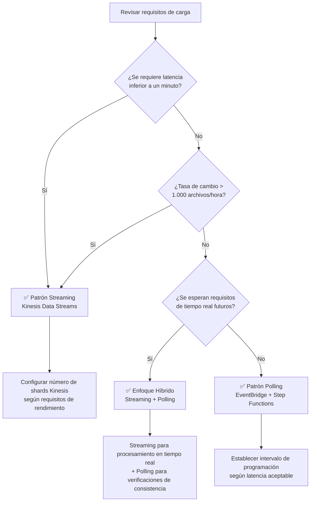

# Guía de selección: Streaming vs Polling

Esta guía compara dos patrones de arquitectura para la automatización serverless con FSx for ONTAP S3 Access Points — **Polling con EventBridge** y **Streaming con Kinesis** — y proporciona criterios de decisión para seleccionar el patrón óptimo para su carga de trabajo.

## Descripción general

### Patrón de Polling con EventBridge (Estándar Phase 1/2)

EventBridge Scheduler activa periódicamente un flujo de trabajo de Step Functions, donde un Discovery Lambda usa S3 AP ListObjectsV2 para obtener la lista actual de objetos y determinar los objetivos de procesamiento.

```
EventBridge Scheduler (rate/cron) → Step Functions → Discovery Lambda → Processing
```

### Patrón de Streaming con Kinesis (Adición Phase 3)

Polling de alta frecuencia (intervalo de 1 minuto) detecta cambios y los procesa en casi tiempo real a través de Kinesis Data Streams.

```
EventBridge (rate(1 min)) → Stream Producer → Kinesis Data Stream → Stream Consumer → Processing
```

## Tabla comparativa

| Dimensión | Polling (EventBridge + Step Functions) | Streaming (Kinesis + DynamoDB + Lambda) |
|-----------|---------------------------------------|----------------------------------------|
| **Latencia** | Mínimo 1 minuto (intervalo mínimo de EventBridge Scheduler) | Nivel de segundos (Kinesis Event Source Mapping) |
| **Costo** | Cargos de ejecución de EventBridge + Step Functions | Horas de shard de Kinesis + DynamoDB + cargos de ejecución de Lambda |
| **Complejidad operativa** | Baja (combinación de servicios administrados) | Media (gestión de shards, monitoreo de DLQ, gestión de tabla de estado) |
| **Manejo de errores** | Step Functions Retry/Catch (declarativo) | bisect-on-error + tabla dead-letter |
| **Escalabilidad** | Concurrencia de Map State (máx. 40 paralelos) | Proporcional al número de shards (1 shard = 1 MB/s escritura, 2 MB/s lectura) |

## Estimaciones de costos

Comparación de costos para tres escalas de carga de trabajo representativas (base ap-northeast-1, estimaciones mensuales).

| Escala de carga | Polling | Streaming | Recomendación |
|----------------|---------|-----------|---------------|
| **100 archivos/hora** | ~$5/mes | ~$15/mes | ✅ Polling |
| **1.000 archivos/hora** | ~$15/mes | ~$25/mes | Ambos funcionan |
| **10.000 archivos/hora** | ~$50/mes | ~$40/mes | ✅ Streaming |

## Diagrama de flujo de decisión



### Resumen de criterios de decisión

| Condición | Patrón recomendado |
|-----------|-------------------|
| Se requiere latencia inferior a un minuto (nivel de segundos) | Streaming |
| Tasa de cambio de archivos > 1.000/hora | Streaming |
| Minimización de costos es la máxima prioridad | Polling |
| Simplicidad operativa es la máxima prioridad | Polling |
| Se requiere tiempo real y consistencia simultáneamente | Híbrido |

## Enfoque Híbrido (Recomendado)

Para entornos de producción, recomendamos el **enfoque híbrido: streaming para procesamiento en tiempo real + polling para reconciliación de consistencia**.

### Diseño

```mermaid
graph TB
    subgraph "Ruta en tiempo real (Streaming)"
        SP[Stream Producer<br/>rate(1 min)]
        KDS[Kinesis Data Stream]
        SC[Stream Consumer]
    end

    subgraph "Ruta de consistencia (Polling)"
        EBS[EventBridge Scheduler<br/>rate(1 hour)]
        SFN[Step Functions]
        DL[Discovery Lambda]
    end

    subgraph "Procesamiento común"
        PROC[Pipeline de procesamiento]
        OUT[S3 Output]
    end

    SP --> KDS --> SC --> PROC
    EBS --> SFN --> DL --> PROC
    PROC --> OUT
```

### Beneficios

1. **Tiempo real**: Los nuevos archivos comienzan el procesamiento en segundos
2. **Garantía de consistencia**: El polling horario detecta y recupera elementos faltantes
3. **Tolerancia a fallos**: El polling cubre automáticamente las fallas del streaming
4. **Migración gradual**: Migración incremental de solo polling → híbrido → solo streaming

### Puntos de implementación

- **Procesamiento idempotente**: DynamoDB conditional writes previenen el procesamiento duplicado
- **Tabla de estado compartida**: Stream Producer y Discovery Lambda referencian la misma tabla DynamoDB
- **Gestión del estado de procesamiento**: El campo `processing_status` rastrea el estado procesado/no procesado

## Diferencias de costos regionales

Los precios de shards de Kinesis Data Streams varían según la región.

| Región | Precio hora-shard | Mensual (1 shard) |
|--------|------------------|-------------------|
| us-east-1 | $0,015/hora | ~$10,80 |
| ap-northeast-1 | $0,0195/hora | ~$14,04 |
| eu-west-1 | $0,015/hora | ~$10,80 |

> **Nota**: Los precios están sujetos a cambios. Consulte la [página de precios de Amazon Kinesis Data Streams](https://aws.amazon.com/kinesis/data-streams/pricing/) para las tarifas actuales.

## Enlaces de referencia

- [Precios de Amazon Kinesis Data Streams](https://aws.amazon.com/kinesis/data-streams/pricing/)
- [Guía del desarrollador de Amazon Kinesis Data Streams](https://docs.aws.amazon.com/streams/latest/dev/introduction.html)
- [Precios de AWS Step Functions](https://aws.amazon.com/step-functions/pricing/)
- [Amazon EventBridge Scheduler](https://docs.aws.amazon.com/scheduler/latest/UserGuide/what-is-scheduler.html)
- [Mapeo de origen de eventos de AWS Lambda (Kinesis)](https://docs.aws.amazon.com/lambda/latest/dg/with-kinesis.html)
- [Precios de capacidad bajo demanda de DynamoDB](https://aws.amazon.com/dynamodb/pricing/on-demand/)
