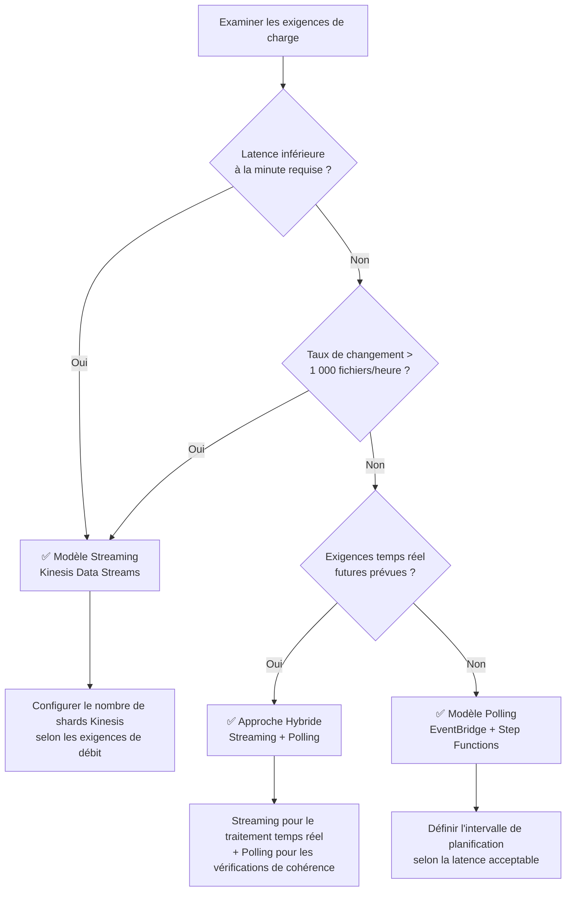

# Guide de sélection : Streaming vs Polling

Ce guide compare deux modèles d'architecture pour l'automatisation serverless avec FSx for ONTAP S3 Access Points — **Polling EventBridge** et **Streaming Kinesis** — et fournit des critères de décision pour sélectionner le modèle optimal pour votre charge de travail.

## Vue d'ensemble

### Modèle Polling EventBridge (Standard Phase 1/2)

EventBridge Scheduler déclenche périodiquement un workflow Step Functions, où un Discovery Lambda utilise S3 AP ListObjectsV2 pour récupérer la liste actuelle des objets et déterminer les cibles de traitement.

```
EventBridge Scheduler (rate/cron) → Step Functions → Discovery Lambda → Processing
```

### Modèle Streaming Kinesis (Ajout Phase 3)

Un polling haute fréquence (intervalle de 1 minute) détecte les changements et les traite en quasi-temps réel via Kinesis Data Streams.

```
EventBridge (rate(1 min)) → Stream Producer → Kinesis Data Stream → Stream Consumer → Processing
```

## Tableau comparatif

| Dimension | Polling (EventBridge + Step Functions) | Streaming (Kinesis + DynamoDB + Lambda) |
|-----------|---------------------------------------|----------------------------------------|
| **Latence** | Minimum 1 minute (intervalle minimum EventBridge Scheduler) | Niveau secondes (Kinesis Event Source Mapping) |
| **Coût** | Frais d'exécution EventBridge + Step Functions | Heures de shard Kinesis + DynamoDB + frais d'exécution Lambda |
| **Complexité opérationnelle** | Faible (combinaison de services managés) | Moyenne (gestion des shards, surveillance DLQ, gestion de la table d'état) |
| **Gestion des erreurs** | Step Functions Retry/Catch (déclaratif) | bisect-on-error + table dead-letter |
| **Évolutivité** | Concurrence Map State (max 40 parallèles) | Proportionnelle au nombre de shards (1 shard = 1 Mo/s écriture, 2 Mo/s lecture) |

## Estimations de coûts

Comparaison des coûts pour trois échelles de charge de travail représentatives (base ap-northeast-1, estimations mensuelles).

| Échelle de charge | Polling | Streaming | Recommandation |
|-------------------|---------|-----------|----------------|
| **100 fichiers/heure** | ~5 $/mois | ~15 $/mois | ✅ Polling |
| **1 000 fichiers/heure** | ~15 $/mois | ~25 $/mois | Les deux conviennent |
| **10 000 fichiers/heure** | ~50 $/mois | ~40 $/mois | ✅ Streaming |

## Diagramme de décision



### Résumé des critères de décision

| Condition | Modèle recommandé |
|-----------|-------------------|
| Latence inférieure à la minute (niveau secondes) requise | Streaming |
| Taux de changement de fichiers > 1 000/heure | Streaming |
| Minimisation des coûts prioritaire | Polling |
| Simplicité opérationnelle prioritaire | Polling |
| Temps réel et cohérence requis simultanément | Hybride |

## Approche Hybride (Recommandée)

Pour les environnements de production, nous recommandons l'**approche hybride : streaming pour le traitement temps réel + polling pour la réconciliation de cohérence**.

### Conception

```mermaid
graph TB
    subgraph "Chemin temps réel (Streaming)"
        SP[Stream Producer<br/>rate(1 min)]
        KDS[Kinesis Data Stream]
        SC[Stream Consumer]
    end

    subgraph "Chemin cohérence (Polling)"
        EBS[EventBridge Scheduler<br/>rate(1 hour)]
        SFN[Step Functions]
        DL[Discovery Lambda]
    end

    subgraph "Traitement commun"
        PROC[Pipeline de traitement]
        OUT[S3 Output]
    end

    SP --> KDS --> SC --> PROC
    EBS --> SFN --> DL --> PROC
    PROC --> OUT
```

### Avantages

1. **Temps réel** : Les nouveaux fichiers commencent le traitement en quelques secondes
2. **Garantie de cohérence** : Le polling horaire détecte et récupère les éléments manqués
3. **Tolérance aux pannes** : Le polling couvre automatiquement les défaillances du streaming
4. **Migration progressive** : Migration incrémentale de polling seul → hybride → streaming seul

### Points d'implémentation

- **Traitement idempotent** : DynamoDB conditional writes empêchent le traitement en double
- **Table d'état partagée** : Stream Producer et Discovery Lambda référencent la même table DynamoDB
- **Gestion du statut de traitement** : Le champ `processing_status` suit l'état traité/non traité

## Différences de coûts régionales

La tarification des shards Kinesis Data Streams varie selon la région.

| Région | Prix heure-shard | Mensuel (1 shard) |
|--------|-----------------|-------------------|
| us-east-1 | 0,015 $/heure | ~10,80 $ |
| ap-northeast-1 | 0,0195 $/heure | ~14,04 $ |
| eu-west-1 | 0,015 $/heure | ~10,80 $ |

> **Note** : Les tarifs sont susceptibles de changer. Consultez la [page de tarification Amazon Kinesis Data Streams](https://aws.amazon.com/kinesis/data-streams/pricing/) pour les tarifs actuels.

## Liens de référence

- [Tarification Amazon Kinesis Data Streams](https://aws.amazon.com/kinesis/data-streams/pricing/)
- [Guide du développeur Amazon Kinesis Data Streams](https://docs.aws.amazon.com/streams/latest/dev/introduction.html)
- [Tarification AWS Step Functions](https://aws.amazon.com/step-functions/pricing/)
- [Amazon EventBridge Scheduler](https://docs.aws.amazon.com/scheduler/latest/UserGuide/what-is-scheduler.html)
- [Mappage de source d'événements AWS Lambda (Kinesis)](https://docs.aws.amazon.com/lambda/latest/dg/with-kinesis.html)
- [Tarification capacité à la demande DynamoDB](https://aws.amazon.com/dynamodb/pricing/on-demand/)
