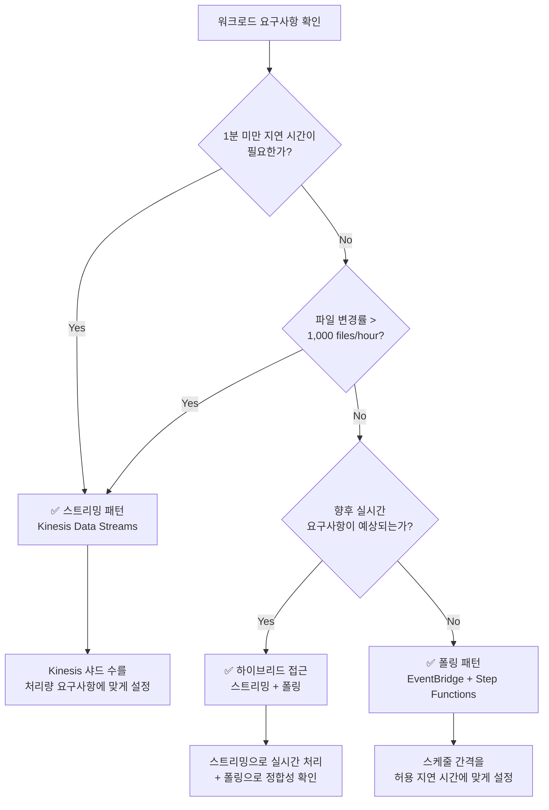

# 스트리밍 vs 폴링 선택 가이드

본 가이드에서는 FSx for ONTAP S3 Access Points를 활용한 서버리스 자동화 패턴의 두 가지 아키텍처 패턴 — **EventBridge 폴링**과 **Kinesis 스트리밍** — 을 비교하고, 워크로드에 최적인 패턴을 선택하기 위한 판단 기준을 제공합니다.

## 개요

### EventBridge 폴링 패턴 (Phase 1/2 표준)

EventBridge Scheduler가 정기적으로 Step Functions 워크플로를 시작하고, Discovery Lambda가 S3 AP의 ListObjectsV2로 현재 객체 목록을 가져와 처리 대상을 결정하는 패턴입니다.

```
EventBridge Scheduler (rate/cron) → Step Functions → Discovery Lambda → Processing
```

### Kinesis 스트리밍 패턴 (Phase 3 추가)

고빈도 폴링(1분 간격)으로 변경을 감지하고, Kinesis Data Streams를 통해 준실시간으로 처리하는 패턴입니다.

```
EventBridge (rate(1 min)) → Stream Producer → Kinesis Data Stream → Stream Consumer → Processing
```

## 비교표

| 비교 축 | 폴링 (EventBridge + Step Functions) | 스트리밍 (Kinesis + DynamoDB + Lambda) |
|---------|-------------------------------------|---------------------------------------|
| **지연 시간** | 최소 1분 (EventBridge Scheduler 최소 간격) | 초 단위 (Kinesis Event Source Mapping) |
| **비용** | EventBridge + Step Functions 실행 요금 | Kinesis 샤드 시간 + DynamoDB + Lambda 실행 요금 |
| **운영 복잡성** | 낮음 (관리형 서비스 조합) | 중간 (샤드 관리, DLQ 모니터링, 상태 테이블 관리) |
| **장애 처리** | Step Functions Retry/Catch (선언적) | bisect-on-error + dead-letter 테이블 |
| **확장성** | Map State concurrency (최대 40 병렬) | 샤드 수에 비례 (1 샤드 = 1 MB/s 쓰기, 2 MB/s 읽기) |

## 비용 추정

3가지 대표적인 워크로드 규모에서의 비용 비교입니다 (ap-northeast-1 기준, 월간 추정).

| 워크로드 규모 | 폴링 | 스트리밍 | 권장 |
|-------------|------|---------|------|
| **100 files/hour** | ~$5/월 | ~$15/월 | ✅ 폴링 |
| **1,000 files/hour** | ~$15/월 | ~$25/월 | 둘 다 가능 |
| **10,000 files/hour** | ~$50/월 | ~$40/월 | ✅ 스트리밍 |

## 판단 플로차트



### 판단 기준 요약

| 조건 | 권장 패턴 |
|------|----------|
| 1분 미만 (초 단위) 지연 시간 필요 | 스트리밍 |
| 파일 변경률 > 1,000 files/hour | 스트리밍 |
| 비용 최소화가 최우선 | 폴링 |
| 운영 단순성이 최우선 | 폴링 |
| 실시간 + 정합성 모두 필요 | 하이브리드 |

## 하이브리드 접근 (권장)

프로덕션 환경에서는 **스트리밍으로 실시간 처리 + 폴링으로 정합성 리컨실리에이션**의 하이브리드 접근을 권장합니다.

### 설계

```mermaid
graph TB
    subgraph "실시간 경로 (스트리밍)"
        SP[Stream Producer<br/>rate(1 min)]
        KDS[Kinesis Data Stream]
        SC[Stream Consumer]
    end

    subgraph "정합성 경로 (폴링)"
        EBS[EventBridge Scheduler<br/>rate(1 hour)]
        SFN[Step Functions]
        DL[Discovery Lambda]
    end

    subgraph "공통 처리"
        PROC[Processing Pipeline]
        OUT[S3 Output]
    end

    SP --> KDS --> SC --> PROC
    EBS --> SFN --> DL --> PROC
    PROC --> OUT
```

### 장점

1. **실시간성**: 새 파일은 초 단위로 처리 시작
2. **정합성 보장**: 1시간마다 폴링으로 누락 감지 및 복구
3. **장애 내성**: 스트리밍 장애 시에도 폴링이 자동으로 커버
4. **단계적 마이그레이션**: 폴링만 → 하이브리드 → 스트리밍만으로 단계적 전환 가능

### 구현 포인트

- **멱등 처리**: DynamoDB conditional writes로 중복 처리 방지
- **상태 테이블 공유**: Stream Producer와 Discovery Lambda가 동일한 DynamoDB 상태 테이블 참조
- **처리 상태 관리**: `processing_status` 필드로 처리 완료/미완료 관리

## 리전별 비용 차이

Kinesis Data Streams의 샤드 요금은 리전에 따라 다릅니다.

| 리전 | 샤드 시간 요금 | 월간 (1 샤드) |
|------|--------------|-------------|
| us-east-1 | $0.015/hour | ~$10.80 |
| ap-northeast-1 | $0.0195/hour | ~$14.04 |
| eu-west-1 | $0.015/hour | ~$10.80 |

> **참고**: 요금은 변경될 수 있습니다. 최신 요금은 [Amazon Kinesis Data Streams 요금 페이지](https://aws.amazon.com/kinesis/data-streams/pricing/)를 참조하세요.

## 참고 링크

- [Amazon Kinesis Data Streams 요금](https://aws.amazon.com/kinesis/data-streams/pricing/)
- [Amazon Kinesis Data Streams 개발자 가이드](https://docs.aws.amazon.com/streams/latest/dev/introduction.html)
- [AWS Step Functions 요금](https://aws.amazon.com/step-functions/pricing/)
- [Amazon EventBridge Scheduler](https://docs.aws.amazon.com/scheduler/latest/UserGuide/what-is-scheduler.html)
- [AWS Lambda 이벤트 소스 매핑 (Kinesis)](https://docs.aws.amazon.com/lambda/latest/dg/with-kinesis.html)
- [DynamoDB 온디맨드 용량 요금](https://aws.amazon.com/dynamodb/pricing/on-demand/)
