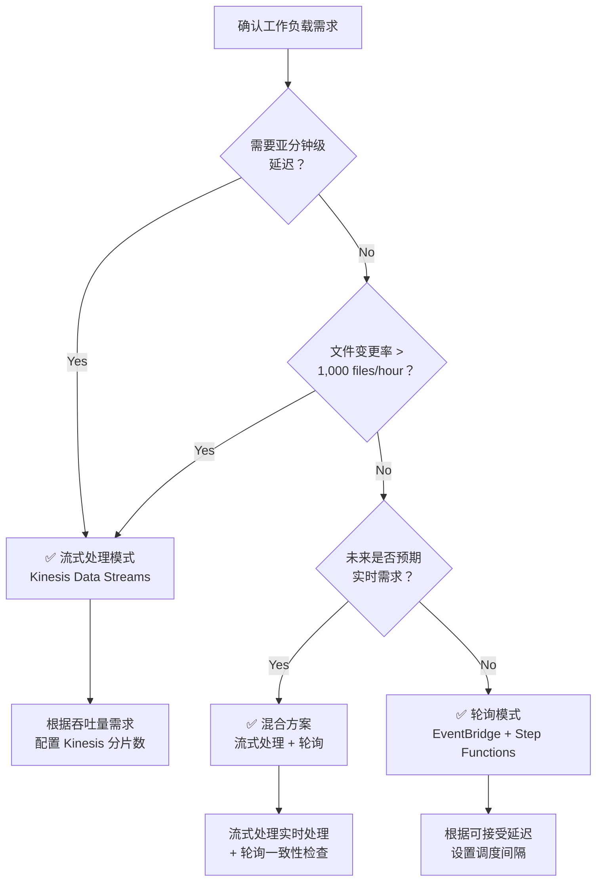

# 流式处理 vs 轮询选择指南

本指南比较了 FSx for ONTAP S3 Access Points 无服务器自动化模式中的两种架构模式 — **EventBridge 轮询**和 **Kinesis 流式处理** — 并提供选择最佳模式的决策标准。

## 概述

### EventBridge 轮询模式（Phase 1/2 标准）

EventBridge Scheduler 定期触发 Step Functions 工作流，Discovery Lambda 使用 S3 AP 的 ListObjectsV2 获取当前对象列表并确定处理目标。

```
EventBridge Scheduler (rate/cron) → Step Functions → Discovery Lambda → Processing
```

### Kinesis 流式处理模式（Phase 3 新增）

高频轮询（1 分钟间隔）检测变更，通过 Kinesis Data Streams 实现近实时处理。

```
EventBridge (rate(1 min)) → Stream Producer → Kinesis Data Stream → Stream Consumer → Processing
```

## 比较表

| 比较维度 | 轮询 (EventBridge + Step Functions) | 流式处理 (Kinesis + DynamoDB + Lambda) |
|---------|-------------------------------------|---------------------------------------|
| **延迟** | 最小 1 分钟（EventBridge Scheduler 最小间隔） | 秒级（Kinesis Event Source Mapping） |
| **成本** | EventBridge + Step Functions 执行费用 | Kinesis 分片小时 + DynamoDB + Lambda 执行费用 |
| **运维复杂度** | 低（托管服务组合） | 中（分片管理、DLQ 监控、状态表管理） |
| **故障处理** | Step Functions Retry/Catch（声明式） | bisect-on-error + dead-letter 表 |
| **可扩展性** | Map State 并发（最大 40 并行） | 与分片数成正比（1 分片 = 1 MB/s 写入，2 MB/s 读取） |

## 成本估算

三种代表性工作负载规模的成本比较（ap-northeast-1 基准，月度估算）。

| 工作负载规模 | 轮询 | 流式处理 | 推荐 |
|------------|------|---------|------|
| **100 files/hour** | ~$5/月 | ~$15/月 | ✅ 轮询 |
| **1,000 files/hour** | ~$15/月 | ~$25/月 | 均可 |
| **10,000 files/hour** | ~$50/月 | ~$40/月 | ✅ 流式处理 |

## 决策流程图



### 决策标准摘要

| 条件 | 推荐模式 |
|------|---------|
| 需要亚分钟（秒级）延迟 | 流式处理 |
| 文件变更率 > 1,000 files/hour | 流式处理 |
| 成本最小化为首要目标 | 轮询 |
| 运维简单性为首要目标 | 轮询 |
| 同时需要实时性和一致性 | 混合 |

## 混合方案（推荐）

在生产环境中，推荐采用**流式处理实现实时处理 + 轮询实现一致性对账**的混合方案。

### 设计

```mermaid
graph TB
    subgraph "实时路径（流式处理）"
        SP[Stream Producer<br/>rate(1 min)]
        KDS[Kinesis Data Stream]
        SC[Stream Consumer]
    end

    subgraph "一致性路径（轮询）"
        EBS[EventBridge Scheduler<br/>rate(1 hour)]
        SFN[Step Functions]
        DL[Discovery Lambda]
    end

    subgraph "公共处理"
        PROC[Processing Pipeline]
        OUT[S3 Output]
    end

    SP --> KDS --> SC --> PROC
    EBS --> SFN --> DL --> PROC
    PROC --> OUT
```

### 优势

1. **实时性**：新文件在秒级内开始处理
2. **一致性保证**：每小时轮询检测并恢复遗漏项
3. **容错性**：流式处理故障时轮询自动覆盖
4. **渐进式迁移**：可从仅轮询 → 混合 → 仅流式处理逐步迁移

### 实现要点

- **幂等处理**：DynamoDB conditional writes 防止重复处理
- **状态表共享**：Stream Producer 和 Discovery Lambda 引用同一 DynamoDB 状态表
- **处理状态管理**：`processing_status` 字段跟踪已处理/未处理状态

## 区域成本差异

Kinesis Data Streams 的分片定价因区域而异。

| 区域 | 分片小时价格 | 月度（1 分片） |
|------|------------|--------------|
| us-east-1 | $0.015/hour | ~$10.80 |
| ap-northeast-1 | $0.0195/hour | ~$14.04 |
| eu-west-1 | $0.015/hour | ~$10.80 |

> **注意**：定价可能变更。请参阅 [Amazon Kinesis Data Streams 定价页面](https://aws.amazon.com/kinesis/data-streams/pricing/) 获取最新费率。

## 参考链接

- [Amazon Kinesis Data Streams 定价](https://aws.amazon.com/kinesis/data-streams/pricing/)
- [Amazon Kinesis Data Streams 开发者指南](https://docs.aws.amazon.com/streams/latest/dev/introduction.html)
- [AWS Step Functions 定价](https://aws.amazon.com/step-functions/pricing/)
- [Amazon EventBridge Scheduler](https://docs.aws.amazon.com/scheduler/latest/UserGuide/what-is-scheduler.html)
- [AWS Lambda 事件源映射 (Kinesis)](https://docs.aws.amazon.com/lambda/latest/dg/with-kinesis.html)
- [DynamoDB 按需容量定价](https://aws.amazon.com/dynamodb/pricing/on-demand/)
