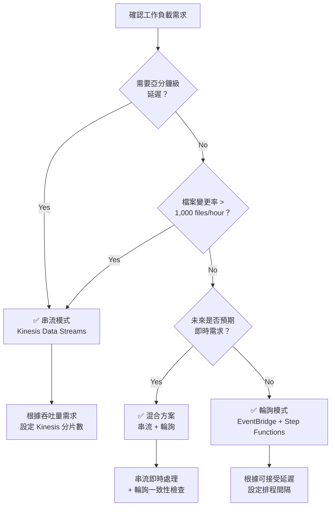

# 串流 vs 輪詢選擇指南

本指南比較了 FSx for ONTAP S3 Access Points 無伺服器自動化模式中的兩種架構模式 — **EventBridge 輪詢**和 **Kinesis 串流** — 並提供選擇最佳模式的決策標準。

## 概述

### EventBridge 輪詢模式（Phase 1/2 標準）

EventBridge Scheduler 定期觸發 Step Functions 工作流程，Discovery Lambda 使用 S3 AP 的 ListObjectsV2 取得目前物件清單並決定處理目標。

```
EventBridge Scheduler (rate/cron) → Step Functions → Discovery Lambda → Processing
```

### Kinesis 串流模式（Phase 3 新增）

高頻輪詢（1 分鐘間隔）偵測變更，透過 Kinesis Data Streams 實現近即時處理。

```
EventBridge (rate(1 min)) → Stream Producer → Kinesis Data Stream → Stream Consumer → Processing
```

## 比較表

| 比較維度 | 輪詢 (EventBridge + Step Functions) | 串流 (Kinesis + DynamoDB + Lambda) |
|---------|-------------------------------------|------------------------------------|
| **延遲** | 最小 1 分鐘（EventBridge Scheduler 最小間隔） | 秒級（Kinesis Event Source Mapping） |
| **成本** | EventBridge + Step Functions 執行費用 | Kinesis 分片小時 + DynamoDB + Lambda 執行費用 |
| **維運複雜度** | 低（託管服務組合） | 中（分片管理、DLQ 監控、狀態表管理） |
| **故障處理** | Step Functions Retry/Catch（宣告式） | bisect-on-error + dead-letter 表 |
| **可擴展性** | Map State 並行（最大 40 並行） | 與分片數成正比（1 分片 = 1 MB/s 寫入，2 MB/s 讀取） |

## 成本估算

三種代表性工作負載規模的成本比較（ap-northeast-1 基準，月度估算）。

| 工作負載規模 | 輪詢 | 串流 | 建議 |
|------------|------|------|------|
| **100 files/hour** | ~$5/月 | ~$15/月 | ✅ 輪詢 |
| **1,000 files/hour** | ~$15/月 | ~$25/月 | 皆可 |
| **10,000 files/hour** | ~$50/月 | ~$40/月 | ✅ 串流 |

## 決策流程圖



### 決策標準摘要

| 條件 | 建議模式 |
|------|---------|
| 需要亞分鐘（秒級）延遲 | 串流 |
| 檔案變更率 > 1,000 files/hour | 串流 |
| 成本最小化為首要目標 | 輪詢 |
| 維運簡單性為首要目標 | 輪詢 |
| 同時需要即時性和一致性 | 混合 |

## 混合方案（建議）

在生產環境中，建議採用**串流實現即時處理 + 輪詢實現一致性對帳**的混合方案。

### 設計

```mermaid
graph TB
    subgraph "即時路徑（串流）"
        SP[Stream Producer<br/>rate(1 min)]
        KDS[Kinesis Data Stream]
        SC[Stream Consumer]
    end

    subgraph "一致性路徑（輪詢）"
        EBS[EventBridge Scheduler<br/>rate(1 hour)]
        SFN[Step Functions]
        DL[Discovery Lambda]
    end

    subgraph "共用處理"
        PROC[Processing Pipeline]
        OUT[S3 Output]
    end

    SP --> KDS --> SC --> PROC
    EBS --> SFN --> DL --> PROC
    PROC --> OUT
```

### 優勢

1. **即時性**：新檔案在秒級內開始處理
2. **一致性保證**：每小時輪詢偵測並恢復遺漏項
3. **容錯性**：串流故障時輪詢自動覆蓋
4. **漸進式遷移**：可從僅輪詢 → 混合 → 僅串流逐步遷移

### 實作要點

- **冪等處理**：DynamoDB conditional writes 防止重複處理
- **狀態表共享**：Stream Producer 和 Discovery Lambda 參照同一 DynamoDB 狀態表
- **處理狀態管理**：`processing_status` 欄位追蹤已處理/未處理狀態

## 區域成本差異

Kinesis Data Streams 的分片定價因區域而異。

| 區域 | 分片小時價格 | 月度（1 分片） |
|------|------------|--------------|
| us-east-1 | $0.015/hour | ~$10.80 |
| ap-northeast-1 | $0.0195/hour | ~$14.04 |
| eu-west-1 | $0.015/hour | ~$10.80 |

> **注意**：定價可能變更。請參閱 [Amazon Kinesis Data Streams 定價頁面](https://aws.amazon.com/kinesis/data-streams/pricing/) 取得最新費率。

## 參考連結

- [Amazon Kinesis Data Streams 定價](https://aws.amazon.com/kinesis/data-streams/pricing/)
- [Amazon Kinesis Data Streams 開發者指南](https://docs.aws.amazon.com/streams/latest/dev/introduction.html)
- [AWS Step Functions 定價](https://aws.amazon.com/step-functions/pricing/)
- [Amazon EventBridge Scheduler](https://docs.aws.amazon.com/scheduler/latest/UserGuide/what-is-scheduler.html)
- [AWS Lambda 事件來源對應 (Kinesis)](https://docs.aws.amazon.com/lambda/latest/dg/with-kinesis.html)
- [DynamoDB 隨需容量定價](https://aws.amazon.com/dynamodb/pricing/on-demand/)
