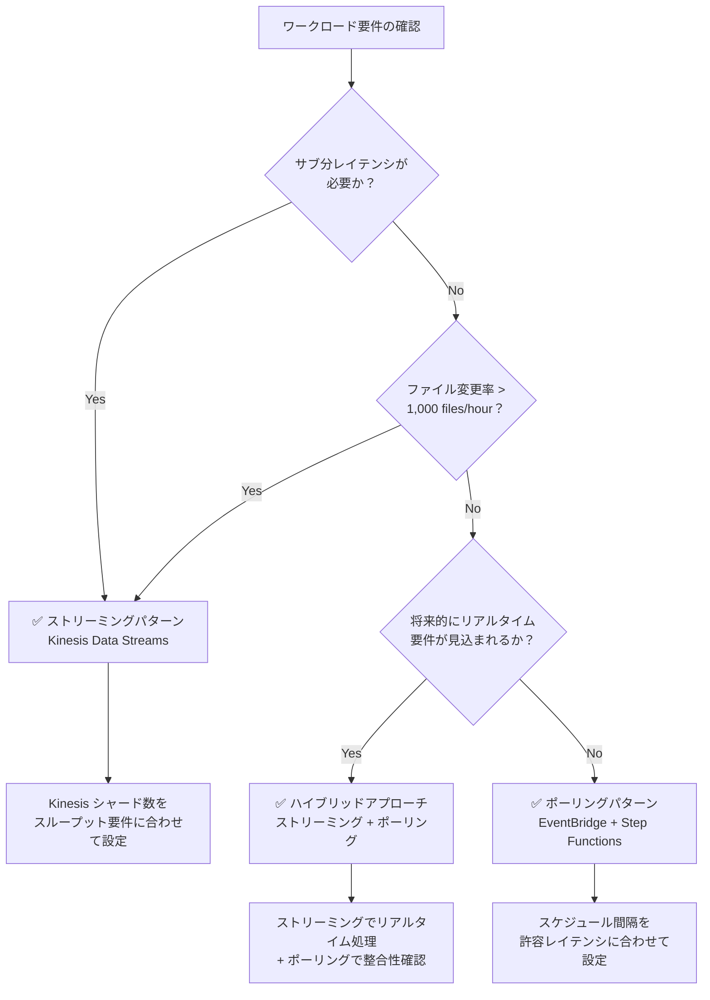

# ストリーミング vs ポーリング選択ガイド

本ガイドでは、FSx for ONTAP S3 Access Points を活用したサーバーレス自動化パターンにおける 2 つのアーキテクチャパターン — **EventBridge ポーリング** と **Kinesis ストリーミング** — を比較し、ワークロードに最適なパターンを選択するための判断基準を提供します。

## 概要

### EventBridge ポーリングパターン（Phase 1/2 標準）

EventBridge Scheduler が定期的に Step Functions ワークフローを起動し、Discovery Lambda が S3 AP の ListObjectsV2 で現在のオブジェクト一覧を取得して処理対象を決定するパターンです。

```
EventBridge Scheduler (rate/cron) → Step Functions → Discovery Lambda → Processing
```

### Kinesis ストリーミングパターン（Phase 3 追加）

高頻度ポーリング（1 分間隔）で変更を検知し、Kinesis Data Streams を介してニアリアルタイムで処理するパターンです。

```
EventBridge (rate(1 min)) → Stream Producer → Kinesis Data Stream → Stream Consumer → Processing
```

## 比較表

| 比較軸 | ポーリング（EventBridge + Step Functions） | ストリーミング（Kinesis + DynamoDB + Lambda） |
|--------|------------------------------------------|---------------------------------------------|
| **レイテンシ** | 最小 1 分（EventBridge Scheduler の最小間隔） | 秒レベル（Kinesis Event Source Mapping） |
| **コスト** | EventBridge + Step Functions 実行料金 | Kinesis シャード時間 + DynamoDB + Lambda 実行料金 |
| **運用複雑性** | 低（マネージドサービスの組み合わせ） | 中（シャード管理、DLQ 監視、状態テーブル管理） |
| **障害ハンドリング** | Step Functions Retry/Catch（宣言的） | bisect-on-error + dead-letter テーブル |
| **スケーラビリティ** | Map State concurrency（最大 40 並列） | シャード数に比例（1 シャード = 1 MB/s 書込、2 MB/s 読取） |

### 詳細比較

#### レイテンシ

- **ポーリング**: EventBridge Scheduler の最小間隔は `rate(1 minute)`。実際の処理レイテンシは「スケジュール間隔 + Discovery 実行時間 + 処理時間」
- **ストリーミング**: Kinesis Event Source Mapping のバッチウィンドウ（デフォルト: 0 秒）+ 処理時間。変更検知から処理完了まで数秒〜数十秒

#### コスト

- **ポーリング**: EventBridge Scheduler（無料枠あり）+ Step Functions（状態遷移課金）+ Lambda 実行料金
- **ストリーミング**: Kinesis シャード時間（$0.015/シャード/時間 ※リージョンにより異なる）+ DynamoDB（状態テーブル + DLQ テーブル）+ Lambda 実行料金

#### 運用複雑性

- **ポーリング**: Step Functions の可視化、CloudWatch Logs、EventBridge スケジュール管理のみ
- **ストリーミング**: シャード数の適正化、Iterator Age 監視、DLQ レコードの再処理、DynamoDB 状態テーブルの整合性管理が追加で必要

#### 障害ハンドリング

- **ポーリング**: Step Functions の Retry/Catch で宣言的にエラーハンドリング。失敗時は次回スケジュールで自動リカバリ
- **ストリーミング**: bisect-on-error でバッチ内の失敗レコードを特定。処理不能レコードは DynamoDB dead-letter テーブルに退避。手動またはバッチでの再処理が必要

#### スケーラビリティ

- **ポーリング**: Map State の MaxConcurrency で並列度を制御。大量ファイル時は Map State のページネーションで対応
- **ストリーミング**: シャード数を増やすことで書込/読取スループットをリニアにスケール。Enhanced Fan-Out で複数コンシューマーの並列処理も可能

## コスト見積もり

3 つの代表的なワークロード規模でのコスト比較です（ap-northeast-1 基準、月額概算）。

| ワークロード規模 | ポーリング | ストリーミング | 推奨 |
|----------------|-----------|-------------|------|
| **100 files/hour** | ~$5/月 | ~$15/月 | ✅ ポーリング |
| **1,000 files/hour** | ~$15/月 | ~$25/月 | どちらも可 |
| **10,000 files/hour** | ~$50/月 | ~$40/月 | ✅ ストリーミング |

### 内訳

#### 100 files/hour（ポーリング推奨）

| 項目 | ポーリング | ストリーミング |
|------|-----------|-------------|
| スケジューリング | EventBridge: ~$0 | EventBridge: ~$0 |
| オーケストレーション | Step Functions: ~$2 | — |
| ストリーム | — | Kinesis (1 shard): ~$11 |
| 状態管理 | — | DynamoDB: ~$1 |
| Lambda | ~$3 | ~$3 |
| **合計** | **~$5** | **~$15** |

#### 1,000 files/hour（どちらも可）

| 項目 | ポーリング | ストリーミング |
|------|-----------|-------------|
| スケジューリング | EventBridge: ~$0 | EventBridge: ~$0 |
| オーケストレーション | Step Functions: ~$8 | — |
| ストリーム | — | Kinesis (1 shard): ~$11 |
| 状態管理 | — | DynamoDB: ~$5 |
| Lambda | ~$7 | ~$9 |
| **合計** | **~$15** | **~$25** |

#### 10,000 files/hour（ストリーミング推奨）

| 項目 | ポーリング | ストリーミング |
|------|-----------|-------------|
| スケジューリング | EventBridge: ~$0 | EventBridge: ~$0 |
| オーケストレーション | Step Functions: ~$30 | — |
| ストリーム | — | Kinesis (2 shards): ~$22 |
| 状態管理 | — | DynamoDB: ~$8 |
| Lambda | ~$20 | ~$10 |
| **合計** | **~$50** | **~$40** |

> **注**: 上記は概算値です。実際のコストはリクエストパターン、Lambda メモリ設定、DynamoDB キャパシティモードにより変動します。

## 判断フローチャート



### 判断基準サマリー

| 条件 | 推奨パターン |
|------|------------|
| サブ分（秒レベル）レイテンシが必要 | ストリーミング |
| ファイル変更率 > 1,000 files/hour | ストリーミング |
| コスト最小化が最優先 | ポーリング |
| 運用シンプルさが最優先 | ポーリング |
| リアルタイム + 整合性の両立 | ハイブリッド |

## ハイブリッドアプローチ（推奨）

本番環境では、**ストリーミングでリアルタイム処理 + ポーリングで整合性リコンシリエーション** のハイブリッドアプローチを推奨します。

### 設計

```mermaid
graph TB
    subgraph "リアルタイムパス（ストリーミング）"
        SP[Stream Producer<br/>rate(1 min)]
        KDS[Kinesis Data Stream]
        SC[Stream Consumer]
    end

    subgraph "整合性パス（ポーリング）"
        EBS[EventBridge Scheduler<br/>rate(1 hour)]
        SFN[Step Functions]
        DL[Discovery Lambda]
    end

    subgraph "共通処理"
        PROC[Processing Pipeline]
        OUT[S3 Output]
    end

    SP --> KDS --> SC --> PROC
    EBS --> SFN --> DL --> PROC
    PROC --> OUT
```

### メリット

1. **リアルタイム性**: 新規ファイルは秒レベルで処理開始
2. **整合性保証**: 1 時間ごとのポーリングで漏れを検出・リカバリ
3. **障害耐性**: ストリーミング障害時もポーリングが自動的にカバー
4. **段階的移行**: ポーリングのみ → ハイブリッド → ストリーミングのみ、と段階的に移行可能

### 実装のポイント

- **冪等処理**: DynamoDB conditional writes で重複処理を防止
- **状態テーブル共有**: Stream Producer と Discovery Lambda が同じ DynamoDB 状態テーブルを参照
- **処理ステータス管理**: `processing_status` フィールドで処理済み/未処理を管理

## リージョン別コスト差異

Kinesis Data Streams のシャード料金はリージョンにより異なります。

| リージョン | シャード時間料金 | 月額（1 シャード） |
|-----------|----------------|------------------|
| us-east-1 | $0.015/hour | ~$10.80 |
| ap-northeast-1 | $0.0195/hour | ~$14.04 |
| eu-west-1 | $0.015/hour | ~$10.80 |

> **注**: 料金は変更される可能性があります。最新の料金は [Amazon Kinesis Data Streams 料金ページ](https://aws.amazon.com/kinesis/data-streams/pricing/) を参照してください。

DynamoDB の料金もリージョンにより異なりますが、本パターンの使用量（状態テーブル + DLQ テーブル）では差異は軽微です。

## 参考リンク

- [Amazon Kinesis Data Streams 料金](https://aws.amazon.com/kinesis/data-streams/pricing/)
- [Amazon Kinesis Data Streams 開発者ガイド](https://docs.aws.amazon.com/streams/latest/dev/introduction.html)
- [AWS Step Functions 料金](https://aws.amazon.com/step-functions/pricing/)
- [Amazon EventBridge Scheduler](https://docs.aws.amazon.com/scheduler/latest/UserGuide/what-is-scheduler.html)
- [AWS Lambda イベントソースマッピング（Kinesis）](https://docs.aws.amazon.com/lambda/latest/dg/with-kinesis.html)
- [DynamoDB オンデマンドキャパシティ料金](https://aws.amazon.com/dynamodb/pricing/on-demand/)
