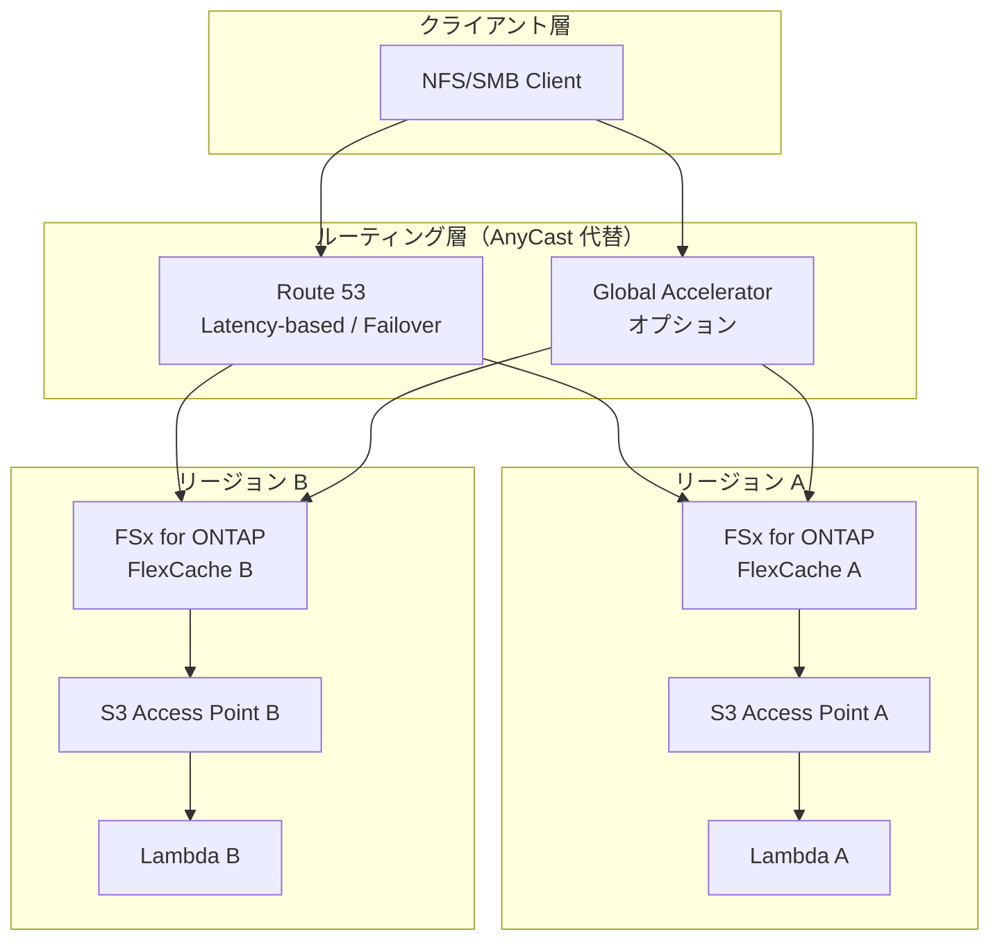

# サポートマトリックス — FSx for ONTAP / FlexCache / S3 Access Points

## 概要

本ドキュメントは、FlexCache、S3 Access Points、関連機能の各プラットフォームでのサポート状況を整理する。

> **注意**: FSx for ONTAP のマネージドサービス上での機能可否は AWS サービス仕様に依存し、ONTAP バージョンだけでは判断できない。PoC 時に必ず実環境で検証すること。

## プラットフォーム別サポートマトリックス

### FlexCache 基本機能

| 機能 | FSx for ONTAP | On-prem ONTAP | Cloud Volumes ONTAP | Lab/Simulator |
|------|:---:|:---:|:---:|:---:|
| FlexCache origin volume | ✅ | ✅ | ✅ | ✅ |
| FlexCache cache volume | ✅ | ✅ | ✅ | ✅ |
| 同一クラスタ内 FlexCache | ✅ | ✅ | ✅ | ✅ |
| クロスクラスタ FlexCache | ✅ (Peering) | ✅ | ✅ | ⚠️ 構成依存 |
| FlexCache prepopulate | ✅ (ONTAP 9.13.1+) | ✅ | ✅ | ✅ |
| FlexCache writeback | ⚠️ バージョン依存 | ✅ (9.15.1+) | ⚠️ バージョン依存 | ✅ |
| FlexCache global file lock | ⚠️ バージョン依存 | ✅ (9.14.1+) | ⚠️ バージョン依存 | ✅ |
| FlexCache disconnected mode | ⚠️ 未確認 | ✅ (9.12.1+) | ⚠️ 未確認 | ✅ |

### S3 Access Points

| 機能 | FSx for ONTAP | On-prem ONTAP | Cloud Volumes ONTAP | Lab/Simulator |
|------|:---:|:---:|:---:|:---:|
| S3 Access Points (origin volume) | ✅ | ❌ (AWS 専用) | ❌ (AWS 専用) | ❌ |
| S3 Access Points (FlexCache volume) | ⚠️ 未確認/要検証 | ❌ | ❌ | ❌ |
| S3 AP ListObjectsV2 | ✅ | ❌ | ❌ | ❌ |
| S3 AP GetObject | ✅ | ❌ | ❌ | ❌ |
| S3 AP PutObject (≤5GB) | ✅ | ❌ | ❌ | ❌ |
| S3 AP HeadObject | ✅ | ❌ | ❌ | ❌ |
| S3 AP DeleteObject | ✅ | ❌ | ❌ | ❌ |
| S3 AP GetBucketNotification | ❌ | ❌ | ❌ | ❌ |
| S3 AP Event Notifications | ❌ | ❌ | ❌ | ❌ |
| S3 AP Lifecycle Policy | ❌ | ❌ | ❌ | ❌ |
| S3 AP Versioning | ❌ | ❌ | ❌ | ❌ |
| S3 AP Presigned URL | ❌ | ❌ | ❌ | ❌ |

### ネットワーク / ルーティング機能

| 機能 | FSx for ONTAP | On-prem ONTAP | Cloud Volumes ONTAP | Lab/Simulator |
|------|:---:|:---:|:---:|:---:|
| Virtual IP (VIP) LIF | ❌ (マネージド) | ✅ | ❌ | ✅ |
| BGP peer configuration | ❌ (マネージド) | ✅ | ❌ | ✅ |
| AnyCast same IP (BGP) | ❌ | ✅ | ❌ | ✅ |
| IPspace / VRF | ❌ (マネージド) | ✅ | ❌ | ✅ |
| BGP MED / AS-Path 制御 | ❌ | ✅ | ❌ | ✅ |
| DNS ベースルーティング (Route 53) | ✅ (代替) | ✅ | ✅ | ✅ |
| AWS Global Accelerator | ✅ (代替) | N/A | ✅ | N/A |
| Application-level routing | ✅ (代替) | ✅ | ✅ | ✅ |

### DR / HA 機能

| 機能 | FSx for ONTAP | On-prem ONTAP | Cloud Volumes ONTAP | Lab/Simulator |
|------|:---:|:---:|:---:|:---:|
| SnapMirror (volume level) | ✅ | ✅ | ✅ | ✅ |
| SVM-DR | ✅ | ✅ | ⚠️ 制限あり | ✅ |
| MetroCluster | ❌ (マネージド HA) | ✅ | ❌ | ⚠️ |
| Multi-AZ HA | ✅ (自動) | N/A | ✅ | N/A |
| FlexCache + SnapMirror 連携 | ✅ | ✅ | ✅ | ✅ |
| FlexCache re-peer (DR 時) | ⚠️ 要検証 | ✅ | ⚠️ 要検証 | ✅ |

### 自動化 / オーケストレーション

| 機能 | FSx for ONTAP | On-prem ONTAP | Cloud Volumes ONTAP | Lab/Simulator |
|------|:---:|:---:|:---:|:---:|
| ONTAP REST API | ✅ | ✅ | ✅ | ✅ |
| ONTAP CLI (SSH) | ✅ (制限あり) | ✅ | ✅ | ✅ |
| CloudFormation (FSx リソース) | ✅ | ❌ | ❌ | ❌ |
| AWS SDK (FSx API) | ✅ | ❌ | ❌ | ❌ |
| Step Functions orchestration | ✅ | ✅ (API 経由) | ✅ (API 経由) | ✅ |
| Lambda + ONTAP REST API | ✅ | ✅ (VPN/DX 経由) | ✅ | ✅ |
| Terraform (NetApp provider) | ✅ | ✅ | ✅ | ✅ |
| Ansible (NetApp collection) | ✅ | ✅ | ✅ | ✅ |

## ONTAP バージョン別 FlexCache 機能

| 機能 | 9.8 | 9.10.1 | 9.12.1 | 9.13.1 | 9.14.1 | 9.15.1 |
|------|:---:|:---:|:---:|:---:|:---:|:---:|
| FlexCache 基本 (NFS) | ✅ | ✅ | ✅ | ✅ | ✅ | ✅ |
| FlexCache SMB | ❌ | ✅ | ✅ | ✅ | ✅ | ✅ |
| Prepopulate | ❌ | ❌ | ❌ | ✅ | ✅ | ✅ |
| Disconnected mode | ❌ | ❌ | ✅ | ✅ | ✅ | ✅ |
| Global file lock | ❌ | ❌ | ❌ | ❌ | ✅ | ✅ |
| Writeback | ❌ | ❌ | ❌ | ❌ | ❌ | ✅ |
| Multi-protocol (NFS+SMB) | ❌ | ❌ | ❌ | ❌ | ✅ | ✅ |

> **FSx for ONTAP の ONTAP バージョン**: FSx for ONTAP は AWS が管理する ONTAP バージョンを使用する。利用可能な機能は AWS のリリースサイクルに依存する。最新の対応バージョンは AWS ドキュメントを参照。

## FSx for ONTAP での AnyCast 代替パターン

FSx for ONTAP では Virtual IP / BGP が利用できないため、以下の代替パターンで同等の効果を実現する。

### 代替パターン比較

| 方式 | 切替速度 | 複雑度 | コスト | 適用シナリオ |
|------|---------|--------|--------|------------|
| Route 53 Weighted/Failover | 60-300秒 (TTL依存) | 低 | 低 | DR、地理分散 |
| Route 53 Latency-based | 自動 | 低 | 低 | マルチリージョン |
| Global Accelerator | 数秒 | 中 | 中 | 高可用性要件 |
| Application routing (Lambda) | 即時 | 中 | 低 | カスタムロジック |
| NLB + Target Group | 数秒 | 中 | 中 | VPC 内ルーティング |

### 推奨構成

## FlexCache ボリュームへの S3 AP 利用に関する注意

### 現時点での確認状況

| 項目 | 状態 | 備考 |
|------|------|------|
| Origin volume への S3 AP attach | ✅ 確認済み | 本リポジトリで検証済み |
| FlexCache volume への S3 AP attach | ⚠️ 未確認 | AWS ドキュメントに明示的な記載なし |
| FlexCache volume の S3 AP 経由読み取り | ⚠️ 未確認 | PoC で要検証 |
| FlexCache volume の S3 AP 経由書き込み | ⚠️ 未確認 | writeback 対応バージョンでも要検証 |

### PoC 検証推奨事項

1. FSx for ONTAP で FlexCache volume を作成
2. FlexCache volume に S3 Access Point を attach 可能か確認
3. S3 AP 経由で ListObjectsV2 / GetObject が動作するか確認
4. キャッシュヒット時とキャッシュミス時のレイテンシを計測
5. 結果を本ドキュメントに追記

## 関連ドキュメント

- [業界・ワークロード マッピング](industry-workload-mapping.md)
- [FlexCache AnyCast / DR パターン](../solutions/flexcache/anycast-dr/README.md)
- [Dynamic FlexCache Render Workflow](../solutions/flexcache/dynamic-render-workflow/README.md)
- [FlexCache PoC チェックリスト](flexcache-poc-checklist.md)
- [コスト分析](cost-analysis.md)
