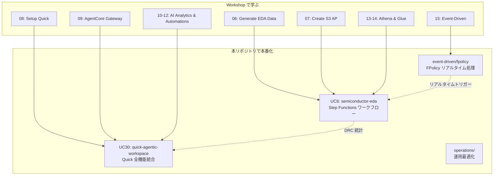

# AWS Workshop: FSx for ONTAP S3 AP × EDA ワークフロー統合ガイド

> **Workshop リンク**: [FSx for NetApp ONTAP S3 Access Points Workshop](https://catalog.us-east-1.prod.workshops.aws/workshops/9cd82e0b-8348-456b-932a-818b9e5825a1/en-US)

本ドキュメントは、AWS Workshop Studio で公開されている EDA ハンズオンの各モジュールと、本リポジトリの UC パターンの対応関係を整理し、Workshop で検証済みのシナリオを各パターンに取り込むためのガイドです。

---

## Workshop 概要

| 項目 | 内容 |
|------|------|
| タイトル | FSx for NetApp ONTAP S3 Access Points Workshop |
| テーマ | EDA Regression ログを FSx for ONTAP 上で NFS 書き込み → S3 AP 経由で AI/分析 |
| 所要時間 | 約 3 時間（全モジュール） |
| コア原則 | **Zero Data Movement** — NFS で書き込んだデータを S3 にコピーせず S3 API で活用 |

### アーキテクチャコンセプト

```
EC2 (EDA simulations) --NFS--> FSx for ONTAP <--S3 API-- AgentCore Gateway <--MCP-- Amazon Quick
                                                                              (single copy of data)
```

---

## Workshop モジュール ↔ 本リポジトリ パターン対応表

| # | Workshop モジュール | 所要時間 | 対応する UC/パターン | 本リポジトリでの実装状況 |
|---|---|---|---|---|
| 01 | Architecture Overview | 10 min | 全パターン共通 | ✅ `docs/` に設計原則記載済み |
| 02 | Getting Started | — | `infrastructure/handson-lab/` | ✅ IaC で自動構築 |
| 03 | Setup & Deployment | — | `infrastructure/handson-lab/` | ✅ CloudFormation |
| 04 | Verify Infrastructure | — | `scripts/` | ✅ 検証スクリプト |
| 05 | S3 Access Points | — | `shared/s3ap_helper.py` | ✅ コア抽象化 |
| 06 | **Generate EDA Data** | 10 min | **UC6** `semiconductor-eda/` | ✅ テストデータ生成（`test-data/`） |
| 07 | Create S3 Access Points | — | `docs/guides/deployment-guide.md` | ✅ デプロイガイド |
| 08 | **Setup Amazon Quick** | 15 min | **UC30** `genai/quick-agentic-workspace/` | ✅ Quick Index 連携 |
| 09 | **Deploy AgentCore Gateway** | 20 min | **UC30** `genai/quick-agentic-workspace/` | ✅ AgentCore MCP 統合 |
| 10 | **AI-Powered Analytics** | 20 min | **UC6** + **UC30** | ✅ 自然言語クエリ |
| 11 | **QuickSight Dashboards** | 15 min | **UC6** DRC ダッシュボード | ✅ Athena + Quick Sight |
| 12 | **Quick Automations** | 15 min | **UC30** Quick Flows | ✅ トリアージ自動化 |
| 13 | **Athena SQL Queries** | 15 min | **UC6** DRC Aggregation | ✅ Athena ワークフロー |
| 14 | **Glue Data Catalog** | 15 min | **UC6** Glue テーブル | ✅ Crawler 自動スキーマ検出 |
| 15 | **Event-Driven Processing** | 20 min | **FPolicy** `event-driven/fpolicy/` | ✅ EventBridge + Lambda |
| 17 | **Transfer Family (SFTP)** | — | `docs/` 参照ドキュメント | ✅ FR-10 解決済み |
| 19 | Architecture Recap | — | 全体 | — |
| 20 | Cleanup | — | — | — |

---

## 各モジュール詳細と取り込みポイント

### Module 06: Generate EDA Data

**Workshop での実施内容**:
- 500 EDA ジョブワークフロー、約 2,000 ログファイルを合成生成
- LSF ジョブスケジューリングログ（リソース使用量付き）
- Cadence ncvlog/ncelab コンパイルログ
- Xcelium シミュレーションログ（複数の障害シナリオ）
- ポストプロセッシングカバレッジ分析ログ
- ライセンスサーバーエラー（4% の障害率）

**UC6 への取り込み**:
- `test-data/uc6/` にサンプル EDA ログを追加（LSF + Xcelium 形式）
- DemoMode=true でこれらの合成データを使用して動作確認可能
- Discovery Lambda の対象拡張子に `.log` を追加（GDS/OASIS 以外も対応）

**EDA ツール対応表**:

| ツール | ログ種別 | UC6 での処理 |
|--------|---------|-------------|
| LSF (IBM Spectrum) | ジョブスケジューリング | リソース使用量集計 |
| Cadence ncvlog/ncelab | コンパイル | エラー/警告カウント |
| Cadence Xcelium | シミュレーション | PASS/FAIL/UVM_FATAL 検出 |
| Coverage Analysis | ポストプロセッシング | カバレッジ率集計 |

---

### Module 08: Setup Amazon Quick

**Workshop での実施内容**:
1. Amazon Quick アカウント作成/プロビジョニング
2. S3 AP を Knowledge Base データソースとして接続（`s3://<AP-alias>`）
3. データ同期完了確認
4. Chat Agent による自然言語検索テスト

**UC30 への取り込み**:
- Quick Index のデータソース設定手順を `docs/demo-guide.md` に反映
- AD Windows identity での S3 AP 構成が前提条件であることを明記

> **制約**: UNIX identity の S3 AP では Quick のデータアクセスロールを AP ポリシーに追加できない。AD ベースの Windows identity で構成する必要がある。

---

### Module 09: Deploy AgentCore Gateway

**Workshop での実施内容**:
- Cognito User Pool（OAuth 2.0 認証）
- Lambda 関数: S3 AP 経由で list / read / search 操作を公開
- AgentCore MCP Gateway: Quick Suite と Lambda を接続
- Quick Suite MCP integration: エージェント型ログ分析

**Knowledge Base 方式との違い**:

| 方式 | データアクセス | リアルタイム性 | 実装 |
|------|-------------|-------------|------|
| Knowledge Base (Index) | インデックスのスナップショット | 同期タイミング依存 | Module 08 |
| AgentCore (MCP) | S3 AP 経由でライブ読み取り | 常に最新 | Module 09 |

**UC30 への取り込み**:
- AgentCore Gateway のアーキテクチャを `docs/architecture.md` に追加
- MCP ツール定義（list/read/search）を `docs/agentcore-mcp-tools.md` に記載
- 「Knowledge Base vs AgentCore」の選択ガイドを追加

---

### Module 10: AI-Powered Analytics

**Workshop での実施内容**:
- 自然言語で EDA ログに質問:
  - 「How many simulations failed?」
  - 「What are the most common errors?」
  - 「Show me tests with timing violations」
  - 「Which modules have the most warnings?」
  - 「Summarize the test results」
- Knowledge Base 方式と AgentCore MCP 方式の両方で動作確認

**UC6 への取り込み**:
- Bedrock レポート生成のプロンプトテンプレートに上記のクエリパターンを追加
- Report Lambda の出力に「よくある質問への回答」セクションを追加

---

### Module 11: QuickSight Dashboards

**Workshop での実施内容**:
- `regression_summary.csv` を Quick Sight データセットとして登録
- EDA Regression ダッシュボード作成:
  - ジョブ成功/失敗率のパイチャート
  - モジュール別エラー分布
  - タイミング違反のヒートマップ
  - リソース使用量トレンド

**UC6 への取り込み**:
- DRC 統計の CSV 出力フォーマットを Quick Sight 互換に調整
- `docs/demo-guide.md` に Quick Sight ダッシュボード作成手順を追加
- Athena テーブルを Quick Sight から直接接続する手順を記載

---

### Module 12: Quick Automations

**Workshop での実施内容**:
- **日次トリアージ自動化**: Regression 失敗をサマリー化してメール送信
- **カバレッジゲートアラート**: モジュールのカバレッジが 80% 未満になったら即座にアラート
- **ライセンス障害モニター**: 繰り返し発生するライセンスチェックアウト問題を検出

**UC6 / UC30 への取り込み**:
- Quick Flows テンプレート例を `docs/quick-flows-templates.md` に追加
- UC6 の SNS 通知に加えて、Quick Flows 経由のインテリジェントアラートを代替案として記載

**自動化シナリオ対応表**:

| Workshop シナリオ | 本リポジトリの対応 | 実装方法 |
|-----------------|-------------------|---------|
| 日次トリアージ | UC6 Report Lambda + SNS | Step Functions 定期実行 |
| カバレッジゲート | UC6 DRC Aggregation 閾値 | Athena クエリ + CloudWatch Alarm |
| ライセンスモニター | OPS1 容量監視の拡張候補 | 新規パターンとして検討 |

---

### Module 13: Athena SQL Queries

**Workshop での実施内容**:
- Glue データベース/テーブルを S3 AP 上の CSV に対して作成
- SQL クエリで EDA Regression データを分析:
  - モジュール別失敗数
  - タイミング違反の特定
  - ライセンス障害の原因分析
  - リソース使用量の統計

**UC6 への取り込み**:
- DRC Aggregation Lambda の Athena クエリテンプレートを拡充
- Workshop で使用されたクエリパターンをサンプルとして `test-data/uc6/sample-queries.sql` に追加
- Glue テーブル定義の自動化（Crawler 利用 vs 手動定義）を選択可能に

---

### Module 14: Glue Data Catalog

**Workshop での実施内容**:
- Glue Crawler 用 IAM ロール作成（S3 AP 権限付き）
- Glue Crawler 作成 & 実行 → CSV スキーマ自動検出
- Data Catalog コンソールで検出テーブル確認
- Athena / Quick Sight / SageMaker からの利用確認

**UC6 への取り込み**:
- `template.yaml` に Glue Crawler リソースをオプションで追加（`EnableGlueCrawler` パラメータ）
- Crawler の IAM ロールに S3 AP ARN ベースの権限を付与
- 検出スキーマの Athena 互換性確認手順を `docs/demo-guide.md` に追加

**IAM ポリシー例（Glue Crawler → S3 AP）**:

```yaml
- Sid: GlueCrawlerS3APAccess
  Effect: Allow
  Action:
    - s3:GetObject
    - s3:ListBucket
  Resource:
    - !Sub "arn:aws:s3:${AWS::Region}:${AWS::AccountId}:accesspoint/${S3AccessPointName}"
    - !Sub "arn:aws:s3:${AWS::Region}:${AWS::AccountId}:accesspoint/${S3AccessPointName}/object/*"
```

---

### Module 15: Event-Driven Processing

**Workshop での実施内容**:
- Lambda 関数: S3 AP 経由でシミュレーションログを読み取り
- EventBridge スケジュールルール: 1 時間ごとに Lambda をトリガー
- UVM_FATAL エラーの自動検出 → SNS アラート
- S3 Event Notifications が使えない理由の説明（S3 AP の制約）

**FPolicy パターンへの取り込み**:
- `event-driven/fpolicy/` の README に Workshop の Event-Driven シナリオを参照として追加
- EventBridge Scheduler ベースのポーリング方式（Workshop）と FPolicy イベント駆動方式（本リポジトリ）の比較表を追加

**トリガー方式比較**:

| 方式 | レイテンシー | 実装複雑度 | S3 AP 互換 | Workshop 対応 |
|------|------------|-----------|:---:|:---:|
| EventBridge Scheduler (ポーリング) | 分〜時間 | 低 | ✅ | Module 15 |
| FPolicy → EventBridge (イベント駆動) | 秒〜分 | 高 | ✅ | — |
| S3 Event Notifications | — | — | ❌ 非対応 | — |

---

### Module 17: Transfer Family (SFTP)

**Workshop での実施内容**:
- AWS Transfer Family SFTP エンドポイント → FSx for ONTAP S3 AP
- 外部パートナーからのファイル取り込みシナリオ

**本リポジトリへの反映**:
- `docs/s3ap-compatibility-notes.md` に Transfer Family 互換性情報を記載済み
- FR-10 として 2026/1 に GA リリース確認済み

---

## Workshop → 本リポジトリ活用フロー



---

## 関連ドキュメント

| ドキュメント | 内容 |
|------------|------|
| [UC6 semiconductor-eda README](../solutions/industry/semiconductor-eda/README.md) | GDS/OASIS バリデーション + Amazon Quick 連携 |
| [UC30 quick-agentic-workspace README](../solutions/genai/quick-agentic-workspace/README.md) | Quick Suite 全機能統合パターン |
| [Event-Driven FPolicy README](../solutions/event-driven/fpolicy/README.md) | FPolicy イベント駆動パイプライン |
| [Hands-on Lab IaC](../infrastructure/handson-lab/README.md) | ハンズオン環境の IaC |
| [verify-quick-s3ap.sh](../scripts/verify-quick-s3ap.sh) | Quick + S3 AP E2E 検証スクリプト |
| [AD-Joined SVM Prerequisites](en/ad-joined-svm-s3ap-prerequisites.md) | AD 構成の前提条件 |
