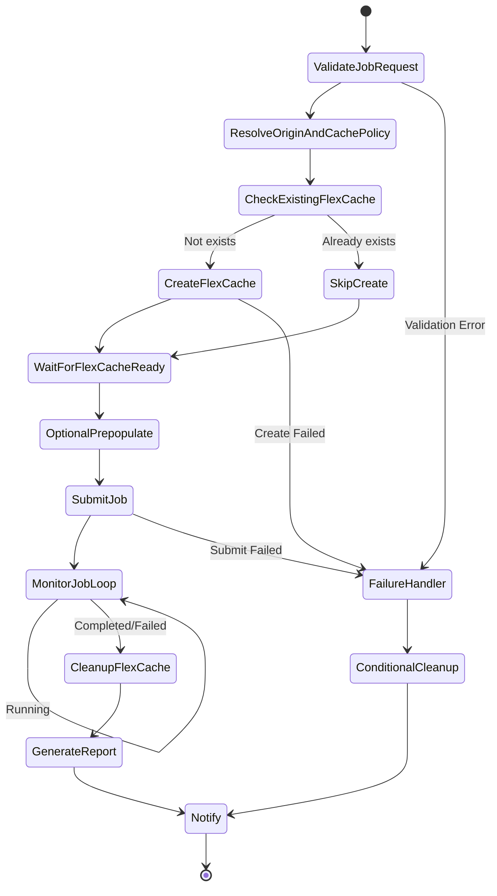

# Dynamic FlexCache Render / EDA Workflow

🌐 **Language / 言語**: [日本語](README.md) | [English](README.en.md)

## 概要

レンダリング/EDA/シミュレーションジョブの投入時に ONTAP REST API で FlexCache ボリュームを動的に作成し、ジョブ完了後に自動削除するワークフロー。NVIDIA 型のジョブ単位キャッシュ管理パターンを AWS Step Functions で実装する。

## なぜジョブ単位に FlexCache を作るのか

| 理由 | 説明 |
|------|------|
| コスト最適化 | ジョブ実行時のみストレージコストが発生 |
| データ分離 | プロジェクト/ジョブ単位でキャッシュを分離 |
| セキュリティ | ジョブ完了後にデータが残らない |
| 運用簡素化 | orphan volume の発生を防止 |
| 性能最適化 | ジョブに必要なデータのみ prepopulate |

## ジョブ終了後に FlexCache を消す理由

- **コスト**: 不要なストレージ容量の課金を回避
- **セキュリティ**: 機密データのキャッシュ残留を防止
- **容量管理**: アグリゲート容量の枯渇を防止
- **運用**: orphan volume の蓄積を防止

## アーキテクチャ



## ユーザーポータルの役割

ユーザーポータル（API Gateway HTTP API）は以下を提供:
- ジョブリクエストの受付（JSON ペイロード）
- ジョブ状態の照会
- FlexCache 状態の確認
- レポートの取得

## ONTAP REST API の役割

- FlexCache 作成: `POST /api/storage/flexcache/flexcaches`
- FlexCache 削除: `DELETE /api/storage/flexcache/flexcaches/{uuid}`
- ジョブ監視: `GET /api/cluster/jobs/{uuid}`
- Prepopulate: `PATCH /api/storage/flexcache/flexcaches/{uuid}`

## FSx for ONTAP S3 AP の役割

- ジョブ実行中のデータ読み取り（Lambda 経由）
- ジョブ結果の分析・レポート生成
- メタデータ抽出・品質チェック

## ディレクトリ構成

```
dynamic-flexcache-render-workflow/
├── README.md
├── template.yaml                      # CloudFormation テンプレート
├── src/
│   ├── portal_api/handler.py          # ジョブリクエスト受付 API
│   ├── create_flexcache/handler.py    # FlexCache 作成 Lambda
│   ├── submit_job/handler.py          # ジョブ投入 Lambda
│   ├── monitor_job/handler.py         # ジョブ監視 Lambda
│   ├── cleanup_flexcache/handler.py   # FlexCache 削除 Lambda
│   └── report/handler.py             # レポート生成 Lambda
├── events/
│   ├── sample-render-job-request.json
│   ├── sample-eda-job-request.json
│   └── sample-cleanup-request.json
├── tests/
│   ├── test_create_flexcache.py
│   ├── test_cleanup_flexcache.py
│   └── test_monitor_job.py
└── docs/
    ├── architecture.md
    ├── workflow-design.md
    ├── ontap-rest-api-design.md
    ├── poc-checklist.md
    ├── demo-guide.md
    ├── failure-handling.md
    ├── security-design.md
    └── cost-optimization.md
```

## クイックスタート

### デプロイ

```bash
aws cloudformation deploy \
  --template-file dynamic-flexcache-render-workflow/template.yaml \
  --stack-name dynamic-flexcache-workflow-demo \
  --capabilities CAPABILITY_IAM \
  --parameter-overrides \
    OntapManagementIp=10.0.0.1 \
    OntapSecretName=fsxn/ontap-credentials \
    OriginSvmName=svm1 \
    OriginVolumeName=render_assets \
    CacheSvmName=svm1 \
    SimulationMode=true
```

### ジョブ投入

```bash
aws stepfunctions start-execution \
  --state-machine-arn <STATE_MACHINE_ARN> \
  --input file://events/sample-render-job-request.json
```

## コスト最適化

- ジョブ実行時のみ FlexCache が存在 → ストレージコスト最小化
- Prepopulate 対象を必要ディレクトリに限定
- orphan FlexCache の定期検出・削除
- Lambda/Step Functions の実行コストのみ（サーバーレス）

## セキュリティ

- Secrets Manager で ONTAP 認証情報を管理
- IAM least privilege
- ONTAP RBAC 最小権限ロール
- ジョブ完了後のデータ自動削除
- TLS 検証デフォルト有効

## 将来拡張

- AWS Deadline Cloud 連携
- AWS Batch 連携
- IBM Spectrum LSF 連携
- Slurm 連携
- EDA regression scheduler 連携

## 関連リンク

- [FlexCache AnyCast / DR パターン](../flexcache-anycast-dr/README.md)
- [サポートマトリックス](../docs/support-matrix-fsx-ontap-flexcache-s3ap.md)
- [業界・ワークロード マッピング](../docs/industry-workload-mapping.md)
- [media-vfx/](../media-vfx/README.md)
- [semiconductor-eda/](../semiconductor-eda/README.md)


## Success Metrics

### Outcome
ジョブ単位の FlexCache 動的作成・削除により、レンダリング/EDA ワークフローの I/O 競合を回避し、コスト最適化を実現する。

### Metrics
| メトリクス | 目標値（例） |
|-----------|------------|
| FlexCache 作成時間 | < 30 seconds |
| ジョブ完了時間の短縮 | > 20% |
| FlexCache 削除成功率 | 100% |
| コスト / ジョブ | 従来比 30% 削減 |
| Human Review 対象率 | N/A（自動化パターン） |

### Measurement Method
Step Functions 実行履歴、ONTAP REST API レスポンス、CloudWatch Metrics、コスト比較。
