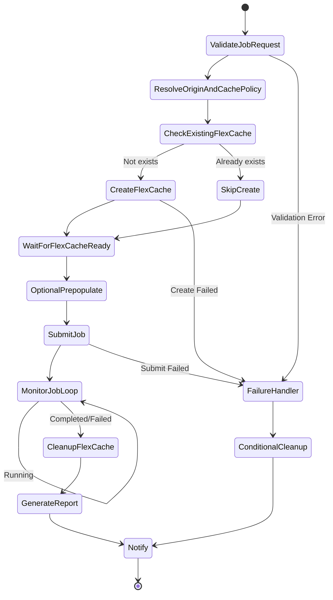

# Dynamic FlexCache Render / EDA Workflow

🌐 **Language / 言語**: [日本語](README.md) | [English](README.en.md) | [한국어](README.ko.md) | [简体中文](README.zh-CN.md)

## 概要

レンダリング/EDA/シミュレーションジョブの投入時に ONTAP REST API で FlexCache ボリュームを動的に作成し、ジョブ完了後に自動削除するワークフロー。NVIDIA 型のジョブ単位キャッシュ管理パターンを AWS Step Functions で実装する。

## なぜジョブ単位に FlexCache を作るのか

| 理由 | 説明 |
|------|------|
| コスト最適化 | ジョブ実行時のみストレージコストが発生 |
| データ分離 | プロジェクト/ジョブ単位でキャッシュを分離 |
| セキュリティ | ジョブ完了後にデータが残らない |
| 運用簡素化 | orphan volume の発生を防止 |
| 性能最適化 | ジョブに必要なデータのみ prepopulate |

## ジョブ終了後に FlexCache を消す理由

- **コスト**: 不要なストレージ容量の課金を回避
- **セキュリティ**: 機密データのキャッシュ残留を防止
- **容量管理**: アグリゲート容量の枯渇を防止
- **運用**: orphan volume の蓄積を防止

## アーキテクチャ



## ユーザーポータルの役割

ユーザーポータル（API Gateway HTTP API）は以下を提供:
- ジョブリクエストの受付（JSON ペイロード）
- ジョブ状態の照会
- FlexCache 状態の確認
- レポートの取得

## ONTAP REST API の役割

- FlexCache 作成: `POST /api/storage/flexcache/flexcaches`
- FlexCache 削除: `DELETE /api/storage/flexcache/flexcaches/{uuid}`
- ジョブ監視: `GET /api/cluster/jobs/{uuid}`
- Prepopulate: `PATCH /api/storage/flexcache/flexcaches/{uuid}`

## FSx for ONTAP S3 AP の役割

- ジョブ実行中のデータ読み取り（Lambda 経由）
- ジョブ結果の分析・レポート生成
- メタデータ抽出・品質チェック

## ディレクトリ構成

```
dynamic-flexcache-render-workflow/
├── README.md
├── template.yaml                      # CloudFormation テンプレート
├── src/
│   ├── portal_api/handler.py          # ジョブリクエスト受付 API
│   ├── create_flexcache/handler.py    # FlexCache 作成 Lambda
│   ├── submit_job/handler.py          # ジョブ投入 Lambda
│   ├── monitor_job/handler.py         # ジョブ監視 Lambda
│   ├── cleanup_flexcache/handler.py   # FlexCache 削除 Lambda
│   └── report/handler.py             # レポート生成 Lambda
├── events/
│   ├── sample-render-job-request.json
│   ├── sample-eda-job-request.json
│   └── sample-cleanup-request.json
├── tests/
│   ├── test_create_flexcache.py
│   ├── test_cleanup_flexcache.py
│   └── test_monitor_job.py
└── docs/
    ├── architecture.md
    ├── workflow-design.md
    ├── ontap-rest-api-design.md
    ├── poc-checklist.md
    ├── demo-guide.md
    ├── failure-handling.md
    ├── security-design.md
    └── cost-optimization.md
```

## クイックスタート

### デプロイ

```bash
aws cloudformation deploy \
  --template-file dynamic-flexcache-render-workflow/template.yaml \
  --stack-name dynamic-flexcache-workflow-demo \
  --capabilities CAPABILITY_IAM \
  --parameter-overrides \
    OntapManagementIp=10.0.0.1 \
    OntapSecretName=fsxn/ontap-credentials \
    OriginSvmName=svm1 \
    OriginVolumeName=render_assets \
    CacheSvmName=svm1 \
    SimulationMode=true
```

### ジョブ投入

```bash
aws stepfunctions start-execution \
  --state-machine-arn <STATE_MACHINE_ARN> \
  --input file://events/sample-render-job-request.json
```

## コスト最適化

- ジョブ実行時のみ FlexCache が存在 → ストレージコスト最小化
- Prepopulate 対象を必要ディレクトリに限定
- orphan FlexCache の定期検出・削除
- Lambda/Step Functions の実行コストのみ（サーバーレス）

## セキュリティ

- Secrets Manager で ONTAP 認証情報を管理
- IAM least privilege
- ONTAP RBAC 最小権限ロール
- ジョブ完了後のデータ自動削除
- TLS 検証デフォルト有効

## 将来拡張

- AWS Deadline Cloud 連携
- AWS Batch 連携
- IBM Spectrum LSF 連携
- Slurm 連携
- EDA regression scheduler 連携

## 関連リンク

- [FlexCache AnyCast / DR パターン](../flexcache-anycast-dr/README.md)
- [サポートマトリックス](../docs/support-matrix-fsx-ontap-flexcache-s3ap.md)
- [業界・ワークロード マッピング](../docs/industry-workload-mapping.md)
- [media-vfx/](../media-vfx/README.md)
- [semiconductor-eda/](../semiconductor-eda/README.md)


## Success Metrics

### Outcome
ジョブ単位の FlexCache 動的作成・削除により、レンダリング/EDA ワークフローの I/O 競合を回避し、コスト最適化を実現する。

### Metrics
| メトリクス | 目標値（例） |
|-----------|------------|
| FlexCache 作成時間 | < 30 seconds |
| ジョブ完了時間の短縮 | > 20% |
| FlexCache 削除成功率 | 100% |
| コスト / ジョブ | 従来比 30% 削減 |
| Human Review 対象率 | N/A（自動化パターン） |

### Measurement Method
Step Functions 実行履歴、ONTAP REST API レスポンス、CloudWatch Metrics、コスト比較。


---

## コスト見積もり（月額概算）

> **注記**: 以下は ap-northeast-1 リージョンの概算であり、実際のコストは使用量により異なります。最新の料金は [AWS Pricing Calculator](https://calculator.aws/) で確認してください。

### サーバーレスコンポーネント（従量課金）

| サービス | 単価 | 想定使用量 | 月額概算 |
|---------|------|-----------|---------|
| Lambda | $0.0000166667/GB-sec | 4 関数 × 10 jobs/日 | ~$1-5 |
| S3 API (GetObject/ListObjects) | $0.0047/10K requests | ~10K requests/日 | ~$1.5 |
| Step Functions | $0.025/1K state transitions | ~1K transitions/日 | ~$0.75 |
| Bedrock (Nova Lite) | $0.00006/1K input tokens | N/A | ~$3-10 |
| Athena | $5/TB scanned | N/A | ~$0.5-2 |
| SNS | $0.50/100K notifications | ~100 notifications/日 | ~$0.15 |
| CloudWatch Logs | $0.76/GB ingested | ~1 GB/月 | ~$0.76 |
| FlexCache ボリューム | FSx ONTAP ストレージ料金に含む |


### 固定コスト（FSx for ONTAP — 既存環境前提）

| コンポーネント | 月額 |
|--------------|------|
| FSx ONTAP (128 MBps, 1 TB) | ~$230 (既存環境を共有) |
| S3 Access Point | 追加料金なし（S3 API 料金のみ） |

### 合計概算

| 構成 | 月額概算 |
|------|---------|
| 最小構成（日次 1 回実行） | ~$5-15 |
| 標準構成（時次実行） | ~$15-50 |
| 大規模構成（高頻度 + アラーム） | ~$50-150 |

> **Governance Caveat**: コスト見積もりは概算であり、保証値ではありません。実際の請求額は使用パターン、データ量、リージョンにより異なります。

---

## ローカルテスト

### Prerequisites チェック

```bash
# 前提条件の確認
aws --version          # AWS CLI v2
sam --version          # SAM CLI
python3 --version      # Python 3.9+
docker --version       # Docker (sam local 用)
aws sts get-caller-identity  # AWS 認証情報
```

### sam local invoke

```bash
# ビルド
sam build

# Discovery Lambda のローカル実行
sam local invoke DiscoveryFunction --event events/discovery-event.json

# 環境変数オーバーライド付き
sam local invoke DiscoveryFunction \
  --event events/discovery-event.json \
  --env-vars env.json
```

### ユニットテスト

```bash
python3 -m pytest tests/ -v
```

詳細は [ローカルテスト クイックスタート](../docs/local-testing-quick-start.md) を参照してください。

---

## 出力サンプル (Output Sample)

FlexCache 動的プロビジョニング + レンダリングジョブの出力例:

```json
{
  "flexcache_provision": {
    "cache_name": "render-job-2026-0523-001",
    "origin_volume": "vfx-assets-vol1",
    "cache_size_gb": 100,
    "status": "online",
    "provision_time_sec": 45
  },
  "job_execution": {
    "job_id": "render-2026-0523-001",
    "frames_total": 240,
    "frames_completed": 240,
    "status": "completed",
    "duration_sec": 1800
  },
  "cleanup": {
    "cache_deleted": true,
    "cleanup_time_sec": 12
  },
  "cost_estimate": {
    "cache_hours": 0.5,
    "estimated_cost_usd": 0.15
  }
}
```

> **注記**: 上記はサンプル出力であり、実際の値は環境・入力データにより異なります。ベンチマーク数値は sizing reference であり、service limit ではありません。

---

## Performance Considerations

- FSx for ONTAP のスループットキャパシティは NFS/SMB/S3AP で共有されます
- S3 Access Point 経由のレイテンシは数十ミリ秒のオーバーヘッドが発生します
- 大量ファイル処理時は Step Functions Map state の MaxConcurrency で並列度を制御してください
- Lambda メモリサイズの増加はネットワーク帯域幅の向上にも寄与します

> **注記**: 本パターンのパフォーマンス数値は sizing reference であり、service limit ではありません。実環境での性能は FSx ONTAP スループットキャパシティ、ネットワーク構成、同時実行ワークロードにより異なります。

---

## Governance Note

> 本パターンは技術アーキテクチャガイダンスを提供します。法的・コンプライアンス・規制上の助言ではありません。組織は適格な専門家に相談してください。
