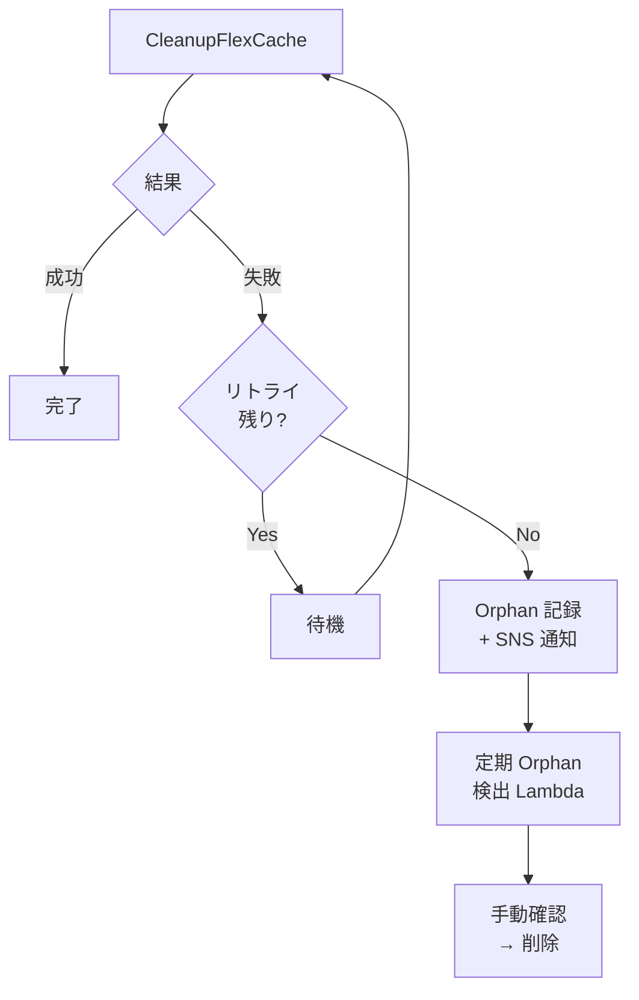

# Dynamic FlexCache Workflow — 障害ハンドリング

## 障害パターンと対応

### 1. FlexCache 作成失敗

| 原因 | 検出方法 | 対応 |
|------|---------|------|
| アグリゲート容量不足 | ONTAP job failure | SNS 通知、ジョブ中止 |
| Origin volume 不存在 | 404 レスポンス | SNS 通知、ジョブ中止 |
| SVM 不存在 | 404 レスポンス | SNS 通知、ジョブ中止 |
| ネットワーク到達不可 | タイムアウト | リトライ（最大2回） |
| ONTAP 内部エラー | 500 レスポンス | リトライ（最大2回） |

**Step Functions 設定**:
```json
{
  "Retry": [
    {
      "ErrorEquals": ["States.TaskFailed"],
      "IntervalSeconds": 15,
      "MaxAttempts": 2,
      "BackoffRate": 2.0
    }
  ],
  "Catch": [
    {
      "ErrorEquals": ["States.ALL"],
      "Next": "FailureHandler"
    }
  ]
}
```

### 2. ONTAP REST API タイムアウト

| 原因 | 対応 |
|------|------|
| 管理 IP 到達不可 | VPC/SG 確認、リトライ |
| ONTAP 高負荷 | バックオフ付きリトライ |
| ネットワーク遅延 | タイムアウト値調整 |

### 3. ONTAP Job 失敗

```python
# ジョブ失敗時の処理
job = client.get(f"/cluster/jobs/{job_uuid}")
if job["state"] == "failure":
    error_message = job.get("message", "Unknown error")
    # 失敗理由に応じた対応
    if "space" in error_message.lower():
        # 容量不足 → リトライ不可
        raise NonRetryableError(error_message)
    elif "busy" in error_message.lower():
        # リソースビジー → リトライ可能
        raise RetryableError(error_message)
```

### 4. ジョブスケジューラ失敗

モックジョブの場合は Lambda 内で完結するため失敗は少ないが、将来の実ジョブスケジューラ連携時:

| スケジューラ | 失敗検出 | 対応 |
|-------------|---------|------|
| AWS Batch | Job status FAILED | CleanupFlexCache → Report |
| Deadline Cloud | Task status FAILED | CleanupFlexCache → Report |
| Slurm | sacct exit code != 0 | CleanupFlexCache → Report |

### 5. ジョブ途中失敗

- ジョブが RUNNING 中に失敗した場合
- MonitorJob Lambda が FAILED を検出
- Step Functions の Choice State で CleanupFlexCache に遷移
- `CleanupOnFailure=true` の場合は FlexCache を削除

### 6. Cleanup 失敗



### 7. Lambda リトライによる重複作成

**防止策**: 冪等性設計
- job_id から FlexCache 名を一意に決定
- 作成前に同名 FlexCache の存在チェック
- 存在する場合は `status: already_exists` を返す

### 8. Step Functions 再実行

- 同じ入力で再実行しても安全（冪等性）
- FlexCache が既に存在 → スキップ
- FlexCache が既に削除 → スキップ
- ジョブが既に完了 → 即座に CleanupFlexCache へ

## Rollback 方針

| フェーズ | Rollback アクション |
|---------|-------------------|
| FlexCache 作成後、ジョブ投入前 | FlexCache 削除 |
| ジョブ投入後、実行中 | ジョブキャンセル → FlexCache 削除 |
| ジョブ完了後、Cleanup 前 | FlexCache 削除（通常フロー） |
| Cleanup 失敗 | Orphan 記録 → 定期削除 |

## Orphan Volume 検出

### 定期実行 Lambda

```python
def detect_and_cleanup_orphans():
    """Orphan FlexCache の検出と削除"""
    # 1. 全 dynamic FlexCache を列挙
    all_caches = client.list_flexcaches()
    dynamic = [c for c in all_caches if c["name"].startswith("dyn_cache_")]
    
    # 2. 各キャッシュのジョブ状態を確認
    for cache in dynamic:
        job_id = extract_job_id(cache["name"])
        job_status = get_job_status(job_id)  # DynamoDB から
        
        if job_status in ("COMPLETED", "FAILED", None):
            # ジョブ完了/失敗/不明 → orphan
            age_hours = get_cache_age_hours(cache)
            if age_hours > 2:  # 2時間以上経過
                client.delete_flexcache(uuid=cache["uuid"])
                notify_orphan_cleanup(cache["name"])
```

### CloudWatch アラーム

```yaml
OrphanFlexCacheAlarm:
  Type: AWS::CloudWatch::Alarm
  Properties:
    AlarmName: OrphanFlexCache-Detected
    MetricName: OrphanFlexCacheCount
    Namespace: Custom/FlexCache
    Statistic: Maximum
    Period: 3600
    EvaluationPeriods: 1
    Threshold: 0
    ComparisonOperator: GreaterThanThreshold
```
