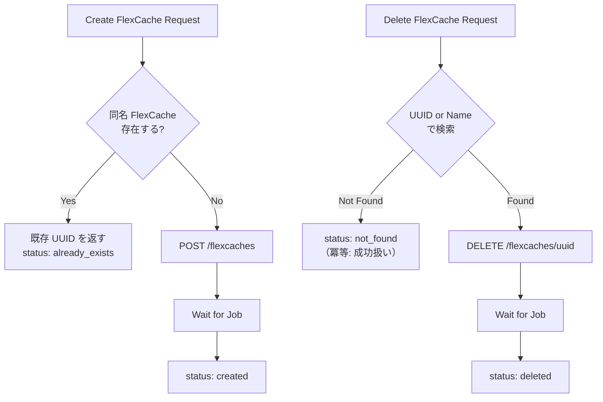

# ONTAP REST API 設計 — Dynamic FlexCache Workflow

## FlexCache 作成

### エンドポイント
```
POST /api/storage/flexcache/flexcaches
```

### リクエスト例
```json
{
  "name": "dyn_cache_render_001",
  "svm": {"name": "svm1"},
  "origins": [
    {
      "volume": {"name": "render_assets"},
      "svm": {"name": "svm1"}
    }
  ],
  "size": 214748364800,
  "path": "/cache/dyn_cache_render_001",
  "aggregates": [{"name": "aggr1"}],
  "prepopulate": {
    "dir_paths": ["/scene01/textures/", "/scene01/geo/"]
  }
}
```

### レスポンス例（成功）
```json
{
  "job": {
    "uuid": "a1b2c3d4-e5f6-7890-abcd-ef1234567890",
    "_links": {
      "self": {"href": "/api/cluster/jobs/a1b2c3d4-e5f6-7890-abcd-ef1234567890"}
    }
  }
}
```

### HTTP ステータスコード

| コード | 意味 | リトライ可否 |
|--------|------|:---:|
| 202 | Accepted（非同期ジョブ開始） | - |
| 400 | Bad Request（パラメータ不正） | ❌ |
| 404 | Origin volume/SVM not found | ❌ |
| 409 | Conflict（同名 volume 存在） | ❌（冪等性チェックで回避） |
| 500 | Internal Server Error | ✅ |
| 503 | Service Unavailable | ✅ |

## FlexCache 削除

### エンドポイント
```
DELETE /api/storage/flexcache/flexcaches/{uuid}
```

### レスポンス例（成功）
```json
{
  "job": {
    "uuid": "b2c3d4e5-f6a7-8901-bcde-f12345678901",
    "_links": {
      "self": {"href": "/api/cluster/jobs/b2c3d4e5-f6a7-8901-bcde-f12345678901"}
    }
  }
}
```

### HTTP ステータスコード

| コード | 意味 | リトライ可否 |
|--------|------|:---:|
| 202 | Accepted（非同期ジョブ開始） | - |
| 404 | Not Found（既に削除済み） | ❌（成功扱い=冪等） |
| 409 | Conflict（volume busy） | ✅（待機後リトライ） |
| 500 | Internal Server Error | ✅ |

## ジョブ監視

### エンドポイント
```
GET /api/cluster/jobs/{uuid}
```

### レスポンス例
```json
{
  "uuid": "a1b2c3d4-e5f6-7890-abcd-ef1234567890",
  "state": "success",
  "message": "FlexCache \"dyn_cache_render_001\" created successfully.",
  "start_time": "2026-05-18T10:00:00Z",
  "end_time": "2026-05-18T10:00:45Z"
}
```

### ジョブ状態

| state | 意味 | アクション |
|-------|------|-----------|
| queued | キュー待ち | ポーリング継続 |
| running | 実行中 | ポーリング継続 |
| success | 成功 | 次のステップへ |
| failure | 失敗 | エラーハンドリング |

## FlexCache 検索

### エンドポイント
```
GET /api/storage/flexcache/flexcaches?name={name}&svm.name={svm_name}
```

### 用途
- 冪等性チェック（作成前に既存確認）
- UUID 取得（削除時に名前から UUID を解決）
- Orphan 検出（ジョブ完了後に残存確認）

## 冪等性設計



## Cleanup 設計

### 正常系
1. ジョブ完了 → CleanupFlexCache Lambda 呼び出し
2. FlexCache UUID で削除リクエスト
3. 非同期ジョブ完了待ち
4. 成功レポート

### 異常系
1. 削除リクエスト失敗 → リトライ（最大3回、バックオフ付き）
2. 404 レスポンス → 成功扱い（既に削除済み）
3. 409 Conflict → 待機後リトライ（volume busy）
4. 全リトライ失敗 → SNS 通知 + orphan として記録

### Orphan 検出
```python
# 定期実行 Lambda で orphan 検出
def detect_orphans(client, prefix="dyn_cache_"):
    all_caches = client.list_flexcaches()
    dynamic_caches = [c for c in all_caches if c["name"].startswith(prefix)]
    # DynamoDB のジョブテーブルと照合
    # 完了/失敗ジョブのキャッシュが残っていれば orphan
```

## タイムアウト設計

| 操作 | タイムアウト | 備考 |
|------|------------|------|
| FlexCache 作成 | 180秒 | サイズ・prepopulate に依存 |
| FlexCache 削除 | 120秒 | 通常は数十秒 |
| ジョブポーリング間隔 | 5秒 | |
| ONTAP REST API 接続 | 10秒 | |
| ONTAP REST API 読み取り | 30秒 | |

## セキュリティ設計

- **認証**: Secrets Manager から Basic Auth 認証情報を取得
- **TLS**: デフォルト有効（verify_ssl=True）
- **RBAC**: FlexCache 操作に必要な最小権限ロール
  ```
  security login role create -role flexcache_operator \
    -cmddirname "volume flexcache" -access all
  security login role create -role flexcache_operator \
    -cmddirname "volume show" -access readonly
  ```
