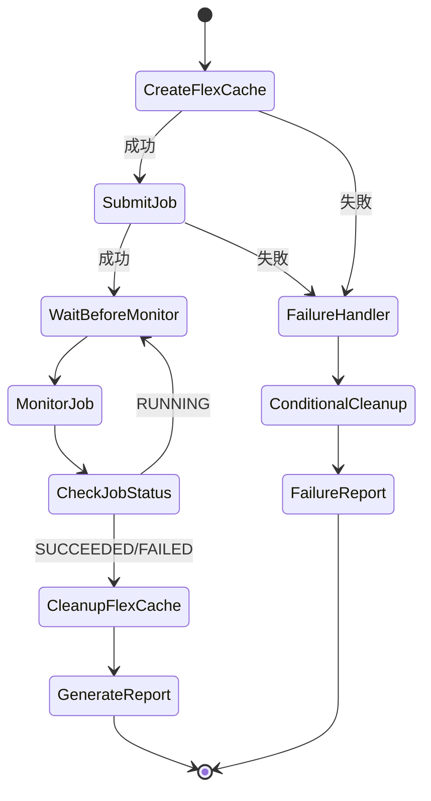
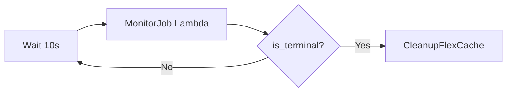

# Dynamic FlexCache Render/EDA Workflow — ワークフロー設計

## Step Functions ステートマシン設計



## ステート詳細

### CreateFlexCache

| 項目 | 値 |
|------|-----|
| Type | Task |
| Resource | CreateFlexCacheFunction |
| Timeout | 300秒 |
| Retry | 2回、15秒間隔、BackoffRate 2.0 |
| Catch | FailureHandler |

**入力**:
```json
{
  "job_id": "render-001",
  "origin_volume": "render_assets",
  "origin_svm": "svm1",
  "cache_svm": "svm1",
  "size_gb": 200,
  "prepopulate_dirs": ["/scene01/"]
}
```

**出力** (`$.flexcache_status`):
```json
{
  "status": "created",
  "cache_name": "dyn_cache_render_001",
  "cache_uuid": "uuid-xxx",
  "junction_path": "/cache/dyn_cache_render_001"
}
```

### SubmitJob

| 項目 | 値 |
|------|-----|
| Type | Task |
| Resource | SubmitJobFunction |
| Timeout | 60秒 |

**入力**: job_id, job_type, project, cache_name, junction_path, parameters

**出力** (`$.job_status`):
```json
{
  "status": "submitted",
  "mock_job_id": "mock-render-001-xxx",
  "submitted_at": 1234567890,
  "expected_completion_at": 1234567920
}
```

### MonitorJob (ポーリングループ)



| 項目 | 値 |
|------|-----|
| Type | Task |
| Resource | MonitorJobFunction |
| Retry | 3回、5秒間隔 |

### CleanupFlexCache

| 項目 | 値 |
|------|-----|
| Type | Task |
| Resource | CleanupFlexCacheFunction |
| Retry | 3回、10秒間隔、BackoffRate 2.0 |

**冪等性保証**:
- 既に削除済み (404) → 成功扱い
- cache_name/uuid なし → スキップ

### FailureHandler

ジョブ投入前の失敗時にも FlexCache を確実に削除する。

```json
{
  "cache_name": "$.flexcache_status.cache_name",
  "cache_uuid": "$.flexcache_status.cache_uuid",
  "job_id": "$.job_id",
  "force": true
}
```

## エラーハンドリング戦略

| フェーズ | エラー | 対応 |
|---------|--------|------|
| CreateFlexCache | API エラー | リトライ → FailureHandler |
| CreateFlexCache | タイムアウト | FailureHandler（cleanup 不要） |
| SubmitJob | 投入失敗 | FailureHandler（FlexCache 削除） |
| MonitorJob | ポーリング失敗 | リトライ（3回） |
| MonitorJob | ジョブ FAILED | CleanupFlexCache → Report |
| CleanupFlexCache | 削除失敗 | リトライ（3回）→ SNS 通知 |

## データフロー

```
Input Event
  ├── job_id, job_type, project
  ├── origin_volume, origin_svm, cache_svm
  ├── size_gb, prepopulate_dirs
  └── parameters (simulate_failure, simulate_duration_seconds)

Step 1: CreateFlexCache
  └── $.flexcache_status = {cache_name, cache_uuid, junction_path}

Step 2: SubmitJob
  └── $.job_status = {mock_job_id, submitted_at, expected_completion_at}

Step 3: MonitorJob (loop)
  └── $.monitor_result = {status, is_terminal, is_success}

Step 4: CleanupFlexCache
  └── $.cleanup_status = {status: deleted/not_found}

Step 5: GenerateReport
  └── $.report_result = {report_key}
```
