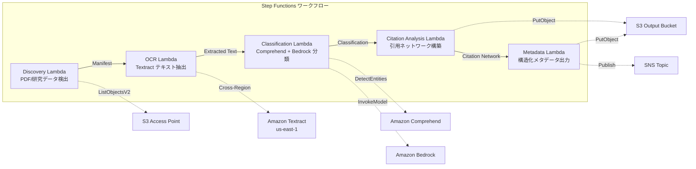

# UC13: Bildung / Forschung — Automatische Klassifizierung von Artikel-PDFs und Analyse von Zitatnetzwerken

🌐 **Language / 言語**: [日本語](README.md) | [English](README.en.md) | [한국어](README.ko.md) | [简体中文](README.zh-CN.md) | [繁體中文](README.zh-TW.md) | [Français](README.fr.md) | Deutsch | [Español](README.es.md)

## Übersicht
Dies ist ein serverloser Workflow, der S3 Access Points von FSx for NetApp ONTAP nutzt, um die automatische Klassifizierung von Zeitschriften-PDFs, die Analyse von Zitationsnetzwerken und die Extraktion von Forschungsdaten-Metadaten zu automatisieren.
### Fälle, in denen dieses Muster geeignet ist
- Zahlreiche Forschungsdaten und PDFs von wissenschaftlichen Arbeiten sind auf FSx ONTAP gespeichert.
- Die Textextraktion von wissenschaftlichen PDFs mit Textract soll automatisiert werden.
- Es ist eine Themenerkennung und Extraktion von Entitäten (Autoren, Institutionen, Schlüsselwörter) mit Comprehend erforderlich.
- Die Analyse von Zitationsbeziehungen und der automatische Aufbau eines Zitationsnetzwerks (Adjazenzliste) ist notwendig.
- Die automatische Generierung einer Klassifizierung von Forschungsdomänen und strukturierter Abstractsequenzen wird angestrebt.
### Fälle, für die dieses Muster nicht geeignet ist
- Eine Echtzeit-Literatursuchmaschine ist erforderlich (OpenSearch / Elasticsearch ist geeignet)
- Eine vollständige Zitationsdatenbank (CrossRef / Semantic Scholar API ist geeignet)
- Feinabstimmung eines großen Natural Language Processing-Modells erforderlich
- Umgebungen, in denen keine Netzwerkreichweite zur ONTAP REST API möglich ist
### Hauptfunktionen
- Automatische Erkennung von Artikel-PDFs (.pdf) und Forschungsdaten (.csv,.json,.xml) über S3 AP
- PDF-Textextraktion mit Textract (Cross-Region)
- Themenerkennung und Entitätsextraktion mit Comprehend
- Klassifizierung von Forschungsdomänen und Generierung strukturierter Abstraktsummarien mit Bedrock
- Analyse von Zitatbeziehungen und Erstellung von Zitationsnachbarlisten aus dem Literaturverzeichnis
- Ausgabe der strukturierten Metadaten (title, authors, classification, keywords, citation_count) für jeden Artikel
## Architektur



### Workflow-Schritte
1. **Discovery**: .pdf,.csv,.json,.xml Dateien von S3 AP erkennen
2. **OCR**: Textract (Cross-Region) zum Textextrahieren aus PDF
3. **Classification**: Entitätenextraktion mit Comprehend, Forschungsdomänenklassifizierung mit Bedrock
4. **Citation Analysis**: Analyse von Zitationsbeziehungen aus Literaturverzeichnissen und Aufbau einer Adjazenzliste
5. **Metadata**: Strukturierte Metadaten für jede Publikation in JSON an S3 ausgeben
## Voraussetzungen
- AWS-Konto und geeignete IAM-Berechtigungen
- FSx for NetApp ONTAP-Dateisysteme (ONTAP 9.17.1P4D3 oder höher)
- S3-Zugriffspunkt aktivierte Volumes (zum Speichern von Artikel-PDFs und Forschungsdaten)
- VPC, private Subnetze
- Amazon Bedrock-Modellzugriff aktiviert (Claude / Nova)
- **Cross-Region**: Da Textract ap-northeast-1 nicht unterstützt, ist ein Cross-Region-Aufruf nach us-east-1 erforderlich
## Bereitstellungsschritte

### 1. Überprüfung der standortübergreifenden Parameter
Textract wird in der Tokyo-Region nicht unterstützt, daher wird der Cross-Region-Aufruf mit dem Parameter `CrossRegionTarget` eingerichtet.
### 2. CloudFormation-Bereitstellung

```bash
aws cloudformation deploy \
  --template-file education-research/template.yaml \
  --stack-name fsxn-education-research \
  --parameter-overrides \
    S3AccessPointAlias=<your-volume-ext-s3alias> \
    S3AccessPointName=<your-s3ap-name> \
    VpcId=<your-vpc-id> \
    PrivateSubnetIds=<subnet-1>,<subnet-2> \
    ScheduleExpression="rate(1 hour)" \
    NotificationEmail=<your-email@example.com> \
    CrossRegionTarget=us-east-1 \
    EnableVpcEndpoints=false \
    EnableCloudWatchAlarms=false \
  --capabilities CAPABILITY_IAM CAPABILITY_AUTO_EXPAND \
  --region ap-northeast-1
```

## Liste der Konfigurationsparameter

| パラメータ | 説明 | デフォルト | 必須 |
|-----------|------|----------|------|
| `S3AccessPointAlias` | FSx ONTAP S3 AP Alias（入力用） | — | ✅ |
| `S3AccessPointName` | S3 AP 名（ARN ベースの IAM 権限付与用。省略時は Alias ベースのみ） | `""` | ⚠️ 推奨 |
| `ScheduleExpression` | EventBridge Scheduler のスケジュール式 | `rate(1 hour)` | |
| `VpcId` | VPC ID | — | ✅ |
| `PrivateSubnetIds` | プライベートサブネット ID リスト | — | ✅ |
| `NotificationEmail` | SNS 通知先メールアドレス | — | ✅ |
| `CrossRegionTarget` | Textract のターゲットリージョン | `us-east-1` | |
| `MapConcurrency` | Map ステートの並列実行数 | `10` | |
| `LambdaMemorySize` | Lambda メモリサイズ (MB) | `512` | |
| `LambdaTimeout` | Lambda タイムアウト (秒) | `300` | |
| `EnableVpcEndpoints` | Interface VPC Endpoints の有効化 | `false` | |
| `EnableCloudWatchAlarms` | CloudWatch Alarms の有効化 | `false` | |
| `EnableSnapStart` | Lambda SnapStart aktivieren (Kaltstart-Reduzierung) | `false` | |

## Bereinigung

```bash
aws s3 rm s3://fsxn-education-research-output-${AWS_ACCOUNT_ID} --recursive

aws cloudformation delete-stack \
  --stack-name fsxn-education-research \
  --region ap-northeast-1

aws cloudformation wait stack-delete-complete \
  --stack-name fsxn-education-research \
  --region ap-northeast-1
```

## Unterstützte Regionen
UC13 verwendet die folgenden Dienste:
| サービス | リージョン制約 |
|---------|-------------|
| Amazon Textract | ap-northeast-1 非対応。`TEXTRACT_REGION` パラメータで対応リージョン（us-east-1 等）を指定 |
| Amazon Comprehend | ほぼ全リージョンで利用可能 |
| Amazon Bedrock | 対応リージョンを確認（[Bedrock 対応リージョン](https://docs.aws.amazon.com/general/latest/gr/bedrock.html)） |
| AWS X-Ray | ほぼ全リージョンで利用可能 |
| CloudWatch EMF | ほぼ全リージョンで利用可能 |
> Rufen Sie die Textract API über den Cross-Region Client auf. Überprüfen Sie die Datenresidenzanforderungen. Weitere Informationen finden Sie in der [Regionskompatibilitätsmatrix](../docs/region-compatibility.md).
## Referenzlinks
- [FSx ONTAP S3 Access Points 概要](https://docs.aws.amazon.com/fsx/latest/ONTAPGuide/accessing-data-via-s3-access-points.html)
- [Amazon Textract-Dokumentation](https://docs.aws.amazon.com/textract/latest/dg/what-is.html)
- [Amazon Comprehend-Dokumentation](https://docs.aws.amazon.com/comprehend/latest/dg/what-is.html)
- [Amazon Bedrock API-Referenz](https://docs.aws.amazon.com/bedrock/latest/APIReference/API_runtime_InvokeModel.html)