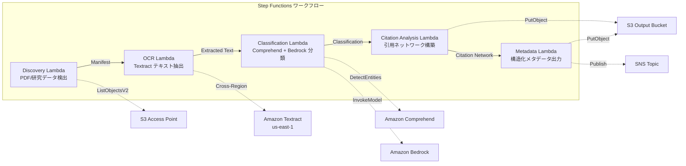

# UC13: Education / Research — Automatic Classification of Paper PDFs and Citation Network Analysis

🌐 **Language / 言語**: [日本語](README.md) | English | [한국어](README.ko.md) | [简体中文](README.zh-CN.md) | [繁體中文](README.zh-TW.md) | [Français](README.fr.md) | [Deutsch](README.de.md) | [Español](README.es.md)

📚 **Documentation**: [Architecture Diagram](docs/architecture.en.md) | [Demo Guide](docs/demo-guide.en.md)

## Overview
Leveraging S3 Access Points for Amazon FSx for NetApp ONTAP, this is a serverless workflow that automates the classification of paper PDFs, citation network analysis, and extraction of research data metadata.
### When this pattern is suitable
- Numerous research papers in PDF format and research data are stored on FSx for NetApp ONTAP.
- We want to automate the text extraction of research paper PDFs using Textract.
- Topic detection and entity extraction (authors, institutions, keywords) are needed using Comprehend.
- Citation relationship analysis and automatic construction of a citation network (adjacency list) are necessary.
- We want to automatically generate research domain classification and a structured abstract summary.
### Cases where this pattern is not suitable
- A real-time paper search engine is needed (OpenSearch / Elasticsearch is suitable)
- A complete citation database (CrossRef / Semantic Scholar API is suitable)
- Fine-tuning of large natural language processing models is needed
- Network access to the ONTAP REST API cannot be ensured in the environment
### Main features
- Automatically detect paper PDFs (.pdf) and research data (.csv,.json,.xml) via S3 AP
- PDF text extraction using Textract (cross-region)
- Topic detection and entity extraction with Comprehend
- Research domain classification and generation of structured abstract summaries with Bedrock
- Citation relationship analysis from the references section and construction of a citation adjacency list
- Output of structured metadata (title, authors, classification, keywords, citation_count) for each paper
## Architecture



### Workflow Steps
1. **Discovery**: Detect.pdf,.csv, .json,.xml files from S3 AP
2. **OCR**: Extract text from PDFs using Textract (cross-region)
3. **Classification**: Extract entities with Comprehend, classify research domains with Bedrock
4. **Citation Analysis**: Analyze citation relationships from the references section and build an adjacency list
5. **Metadata**: Output structured metadata for each paper in JSON to S3
## Prerequisites
- AWS account and appropriate IAM permissions
- FSx for NetApp ONTAP file system (ONTAP 9.17.1P4D3 or later)
- S3 Access Point-enabled volume (to store paper PDFs and research data)
- VPC, private subnets
- Amazon Bedrock model access enabled (Claude / Nova)
- **Cross-region**: Textract is not supported in ap-northeast-1, so a cross-region call to us-east-1 is required
## Deployment Steps

### 1. Verify cross-region parameters
Textract is not supported in the Tokyo region, so configure cross-region invocation with the `CrossRegionTarget` parameter.
### 2. CloudFormation Deployment

```bash
aws cloudformation deploy \
  --template-file education-research/template.yaml \
  --stack-name fsxn-education-research \
  --parameter-overrides \
    S3AccessPointAlias=<your-volume-ext-s3alias> \
    S3AccessPointName=<your-s3ap-name> \
    VpcId=<your-vpc-id> \
    PrivateSubnetIds=<subnet-1>,<subnet-2> \
    ScheduleExpression="rate(1 hour)" \
    NotificationEmail=<your-email@example.com> \
    CrossRegionTarget=us-east-1 \
    EnableVpcEndpoints=false \
    EnableCloudWatchAlarms=false \
  --capabilities CAPABILITY_IAM CAPABILITY_AUTO_EXPAND \
  --region ap-northeast-1
```

## List of Configuration Parameters

| パラメータ | 説明 | デフォルト | 必須 |
|-----------|------|----------|------|
| `S3AccessPointAlias` | FSx ONTAP S3 AP Alias（入力用） | — | ✅ |
| `S3AccessPointName` | S3 AP 名（ARN ベースの IAM 権限付与用。省略時は Alias ベースのみ） | `""` | ⚠️ 推奨 |
| `ScheduleExpression` | EventBridge Scheduler のスケジュール式 | `rate(1 hour)` | |
| `VpcId` | VPC ID | — | ✅ |
| `PrivateSubnetIds` | プライベートサブネット ID リスト | — | ✅ |
| `NotificationEmail` | SNS 通知先メールアドレス | — | ✅ |
| `CrossRegionTarget` | Textract のターゲットリージョン | `us-east-1` | |
| `MapConcurrency` | Map ステートの並列実行数 | `10` | |
| `LambdaMemorySize` | Lambda メモリサイズ (MB) | `512` | |
| `LambdaTimeout` | Lambda タイムアウト (秒) | `300` | |
| `EnableVpcEndpoints` | Interface VPC Endpoints の有効化 | `false` | |
| `EnableCloudWatchAlarms` | CloudWatch Alarms の有効化 | `false` | |
| `EnableSnapStart` | Enable Lambda SnapStart (cold start reduction) | `false` | |

## Cleanup

```bash
aws s3 rm s3://fsxn-education-research-output-${AWS_ACCOUNT_ID} --recursive

aws cloudformation delete-stack \
  --stack-name fsxn-education-research \
  --region ap-northeast-1

aws cloudformation wait stack-delete-complete \
  --stack-name fsxn-education-research \
  --region ap-northeast-1
```

## Supported Regions
UC13 uses the following services:
| サービス | リージョン制約 |
|---------|-------------|
| Amazon Textract | ap-northeast-1 非対応。`TEXTRACT_REGION` パラメータで対応リージョン（us-east-1 等）を指定 |
| Amazon Comprehend | ほぼ全リージョンで利用可能 |
| Amazon Bedrock | 対応リージョンを確認（[Bedrock 対応リージョン](https://docs.aws.amazon.com/general/latest/gr/bedrock.html)） |
| AWS X-Ray | ほぼ全リージョンで利用可能 |
| CloudWatch EMF | ほぼ全リージョンで利用可能 |
> Call the Textract API via the Cross-Region Client. Ensure data residency requirements are met. For more details, refer to the [Region Compatibility Matrix](../docs/region-compatibility.md).
## References
- [FSx for NetApp ONTAP S3 Access Points Overview](https://docs.aws.amazon.com/fsx/latest/ONTAPGuide/accessing-data-via-s3-access-points.html)
- [Amazon Textract Documentation](https://docs.aws.amazon.com/textract/latest/dg/what-is.html)
- [Amazon Comprehend Documentation](https://docs.aws.amazon.com/comprehend/latest/dg/what-is.html)
- [Amazon Bedrock API Reference](https://docs.aws.amazon.com/bedrock/latest/APIReference/API_runtime_InvokeModel.html)