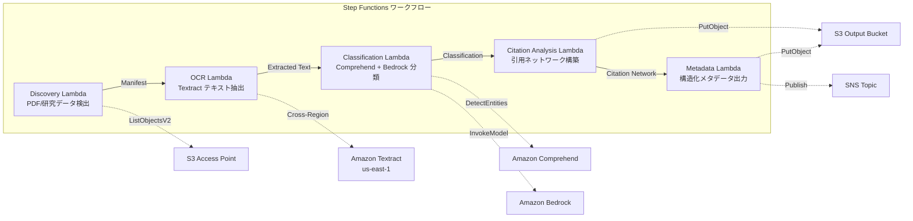

# UC13: Educación / Investigación — Clasificación automática de artículos PDF y análisis de red de citas

🌐 **Language / 言語**: [日本語](README.md) | [English](README.en.md) | [한국어](README.ko.md) | [简体中文](README.zh-CN.md) | [繁體中文](README.zh-TW.md) | [Français](README.fr.md) | [Deutsch](README.de.md) | Español

## Resumen
Un flujo de trabajo sin servidor que aprovecha los Puntos de Acceso S3 de FSx for NetApp ONTAP para automatizar la clasificación automática de PDFs de artículos, análisis de redes de citas y extracción de metadatos de datos de investigación.
### Casos en los que este patrón es apropiado
- Los PDF de artículos y los datos de investigación se están acumulando en gran cantidad en FSx ONTAP
- Quiero automatizar la extracción de texto de los PDF de artículos con Textract
- Necesito detección de temas y extracción de entidades (autores, instituciones, palabras clave) con Comprehend
- Necesito análisis de relaciones de citas y construcción automática de una red de citas (lista de adyacencia)
- Quiero generar automáticamente la clasificación de dominios de investigación y el resumen estructurado del abstract
### Casos en los que este patrón no es adecuado
- Necesita un motor de búsqueda de artículos en tiempo real (OpenSearch / Elasticsearch es apropiado)
- Necesita una base de datos de citas completa (CrossRef / Semantic Scholar API es apropiado)
- Necesita un ajuste fino de modelos de procesamiento de lenguaje natural a gran escala
- El entorno no puede asegurar conectividad de red a la API REST de ONTAP
### Principales características
- Detección automática de PDFs de artículos (.pdf) y datos de investigación (.csv,.json,.xml) a través de S3 AP
- Extracción de texto de PDFs con Textract (cross-region)
- Detección de temas y extracción de entidades con Comprehend
- Clasificación de dominio de investigación y generación de resúmenes estructurados de resúmenes con Bedrock
- Análisis de relaciones de citas y construcción de listas de adyacencia de citas de la sección de referencias bibliográficas
- Salida de metadatos estructurados de cada artículo (título, autores, clasificación, palabras clave, conteo de citas)
## Arquitectura



### Paso del flujo de trabajo
1. **Descubrimiento**: Detectar archivos.pdf,.csv,.json,.xml desde S3 AP
2. **OCR**: Extraer texto de PDF con Textract (cross-region)
3. **Clasificación**: Extracción de entidades con Comprehend, clasificación de dominios de investigación con Bedrock
4. **Análisis de citas**: Analizar relaciones de citas desde la sección de referencias, construir listas de adyacencia
5. **Metadatos**: Salida en JSON de metadatos estructurados de cada artículo a S3
## Requisitos previos
- Cuenta de AWS y permisos IAM apropiados
- Sistema de archivos FSx for NetApp ONTAP (ONTAP 9.17.1P4D3 o superior)
- Punto de acceso de S3 habilitado para volúmenes (almacenar PDFs de artículos y datos de investigación)
- VPC, subredes privadas
- Acceso a modelos de Amazon Bedrock habilitado (Claude / Nova)
- **Cross-region**: Textract no es compatible con ap-northeast-1, por lo que se necesita una llamada cross-region a us-east-1
## Pasos de implementación

### 1. Verificación de parámetros entre regiones
Textract no es compatible con la región de Tokio, por lo que se configura una llamada entre regiones con el parámetro `CrossRegionTarget`.
### 2. Despliegue de CloudFormation

```bash
aws cloudformation deploy \
  --template-file education-research/template.yaml \
  --stack-name fsxn-education-research \
  --parameter-overrides \
    S3AccessPointAlias=<your-volume-ext-s3alias> \
    S3AccessPointName=<your-s3ap-name> \
    VpcId=<your-vpc-id> \
    PrivateSubnetIds=<subnet-1>,<subnet-2> \
    ScheduleExpression="rate(1 hour)" \
    NotificationEmail=<your-email@example.com> \
    CrossRegionTarget=us-east-1 \
    EnableVpcEndpoints=false \
    EnableCloudWatchAlarms=false \
  --capabilities CAPABILITY_IAM CAPABILITY_AUTO_EXPAND \
  --region ap-northeast-1
```

## Lista de parámetros de configuración

| パラメータ | 説明 | デフォルト | 必須 |
|-----------|------|----------|------|
| `S3AccessPointAlias` | FSx ONTAP S3 AP Alias（入力用） | — | ✅ |
| `S3AccessPointName` | S3 AP 名（ARN ベースの IAM 権限付与用。省略時は Alias ベースのみ） | `""` | ⚠️ 推奨 |
| `ScheduleExpression` | EventBridge Scheduler のスケジュール式 | `rate(1 hour)` | |
| `VpcId` | VPC ID | — | ✅ |
| `PrivateSubnetIds` | プライベートサブネット ID リスト | — | ✅ |
| `NotificationEmail` | SNS 通知先メールアドレス | — | ✅ |
| `CrossRegionTarget` | Textract のターゲットリージョン | `us-east-1` | |
| `MapConcurrency` | Map ステートの並列実行数 | `10` | |
| `LambdaMemorySize` | Lambda メモリサイズ (MB) | `512` | |
| `LambdaTimeout` | Lambda タイムアウト (秒) | `300` | |
| `EnableVpcEndpoints` | Interface VPC Endpoints の有効化 | `false` | |
| `EnableCloudWatchAlarms` | CloudWatch Alarms の有効化 | `false` | |
| `EnableSnapStart` | Habilitar Lambda SnapStart (reducción de arranque en frío) | `false` | |

## Limpieza

```bash
aws s3 rm s3://fsxn-education-research-output-${AWS_ACCOUNT_ID} --recursive

aws cloudformation delete-stack \
  --stack-name fsxn-education-research \
  --region ap-northeast-1

aws cloudformation wait stack-delete-complete \
  --stack-name fsxn-education-research \
  --region ap-northeast-1
```

## Regiones compatibles
UC13 utiliza los siguientes servicios:
| サービス | リージョン制約 |
|---------|-------------|
| Amazon Textract | ap-northeast-1 非対応。`TEXTRACT_REGION` パラメータで対応リージョン（us-east-1 等）を指定 |
| Amazon Comprehend | ほぼ全リージョンで利用可能 |
| Amazon Bedrock | 対応リージョンを確認（[Bedrock 対応リージョン](https://docs.aws.amazon.com/general/latest/gr/bedrock.html)） |
| AWS X-Ray | ほぼ全リージョンで利用可能 |
| CloudWatch EMF | ほぼ全リージョンで利用可能 |
> Invoca la API de Textract a través del Cliente Inter-Región. Verifica los requisitos de residencia de datos. Para más detalles, consulta la [Matriz de Compatibilidad de Regiones](../docs/region-compatibility.md).
## Enlaces de referencia
- [Puntos de acceso a Amazon S3 de FSx ONTAP 概要](https://docs.aws.amazon.com/fsx/latest/ONTAPGuide/accessing-data-via-s3-access-points.html)
- [Documentación de Amazon Textract](https://docs.aws.amazon.com/textract/latest/dg/what-is.html)
- [Documentación de Amazon Comprehend](https://docs.aws.amazon.com/comprehend/latest/dg/what-is.html)
- [Referencia de la API de Amazon Bedrock](https://docs.aws.amazon.com/bedrock/latest/APIReference/API_runtime_InvokeModel.html)