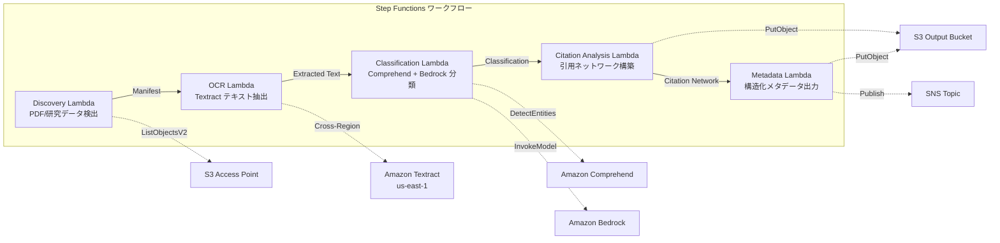

# UC13: Éducation / Recherche — Classification automatique de PDF de documents et analyse de réseau de citations

🌐 **Language / 言語**: [日本語](README.md) | [English](README.en.md) | [한국어](README.ko.md) | [简体中文](README.zh-CN.md) | [繁體中文](README.zh-TW.md) | Français | [Deutsch](README.de.md) | [Español](README.es.md)

## Aperçu
Un workflow sans serveur qui utilise les Amazon S3 Access Points de FSx for NetApp ONTAP pour automatiser la classification automatique des PDF de documents, l'analyse des réseaux de citations et l'extraction des métadonnées des données de recherche.
### Cas où ce schéma est approprié
- De nombreux PDF de recherches et données de recherche sont stockés sur FSx ONTAP
- Je souhaite automatiser l'extraction de texte des PDF de recherches avec Textract
- Il est nécessaire de détecter les sujets et d'extraire les entités (auteurs, institutions, mots-clés) avec Comprehend
- Il est nécessaire d'analyser les relations de citation et de construire automatiquement un réseau de citations (liste d'adjacence)
- Je souhaite générer automatiquement le classement des domaines de recherche et un résumé structuré de l'abstract
### Cas où ce modèle ne convient pas
- Un moteur de recherche de documents en temps réel est nécessaire (OpenSearch / Elasticsearch est approprié)
- Une base de données de citations complète (CrossRef / Semantic Scholar API est approprié)
- Le besoin d'un ajustement fin des modèles de traitement du langage naturel à grande échelle
- Un environnement où l'accès réseau à l'ONTAP REST API ne peut pas être assuré
### Principales fonctionnalités
- Détection automatique des PDF (.pdf) de documents et des données de recherche (.csv,.json,.xml) via l'accès S3 AP
- Extraction de texte PDF avec Textract (inter-régions)
- Détection de sujets et extraction d'entités avec Comprehend
- Classification du domaine de recherche et génération de résumés structurés d'abstracts avec Bedrock
- Analyse des relations de citation et construction de listes d'adjacence de citations à partir de la section bibliographique
- Production de métadonnées structurées pour chaque document (titre, auteurs, classification, mots-clés, nombre de citations)
## Architecture



### Étapes du flux de travail
1. **Découverte** : Détecter les fichiers.pdf,.csv,.json,.xml à partir de S3 AP
2. **OCR** : Extraction de texte à partir de PDF avec Textract (cross-région) 
3. **Classification** : Extraction d'entités avec Comprehend, classification des domaines de recherche avec Bedrock
4. **Analyse des citations** : Analyser les relations de citation à partir de la section bibliographique et construire une liste d'adjacence
5. **Métadonnées** : Sortie S3 en JSON des métadonnées structurées de chaque article
## Conditions préalables
- Compte AWS et permissions IAM appropriées
- Système de fichiers FSx for NetApp ONTAP (ONTAP 9.17.1P4D3 ou supérieur)
- Point d'accès S3 activé pour le volume (stockage des PDF de documents et des données de recherche)
- VPC, sous-réseaux privés
- Accès aux modèles Amazon Bedrock activé (Claude / Nova)
- **Cross-région** : Textract n'est pas pris en charge dans la région ap-northeast-1, un appel cross-région vers us-east-1 est nécessaire
## Étapes de déploiement

### 1. Vérification des paramètres de régions croisées
Textract n'est pas disponible dans la région Tokyo, donc configurez un appel inter-régions avec le paramètre `CrossRegionTarget`.
### 2. Déploiement CloudFormation

```bash
aws cloudformation deploy \
  --template-file education-research/template.yaml \
  --stack-name fsxn-education-research \
  --parameter-overrides \
    S3AccessPointAlias=<your-volume-ext-s3alias> \
    S3AccessPointName=<your-s3ap-name> \
    VpcId=<your-vpc-id> \
    PrivateSubnetIds=<subnet-1>,<subnet-2> \
    ScheduleExpression="rate(1 hour)" \
    NotificationEmail=<your-email@example.com> \
    CrossRegionTarget=us-east-1 \
    EnableVpcEndpoints=false \
    EnableCloudWatchAlarms=false \
  --capabilities CAPABILITY_IAM CAPABILITY_AUTO_EXPAND \
  --region ap-northeast-1
```

## Liste des paramètres de configuration

| パラメータ | 説明 | デフォルト | 必須 |
|-----------|------|----------|------|
| `S3AccessPointAlias` | FSx ONTAP S3 AP Alias（入力用） | — | ✅ |
| `S3AccessPointName` | S3 AP 名（ARN ベースの IAM 権限付与用。省略時は Alias ベースのみ） | `""` | ⚠️ 推奨 |
| `ScheduleExpression` | EventBridge Scheduler のスケジュール式 | `rate(1 hour)` | |
| `VpcId` | VPC ID | — | ✅ |
| `PrivateSubnetIds` | プライベートサブネット ID リスト | — | ✅ |
| `NotificationEmail` | SNS 通知先メールアドレス | — | ✅ |
| `CrossRegionTarget` | Textract のターゲットリージョン | `us-east-1` | |
| `MapConcurrency` | Map ステートの並列実行数 | `10` | |
| `LambdaMemorySize` | Lambda メモリサイズ (MB) | `512` | |
| `LambdaTimeout` | Lambda タイムアウト (秒) | `300` | |
| `EnableVpcEndpoints` | Interface VPC Endpoints の有効化 | `false` | |
| `EnableCloudWatchAlarms` | CloudWatch Alarms の有効化 | `false` | |

## Nettoyage

```bash
aws s3 rm s3://fsxn-education-research-output-${AWS_ACCOUNT_ID} --recursive

aws cloudformation delete-stack \
  --stack-name fsxn-education-research \
  --region ap-northeast-1

aws cloudformation wait stack-delete-complete \
  --stack-name fsxn-education-research \
  --region ap-northeast-1
```

## Régions prises en charge
UC13 utilise les services suivants :
| サービス | リージョン制約 |
|---------|-------------|
| Amazon Textract | ap-northeast-1 非対応。`TEXTRACT_REGION` パラメータで対応リージョン（us-east-1 等）を指定 |
| Amazon Comprehend | ほぼ全リージョンで利用可能 |
| Amazon Bedrock | 対応リージョンを確認（[Bedrock 対応リージョン](https://docs.aws.amazon.com/general/latest/gr/bedrock.html)） |
| AWS X-Ray | ほぼ全リージョンで利用可能 |
| CloudWatch EMF | ほぼ全リージョンで利用可能 |
> Appelez l'API Textract via le client Cross-Region. Vérifiez les exigences de résidence des données. Pour plus de détails, consultez la [Matrice de compatibilité des régions](../docs/region-compatibility.md).
## Liens de référence
- [FSx ONTAP S3 Access Points 概要](https://docs.aws.amazon.com/fsx/latest/ONTAPGuide/accessing-data-via-s3-access-points.html)
- [Documentation Amazon Textract](https://docs.aws.amazon.com/textract/latest/dg/what-is.html)
- [Documentation Amazon Comprehend](https://docs.aws.amazon.com/comprehend/latest/dg/what-is.html)
- [Référence API Amazon Bedrock](https://docs.aws.amazon.com/bedrock/latest/APIReference/API_runtime_InvokeModel.html)