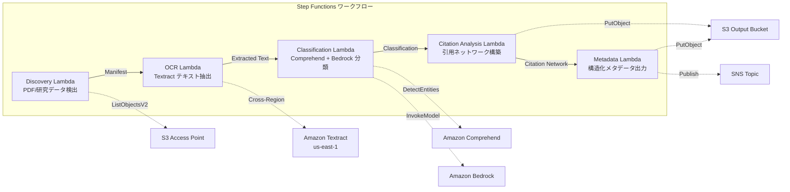

# UC13: 교육 / 연구 — 논문 PDF 자동 분류 및 인용 네트워크 분석

🌐 **Language / 言語**: [日本語](README.md) | [English](README.en.md) | 한국어 | [简体中文](README.zh-CN.md) | [繁體中文](README.zh-TW.md) | [Français](README.fr.md) | [Deutsch](README.de.md) | [Español](README.es.md)

## 개요
FSx for NetApp ONTAP의 S3 액세스 포인트를 활용하여 논문 PDF의 자동 분류, 인용 네트워크 분석, 연구 데이터 메타데이터 추출을 자동화하는 서버리스 워크플로우입니다.
### 이 패턴이 적합한 경우
- 논문 PDF와 연구 데이터가 FSx ONTAP에 대량으로 축적되어 있습니다
- Textract를 사용하여 논문 PDF의 텍스트 추출을 자동화하고 싶습니다
- Comprehend를 사용하여 토픽 감지 및 엔티티 추출(저자, 기관, 키워드)이 필요합니다
- 인용 관계의 분석과 인용 네트워크(인접 리스트)의 자동 구축이 필요합니다
- 연구 도메인 분류 및 구조화된 요약 자동 생성을 원합니다
### 이 패턴이 적합하지 않은 경우
- 실시간 논문 검색 엔진이 필요합니다 (OpenSearch / Elasticsearch가 적합)
- 전체 인용 데이터베이스 (CrossRef / Semantic Scholar API가 적합)
- 대규모 자연어 처리 모델의 파인튜닝이 필요합니다
- ONTAP REST API에 대한 네트워크 접근성을 제공할 수 없는 환경
### 주요 기능
- S3 AP를 통해 논문 PDF(.pdf)와 연구 데이터(.csv,.json,.xml)를 자동 검출
- Textract(크로스리전)을 통한 PDF 텍스트 추출
- Comprehend를 통한 토픽 검출 및 엔티티 추출
- Bedrock을 통한 연구 도메인 분류 및 구조화된 초록 요약 생성
- 참고 문헌 섹션의 인용 관계 분석 및 인용 인접 목록 구성
- 각 논문의 구조화된 메타데이터(제목, 저자, 분류, 키워드, 인용 수) 출력
## 아키텍처



### 워크플로 단계
1. **Discovery**: S3 AP에서.pdf,.csv,.json,.xml 파일을 검색
2. **OCR**: Textract (교차 리전)에서 PDF에서 텍스트 추출
3. **Classification**: Comprehend로 엔티티 추출, Bedrock로 연구 도메인 분류
4. **Citation Analysis**: 참고 문헌 섹션에서 인용 관계를 분석하고 인접 목록 구성
5. **Metadata**: 각 논문의 구조화된 메타데이터를 JSON으로 S3에 출력
## 전제 조건
- AWS 계정과 적절한 IAM 권한
- NetApp ONTAP용 FSx 파일 시스템(ONTAP 9.17.1P4D3 이상)
- S3 Access Point가 활성화된 볼륨(논문 PDF 및 연구 데이터 저장)
- VPC, 프라이빗 서브넷
- Amazon Bedrock 모델 액세스 활성화(Claude / Nova)
- **크로스 리전**: Textract가 ap-northeast-1 지원하지 않으므로, us-east-1로 크로스 리전 호출 필요
## 배포 단계

### 1. 크로스 리전 파라미터 확인
Textract는 도쿄 리전을 지원하지 않기 때문에 `CrossRegionTarget` 파라미터를 사용하여 크로스 리전 호출을 설정합니다.
### 2. CloudFormation 배포

```bash
aws cloudformation deploy \
  --template-file education-research/template.yaml \
  --stack-name fsxn-education-research \
  --parameter-overrides \
    S3AccessPointAlias=<your-volume-ext-s3alias> \
    S3AccessPointName=<your-s3ap-name> \
    VpcId=<your-vpc-id> \
    PrivateSubnetIds=<subnet-1>,<subnet-2> \
    ScheduleExpression="rate(1 hour)" \
    NotificationEmail=<your-email@example.com> \
    CrossRegionTarget=us-east-1 \
    EnableVpcEndpoints=false \
    EnableCloudWatchAlarms=false \
  --capabilities CAPABILITY_IAM CAPABILITY_AUTO_EXPAND \
  --region ap-northeast-1
```

## 설정 매개변수 목록

| パラメータ | 説明 | デフォルト | 必須 |
|-----------|------|----------|------|
| `S3AccessPointAlias` | FSx ONTAP S3 AP Alias（入力用） | — | ✅ |
| `S3AccessPointName` | S3 AP 名（ARN ベースの IAM 権限付与用。省略時は Alias ベースのみ） | `""` | ⚠️ 推奨 |
| `ScheduleExpression` | EventBridge Scheduler のスケジュール式 | `rate(1 hour)` | |
| `VpcId` | VPC ID | — | ✅ |
| `PrivateSubnetIds` | プライベートサブネット ID リスト | — | ✅ |
| `NotificationEmail` | SNS 通知先メールアドレス | — | ✅ |
| `CrossRegionTarget` | Textract のターゲットリージョン | `us-east-1` | |
| `MapConcurrency` | Map ステートの並列実行数 | `10` | |
| `LambdaMemorySize` | Lambda メモリサイズ (MB) | `512` | |
| `LambdaTimeout` | Lambda タイムアウト (秒) | `300` | |
| `EnableVpcEndpoints` | Interface VPC Endpoints の有効化 | `false` | |
| `EnableCloudWatchAlarms` | CloudWatch Alarms の有効化 | `false` | |
| `EnableSnapStart` | Lambda SnapStart 활성화 (콜드 스타트 단축) | `false` | |

## 정리

```bash
aws s3 rm s3://fsxn-education-research-output-${AWS_ACCOUNT_ID} --recursive

aws cloudformation delete-stack \
  --stack-name fsxn-education-research \
  --region ap-northeast-1

aws cloudformation wait stack-delete-complete \
  --stack-name fsxn-education-research \
  --region ap-northeast-1
```

## 지원되는 리전
UC13은 다음 서비스를 사용합니다:
| サービス | リージョン制約 |
|---------|-------------|
| Amazon Textract | ap-northeast-1 非対応。`TEXTRACT_REGION` パラメータで対応リージョン（us-east-1 等）を指定 |
| Amazon Comprehend | ほぼ全リージョンで利用可能 |
| Amazon Bedrock | 対応リージョンを確認（[Bedrock 対応リージョン](https://docs.aws.amazon.com/general/latest/gr/bedrock.html)） |
| AWS X-Ray | ほぼ全リージョンで利用可能 |
| CloudWatch EMF | ほぼ全リージョンで利用可能 |
> Cross-Region Client을 통해 Textract API를 호출합니다. 데이터 레지던시 요구 사항을 확인하세요. 자세한 내용은 [리전 호환성 매트릭스](../docs/region-compatibility.md)를 참조하세요.
## 참고 링크
- [FSx ONTAP S3 액세스 포인트 개요](https://docs.aws.amazon.com/fsx/latest/ONTAPGuide/accessing-data-via-s3-access-points.html)
- [Amazon Textract 문서](https://docs.aws.amazon.com/textract/latest/dg/what-is.html)
- [Amazon Comprehend 문서](https://docs.aws.amazon.com/comprehend/latest/dg/what-is.html)
- [Amazon Bedrock API 참조](https://docs.aws.amazon.com/bedrock/latest/APIReference/API_runtime_InvokeModel.html)