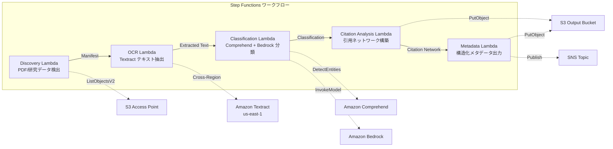

# UC13: 教育 / 研究 — 論文 PDF 自動分類・引用ネットワーク分析

🌐 **Language / 言語**: 日本語 | [English](README.en.md) | [한국어](README.ko.md) | [简体中文](README.zh-CN.md) | [繁體中文](README.zh-TW.md) | [Français](README.fr.md) | [Deutsch](README.de.md) | [Español](README.es.md)

📚 **ドキュメント**: [アーキテクチャ図](docs/architecture.md) | [デモガイド](docs/demo-guide.md)

## 概要

FSx for NetApp ONTAP の S3 Access Points を活用し、論文 PDF の自動分類、引用ネットワーク分析、研究データメタデータ抽出を自動化するサーバーレスワークフローです。

### このパターンが適しているケース

- 論文 PDF や研究データが FSx ONTAP 上に大量に蓄積されている
- Textract による論文 PDF のテキスト抽出を自動化したい
- Comprehend によるトピック検出・エンティティ抽出（著者、機関、キーワード）が必要
- 引用関係の解析と引用ネットワーク（隣接リスト）の自動構築が必要
- 研究ドメイン分類と構造化アブストラクトサマリーを自動生成したい

### このパターンが適さないケース

- リアルタイムの論文検索エンジンが必要（OpenSearch / Elasticsearch が適切）
- 完全な引用データベース（CrossRef / Semantic Scholar API が適切）
- 大規模な自然言語処理モデルのファインチューニングが必要
- ONTAP REST API へのネットワーク到達性が確保できない環境

### 主な機能

- S3 AP 経由で論文 PDF（.pdf）と研究データ（.csv, .json, .xml）を自動検出
- Textract（クロスリージョン）による PDF テキスト抽出
- Comprehend によるトピック検出・エンティティ抽出
- Bedrock による研究ドメイン分類と構造化アブストラクトサマリー生成
- 参考文献セクションからの引用関係解析と引用隣接リスト構築
- 各論文の構造化メタデータ（title, authors, classification, keywords, citation_count）出力


## Success Metrics

### Outcome
論文 PDF 分類・引用ネットワーク分析の自動化により、研究データ管理と教材整理を効率化する。

### Metrics
| メトリクス | 目標値（例） |
|-----------|------------|
| 処理済み文書数 / 実行 | > 200 documents |
| 分類精度 | > 85% |
| 引用抽出成功率 | > 90% |
| 処理時間 / 文書 | < 30 秒 |
| コスト / 実行 | < $8 |
| Human Review 対象率 | < 20%（分類不確実な文書） |

### Measurement Method
Step Functions 実行履歴、Comprehend 分類結果、Textract テキスト抽出、CloudWatch Metrics。

## アーキテクチャ



### ワークフローステップ

1. **Discovery**: S3 AP から .pdf, .csv, .json, .xml ファイルを検出
2. **OCR**: Textract（クロスリージョン）で PDF からテキスト抽出
3. **Classification**: Comprehend でエンティティ抽出、Bedrock で研究ドメイン分類
4. **Citation Analysis**: 参考文献セクションから引用関係を解析し、隣接リストを構築
5. **Metadata**: 各論文の構造化メタデータを JSON で S3 出力

## 前提条件

- AWS アカウントと適切な IAM 権限
- FSx for NetApp ONTAP ファイルシステム（ONTAP 9.17.1P4D3 以上）
- S3 Access Point が有効化されたボリューム（論文 PDF・研究データを格納）
- VPC、プライベートサブネット
- Amazon Bedrock モデルアクセスが有効（Claude / Nova）
- **クロスリージョン**: Textract は ap-northeast-1 非対応のため、us-east-1 へのクロスリージョン呼び出しが必要

## デプロイ手順

### 1. クロスリージョンパラメータの確認

Textract は東京リージョン非対応のため、`CrossRegionTarget` パラメータでクロスリージョン呼び出しを設定します。

### 2. CloudFormation デプロイ

```bash
aws cloudformation deploy \
  --template-file education-research/template.yaml \
  --stack-name fsxn-education-research \
  --parameter-overrides \
    S3AccessPointAlias=<your-volume-ext-s3alias> \
    S3AccessPointName=<your-s3ap-name> \
    VpcId=<your-vpc-id> \
    PrivateSubnetIds=<subnet-1>,<subnet-2> \
    ScheduleExpression="rate(1 hour)" \
    NotificationEmail=<your-email@example.com> \
    CrossRegionTarget=us-east-1 \
    EnableVpcEndpoints=false \
    EnableCloudWatchAlarms=false \
  --capabilities CAPABILITY_IAM CAPABILITY_AUTO_EXPAND \
  --region ap-northeast-1
```

## 設定パラメータ一覧

| パラメータ | 説明 | デフォルト | 必須 |
|-----------|------|----------|------|
| `S3AccessPointAlias` | FSx ONTAP S3 AP Alias（入力用） | — | ✅ |
| `S3AccessPointName` | S3 AP 名（ARN ベースの IAM 権限付与用。省略時は Alias ベースのみ） | `""` | ⚠️ 推奨 |
| `ScheduleExpression` | EventBridge Scheduler のスケジュール式 | `rate(1 hour)` | |
| `VpcId` | VPC ID | — | ✅ |
| `PrivateSubnetIds` | プライベートサブネット ID リスト | — | ✅ |
| `NotificationEmail` | SNS 通知先メールアドレス | — | ✅ |
| `CrossRegionTarget` | Textract のターゲットリージョン | `us-east-1` | |
| `MapConcurrency` | Map ステートの並列実行数 | `10` | |
| `LambdaMemorySize` | Lambda メモリサイズ (MB) | `512` | |
| `LambdaTimeout` | Lambda タイムアウト (秒) | `300` | |
| `EnableVpcEndpoints` | Interface VPC Endpoints の有効化 | `false` | |
| `EnableCloudWatchAlarms` | CloudWatch Alarms の有効化 | `false` | |

## クリーンアップ

```bash
aws s3 rm s3://fsxn-education-research-output-${AWS_ACCOUNT_ID} --recursive

aws cloudformation delete-stack \
  --stack-name fsxn-education-research \
  --region ap-northeast-1

aws cloudformation wait stack-delete-complete \
  --stack-name fsxn-education-research \
  --region ap-northeast-1
```

## Supported Regions

UC13 は以下のサービスを使用します:

| サービス | リージョン制約 |
|---------|-------------|
| Amazon Textract | ap-northeast-1 非対応。`TEXTRACT_REGION` パラメータで対応リージョン（us-east-1 等）を指定 |
| Amazon Comprehend | ほぼ全リージョンで利用可能 |
| Amazon Bedrock | 対応リージョンを確認（[Bedrock 対応リージョン](https://docs.aws.amazon.com/general/latest/gr/bedrock.html)） |
| AWS X-Ray | ほぼ全リージョンで利用可能 |
| CloudWatch EMF | ほぼ全リージョンで利用可能 |

> Cross-Region Client 経由で Textract API を呼び出します。データレジデンシー要件を確認してください。詳細は [リージョン互換性マトリックス](../docs/region-compatibility.md) を参照。

## 参考リンク

- [FSx ONTAP S3 Access Points 概要](https://docs.aws.amazon.com/fsx/latest/ONTAPGuide/accessing-data-via-s3-access-points.html)
- [Amazon Textract ドキュメント](https://docs.aws.amazon.com/textract/latest/dg/what-is.html)
- [Amazon Comprehend ドキュメント](https://docs.aws.amazon.com/comprehend/latest/dg/what-is.html)
- [Amazon Bedrock API リファレンス](https://docs.aws.amazon.com/bedrock/latest/APIReference/API_runtime_InvokeModel.html)


---

## AWS ドキュメントリンク

| サービス | ドキュメント |
|---------|------------|
| FSx for NetApp ONTAP | [ユーザーガイド](https://docs.aws.amazon.com/fsx/latest/ONTAPGuide/what-is-fsx-ontap.html) |
| S3 Access Points | [S3 AP for FSx ONTAP](https://docs.aws.amazon.com/fsx/latest/ONTAPGuide/s3-access-points.html) |
| Step Functions | [開発者ガイド](https://docs.aws.amazon.com/step-functions/latest/dg/welcome.html) |
| Amazon Textract | [開発者ガイド](https://docs.aws.amazon.com/textract/latest/dg/what-is.html) |
| Amazon Comprehend | [開発者ガイド](https://docs.aws.amazon.com/comprehend/latest/dg/what-is.html) |
| Amazon Bedrock | [ユーザーガイド](https://docs.aws.amazon.com/bedrock/latest/userguide/what-is-bedrock.html) |

### Well-Architected Framework 対応

| 柱 | 対応 |
|----|------|
| 運用上の優秀性 | X-Ray トレーシング、EMF メトリクス、分類精度監視 |
| セキュリティ | 最小権限 IAM、KMS 暗号化、研究データアクセス制御 |
| 信頼性 | Step Functions Retry/Catch、クロスリージョン Textract |
| パフォーマンス効率 | 引用ネットワーク並列構築、Athena パーティション |
| コスト最適化 | サーバーレス、Comprehend バッチ処理 |
| 持続可能性 | オンデマンド実行、差分処理（新規論文のみ） |


---

## コスト見積もり（月額概算）

> **注記**: 以下は ap-northeast-1 リージョンの概算であり、実際のコストは使用量により異なります。最新の料金は [AWS Pricing Calculator](https://calculator.aws/) で確認してください。

### サーバーレスコンポーネント（従量課金）

| サービス | 単価 | 想定使用量 | 月額概算 |
|---------|------|-----------|---------|
| Lambda | $0.0000166667/GB-sec | 5 関数 × 50 papers/日 | ~$1-5 |
| S3 API (GetObject/ListObjects) | $0.0047/10K requests | ~10K requests/日 | ~$1.5 |
| Step Functions | $0.025/1K state transitions | ~1K transitions/日 | ~$0.75 |
| Bedrock (Nova Lite) | $0.00006/1K input tokens | ~60K tokens/実行 | ~$3-10 |
| Athena | $5/TB scanned | ~5 MB/クエリ | ~$0.5-2 |
| SNS | $0.50/100K notifications | ~100 notifications/日 | ~$0.15 |
| CloudWatch Logs | $0.76/GB ingested | ~1 GB/月 | ~$0.76 |

### 固定コスト（FSx for ONTAP — 既存環境前提）

| コンポーネント | 月額 |
|--------------|------|
| FSx ONTAP (128 MBps, 1 TB) | ~$230 (既存環境を共有) |
| S3 Access Point | 追加料金なし（S3 API 料金のみ） |

### 合計概算

| 構成 | 月額概算 |
|------|---------|
| 最小構成（日次 1 回実行） | ~$5-15 |
| 標準構成（時次実行） | ~$15-50 |
| 大規模構成（高頻度 + アラーム） | ~$50-150 |

> **Governance Caveat**: コスト見積もりは概算であり、保証値ではありません。実際の請求額は使用パターン、データ量、リージョンにより異なります。

---

## ローカルテスト

### Prerequisites チェック

```bash
# 前提条件の確認
aws --version          # AWS CLI v2
sam --version          # SAM CLI
python3 --version      # Python 3.9+
docker --version       # Docker (sam local 用)
aws sts get-caller-identity  # AWS 認証情報
```

### sam local invoke

```bash
# ビルド
sam build

# Discovery Lambda のローカル実行
sam local invoke DiscoveryFunction --event events/discovery-event.json

# 環境変数オーバーライド付き
sam local invoke DiscoveryFunction \
  --event events/discovery-event.json \
  --env-vars env.json
```

### ユニットテスト

```bash
python3 -m pytest tests/ -v
```

詳細は [ローカルテスト クイックスタート](../docs/local-testing-quick-start.md) を参照してください。

---

## 出力サンプル (Output Sample)

論文 PDF 分類 + 引用ネットワーク分析の出力例:

```json
{
  "discovery": {
    "status": "completed",
    "object_count": 15,
    "prefix": "papers/"
  },
  "classification": [
    {
      "key": "papers/deep-learning-survey-2026.pdf",
      "category": "Computer Science / Machine Learning",
      "keywords": ["deep learning", "transformer", "attention"],
      "language": "en",
      "confidence": 0.94
    }
  ],
  "citation_network": {
    "nodes": 15,
    "edges": 42,
    "most_cited": "papers/attention-is-all-you-need.pdf",
    "clusters": 3,
    "adjacency_list_key": "s3://output-bucket/citations/network.json"
  },
  "summary": {
    "report_key": "reports/research-summary-2026-05-23.md",
    "total_classified": 15,
    "categories_found": 4
  }
}
```

> **注記**: 上記はサンプル出力であり、実際の値は環境・入力データにより異なります。ベンチマーク数値は sizing reference であり、service limit ではありません。

---

## Governance Note

> 本パターンは技術アーキテクチャガイダンスを提供します。法的・コンプライアンス・規制上の助言ではありません。組織は適格な専門家に相談してください。

---

## S3AP Compatibility

S3 Access Points for FSx for ONTAP の互換性制約、トラブルシューティング、トリガーパターンについては [S3AP Compatibility Notes](../docs/s3ap-compatibility-notes.md) を参照してください。