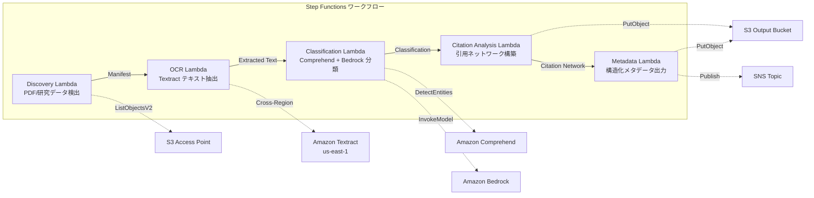

# UC13: 教育 / 研究 — 論文 PDF 自動分類・引用ネットワーク分析

## 概要

FSx for NetApp ONTAP の S3 Access Points を活用し、論文 PDF の自動分類、引用ネットワーク分析、研究データメタデータ抽出を自動化するサーバーレスワークフローです。

### このパターンが適しているケース

- 論文 PDF や研究データが FSx ONTAP 上に大量に蓄積されている
- Textract による論文 PDF のテキスト抽出を自動化したい
- Comprehend によるトピック検出・エンティティ抽出（著者、機関、キーワード）が必要
- 引用関係の解析と引用ネットワーク（隣接リスト）の自動構築が必要
- 研究ドメイン分類と構造化アブストラクトサマリーを自動生成したい

### このパターンが適さないケース

- リアルタイムの論文検索エンジンが必要（OpenSearch / Elasticsearch が適切）
- 完全な引用データベース（CrossRef / Semantic Scholar API が適切）
- 大規模な自然言語処理モデルのファインチューニングが必要
- ONTAP REST API へのネットワーク到達性が確保できない環境

### 主な機能

- S3 AP 経由で論文 PDF（.pdf）と研究データ（.csv, .json, .xml）を自動検出
- Textract（クロスリージョン）による PDF テキスト抽出
- Comprehend によるトピック検出・エンティティ抽出
- Bedrock による研究ドメイン分類と構造化アブストラクトサマリー生成
- 参考文献セクションからの引用関係解析と引用隣接リスト構築
- 各論文の構造化メタデータ（title, authors, classification, keywords, citation_count）出力

## アーキテクチャ



### ワークフローステップ

1. **Discovery**: S3 AP から .pdf, .csv, .json, .xml ファイルを検出
2. **OCR**: Textract（クロスリージョン）で PDF からテキスト抽出
3. **Classification**: Comprehend でエンティティ抽出、Bedrock で研究ドメイン分類
4. **Citation Analysis**: 参考文献セクションから引用関係を解析し、隣接リストを構築
5. **Metadata**: 各論文の構造化メタデータを JSON で S3 出力

## 前提条件

- AWS アカウントと適切な IAM 権限
- FSx for NetApp ONTAP ファイルシステム（ONTAP 9.17.1P4D3 以上）
- S3 Access Point が有効化されたボリューム（論文 PDF・研究データを格納）
- VPC、プライベートサブネット
- Amazon Bedrock モデルアクセスが有効（Claude / Nova）
- **クロスリージョン**: Textract は ap-northeast-1 非対応のため、us-east-1 へのクロスリージョン呼び出しが必要

## デプロイ手順

### 1. クロスリージョンパラメータの確認

Textract は東京リージョン非対応のため、`CrossRegionTarget` パラメータでクロスリージョン呼び出しを設定します。

### 2. CloudFormation デプロイ

```bash
aws cloudformation deploy \
  --template-file education-research/template.yaml \
  --stack-name fsxn-education-research \
  --parameter-overrides \
    S3AccessPointAlias=<your-volume-ext-s3alias> \
    VpcId=<your-vpc-id> \
    PrivateSubnetIds=<subnet-1>,<subnet-2> \
    ScheduleExpression="rate(1 hour)" \
    NotificationEmail=<your-email@example.com> \
    CrossRegionTarget=us-east-1 \
    EnableVpcEndpoints=false \
    EnableCloudWatchAlarms=false \
  --capabilities CAPABILITY_IAM CAPABILITY_AUTO_EXPAND \
  --region ap-northeast-1
```

## 設定パラメータ一覧

| パラメータ | 説明 | デフォルト | 必須 |
|-----------|------|----------|------|
| `S3AccessPointAlias` | FSx ONTAP S3 AP Alias（入力用） | — | ✅ |
| `ScheduleExpression` | EventBridge Scheduler のスケジュール式 | `rate(1 hour)` | |
| `VpcId` | VPC ID | — | ✅ |
| `PrivateSubnetIds` | プライベートサブネット ID リスト | — | ✅ |
| `NotificationEmail` | SNS 通知先メールアドレス | — | ✅ |
| `CrossRegionTarget` | Textract のターゲットリージョン | `us-east-1` | |
| `MapConcurrency` | Map ステートの並列実行数 | `10` | |
| `LambdaMemorySize` | Lambda メモリサイズ (MB) | `512` | |
| `LambdaTimeout` | Lambda タイムアウト (秒) | `300` | |
| `EnableVpcEndpoints` | Interface VPC Endpoints の有効化 | `false` | |
| `EnableCloudWatchAlarms` | CloudWatch Alarms の有効化 | `false` | |

## クリーンアップ

```bash
aws s3 rm s3://fsxn-education-research-output-${AWS_ACCOUNT_ID} --recursive

aws cloudformation delete-stack \
  --stack-name fsxn-education-research \
  --region ap-northeast-1

aws cloudformation wait stack-delete-complete \
  --stack-name fsxn-education-research \
  --region ap-northeast-1
```

## 参考リンク

- [FSx ONTAP S3 Access Points 概要](https://docs.aws.amazon.com/fsx/latest/ONTAPGuide/accessing-data-via-s3-access-points.html)
- [Amazon Textract ドキュメント](https://docs.aws.amazon.com/textract/latest/dg/what-is.html)
- [Amazon Comprehend ドキュメント](https://docs.aws.amazon.com/comprehend/latest/dg/what-is.html)
- [Amazon Bedrock API リファレンス](https://docs.aws.amazon.com/bedrock/latest/APIReference/API_runtime_InvokeModel.html)
