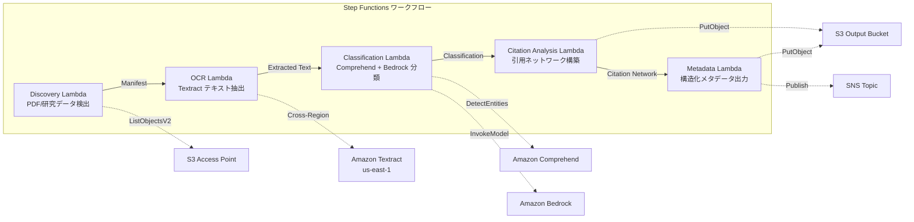

# UC13: 教育 / 研究 — 论文 PDF 自动分类与引用网络分析

🌐 **Language / 言語**: [日本語](README.md) | [English](README.en.md) | [한국어](README.ko.md) | 简体中文 | [繁體中文](README.zh-TW.md) | [Français](README.fr.md) | [Deutsch](README.de.md) | [Español](README.es.md)

## 概述
利用 FSx for NetApp ONTAP 的 S3 Access Points，实现论文 PDF 的自动分类、引用网络分析和研究数据元数据抽取的无服务器工作流。
### 适用场景
- 论文 PDF 和研究数据大量积累在 FSx ONTAP 上
- 希望自动化使用 Textract 从论文 PDF 提取文本
- 需要使用 Comprehend 进行主题检测和实体提取（作者、机构、关键词）
- 需要分析引用关系并自动构建引用网络（邻接列表）
- 希望自动生成研究领域分类和结构化摘要总结
### 不适用的情况

对于这种模式，不适用的情况包括：

- 使用 Amazon Bedrock、AWS Step Functions、Amazon Athena、Amazon S3、AWS Lambda、Amazon FSx for NetApp ONTAP、Amazon CloudWatch 和 AWS CloudFormation 等 AWS 服务时。
- 涉及 GDSII、DRC、OASIS、GDS、Lambda、tapeout 等技术术语时。
- 代码（`...`）和文件路径、URL 不进行翻译时。
- 需要一个实时论文搜索引擎（OpenSearch / Elasticsearch 最合适）
- 需要一个完整的引用数据库（CrossRef / Semantic Scholar API 最合适）
- 需要对大规模自然语言处理模型进行微调
- 环境中无法确保对 ONTAP REST API 的网络访问
### 主要功能
- 通过 S3 AP 自动检测论文 PDF（.pdf）和研究数据（.csv,.json,.xml）
- 使用 Textract（跨区域）提取 PDF 文本
- 使用 Comprehend 进行主题检测和实体抽取
- 使用 Bedrock 进行研究领域分类和结构化摘要生成
- 分析参考文献部分的引用关系并构建引用邻接列表
- 输出每篇论文的结构化元数据（标题、作者、分类、关键词、引用数）
## 架构



### 工作流程步骤

在这个工作流程步骤中，您将使用 Amazon Bedrock 来创建和管理模型。AWS Step Functions 将用于协调各个步骤，Amazon Athena 可以用于查询数据，而 Amazon S3 则存储数据。AWS Lambda 函数可以自动执行任务，而 Amazon FSx for NetApp ONTAP 提供了高性能文件系统。Amazon CloudWatch 用于监控资源，AWS CloudFormation 则用于创建和管理基础设施。确保所有技术术语如 GDSII、DRC、OASIS、GDS、Lambda 和 tapeout 都保持不变。所有的内联代码 (`...`)、文件路径和 URL 也不需要翻译。
1. **发现**: 从 S3 AP 检测.pdf,.csv,.json,.xml 文件
2. **OCR**: 使用 Textract（跨区域）从 PDF 提取文本
3. **分类**: 使用 Comprehend 提取实体，使用 Bedrock 进行研究领域分类
4. **引用分析**: 从参考文献部分解析引用关系，构建邻接列表
5. **元数据**: 将每篇论文的结构化元数据以 JSON 格式输出到 S3
## 前提条件
- AWS 账户和适当的 IAM 权限
- FSx for NetApp ONTAP 文件系统（ONTAP 9.17.1P4D3 以上）
- 已启用 S3 Access Point 的卷（存储论文 PDF 和研究数据）
- VPC、私有子网
- 启用了 Amazon Bedrock 模型访问（Claude / Nova）
- **跨区域**：由于 Textract 不支持 ap-northeast-1，需要进行 us-east-1 跨区域调用
## 部署步骤

### 1. 跨区域参数确认
Textract 不支持东京区域，因此需要在 `CrossRegionTarget` 参数中设置跨区域调用。
### 2. CloudFormation 部署

```bash
aws cloudformation deploy \
  --template-file education-research/template.yaml \
  --stack-name fsxn-education-research \
  --parameter-overrides \
    S3AccessPointAlias=<your-volume-ext-s3alias> \
    S3AccessPointName=<your-s3ap-name> \
    VpcId=<your-vpc-id> \
    PrivateSubnetIds=<subnet-1>,<subnet-2> \
    ScheduleExpression="rate(1 hour)" \
    NotificationEmail=<your-email@example.com> \
    CrossRegionTarget=us-east-1 \
    EnableVpcEndpoints=false \
    EnableCloudWatchAlarms=false \
  --capabilities CAPABILITY_IAM CAPABILITY_AUTO_EXPAND \
  --region ap-northeast-1
```

## 配置参数列表

| パラメータ | 説明 | デフォルト | 必須 |
|-----------|------|----------|------|
| `S3AccessPointAlias` | FSx ONTAP S3 AP Alias（入力用） | — | ✅ |
| `S3AccessPointName` | S3 AP 名（ARN ベースの IAM 権限付与用。省略時は Alias ベースのみ） | `""` | ⚠️ 推奨 |
| `ScheduleExpression` | EventBridge Scheduler のスケジュール式 | `rate(1 hour)` | |
| `VpcId` | VPC ID | — | ✅ |
| `PrivateSubnetIds` | プライベートサブネット ID リスト | — | ✅ |
| `NotificationEmail` | SNS 通知先メールアドレス | — | ✅ |
| `CrossRegionTarget` | Textract のターゲットリージョン | `us-east-1` | |
| `MapConcurrency` | Map ステートの並列実行数 | `10` | |
| `LambdaMemorySize` | Lambda メモリサイズ (MB) | `512` | |
| `LambdaTimeout` | Lambda タイムアウト (秒) | `300` | |
| `EnableVpcEndpoints` | Interface VPC Endpoints の有効化 | `false` | |
| `EnableCloudWatchAlarms` | CloudWatch Alarms の有効化 | `false` | |

## 清理

```bash
aws s3 rm s3://fsxn-education-research-output-${AWS_ACCOUNT_ID} --recursive

aws cloudformation delete-stack \
  --stack-name fsxn-education-research \
  --region ap-northeast-1

aws cloudformation wait stack-delete-complete \
  --stack-name fsxn-education-research \
  --region ap-northeast-1
```

## 支持的区域
UC13 使用以下服务：
| サービス | リージョン制約 |
|---------|-------------|
| Amazon Textract | ap-northeast-1 非対応。`TEXTRACT_REGION` パラメータで対応リージョン（us-east-1 等）を指定 |
| Amazon Comprehend | ほぼ全リージョンで利用可能 |
| Amazon Bedrock | 対応リージョンを確認（[Bedrock 対応リージョン](https://docs.aws.amazon.com/general/latest/gr/bedrock.html)） |
| AWS X-Ray | ほぼ全リージョンで利用可能 |
| CloudWatch EMF | ほぼ全リージョンで利用可能 |
> 通过跨区域客户端调用 Textract API。请确认数据常驻要求。详情请参阅 [区域兼容性矩阵](../docs/region-compatibility.md)。
## 参考链接
- [FSx ONTAP S3 访问点概述](https://docs.aws.amazon.com/fsx/latest/ONTAPGuide/accessing-data-via-s3-access-points.html)
- [Amazon Textract 文档](https://docs.aws.amazon.com/textract/latest/dg/what-is.html)
- [Amazon Comprehend 文档](https://docs.aws.amazon.com/comprehend/latest/dg/what-is.html)
- [Amazon Bedrock API 参考](https://docs.aws.amazon.com/bedrock/latest/APIReference/API_runtime_InvokeModel.html)