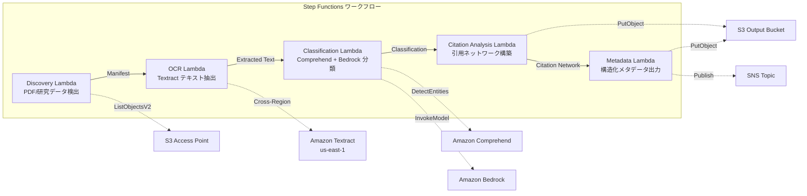

# UC13: 教育 / 研究 — 論文 PDF 自動分類・引用網路分析

🌐 **Language / 言語**: [日本語](README.md) | [English](README.en.md) | [한국어](README.ko.md) | [简体中文](README.zh-CN.md) | 繁體中文 | [Français](README.fr.md) | [Deutsch](README.de.md) | [Español](README.es.md)

## 概述
利用 Amazon FSx for NetApp ONTAP 的 S3 Access Points，建立一個無伺服器工作流程，以自動分類論文 PDF、進行引用網路分析和自動化研究數據元數據的提取。
### 此模式適用於何種情況
- 論文 PDF 和研究數據大量儲存於 FSx ONTAP 上
- 希望自動化 Textract 提取論文 PDF 的文字
- 需要 Comprehend 進行主題檢測與實體提取（作者、機構、關鍵詞）
- 需要分析引用關係並自動構建引用網絡（鄰接列表）
- 希望自動生成研究領域分類和結構化摘要總結
### 不適用的情況
- 需要一個實時論文搜索引擎（OpenSearch / Elasticsearch 合適）
- 一個完整的引用數據庫（CrossRef / Semantic Scholar API 合適）
- 需要大型自然語言處理模型的微調
- 無法確保對 ONTAP REST API 的網路存取
### 主要功能
- 透過 S3 AP 自動檢測論文 PDF（.pdf）和研究數據（.csv,.json,.xml）
- 透過 Textract（跨區域）提取 PDF 文本
- 透過 Comprehend 進行主題檢測和實體抽取
- 透過 Bedrock 進行研究領域分類和結構化摘要總結生成
- 從參考文獻部分分析引用關係和構建引用鄰接列表
- 輸出每篇論文的結構化元數據（標題、作者、分類、關鍵字、引用計數）
## 架構



### 工作流程步驟
1. **發現**：從 S3 AP 中檢測.pdf、.csv、.json、.xml 檔案
2. **OCR**：使用 Textract（跨區域）從 PDF 提取文本
3. **分類**：使用 Comprehend 提取實體，使用 Bedrock 進行研究領域分類
4. **引用分析**：解析參考文獻部分中的引用關係，構建鄰接列表
5. **元數據**：將每篇論文的結構化元數據以 JSON 格式輸出到 S3
## 先決條件
- AWS 帳戶和適當的 IAM 權限
- FSx for NetApp ONTAP 文件系統（ONTAP 9.17.1P4D3 以上）
- 已啟用 S3 Access Point 的卷（用於存儲論文 PDF 和研究數據）
- VPC，私有子網
- Amazon Bedrock 模型訪問已啟用（Claude / Nova）
- **跨區域**：由於 Textract 不支持 ap-northeast-1，因此需要跨區域調用 us-east-1
## 部署步驟

### 1. 確認跨區域參數
Textract 不支援東京區域，因此要在 `CrossRegionTarget` 參數中設定跨區域呼叫。
### 2. CloudFormation 部署

```bash
aws cloudformation deploy \
  --template-file education-research/template.yaml \
  --stack-name fsxn-education-research \
  --parameter-overrides \
    S3AccessPointAlias=<your-volume-ext-s3alias> \
    S3AccessPointName=<your-s3ap-name> \
    VpcId=<your-vpc-id> \
    PrivateSubnetIds=<subnet-1>,<subnet-2> \
    ScheduleExpression="rate(1 hour)" \
    NotificationEmail=<your-email@example.com> \
    CrossRegionTarget=us-east-1 \
    EnableVpcEndpoints=false \
    EnableCloudWatchAlarms=false \
  --capabilities CAPABILITY_IAM CAPABILITY_AUTO_EXPAND \
  --region ap-northeast-1
```

## 設定參數列表

| パラメータ | 説明 | デフォルト | 必須 |
|-----------|------|----------|------|
| `S3AccessPointAlias` | FSx ONTAP S3 AP Alias（入力用） | — | ✅ |
| `S3AccessPointName` | S3 AP 名（ARN ベースの IAM 権限付与用。省略時は Alias ベースのみ） | `""` | ⚠️ 推奨 |
| `ScheduleExpression` | EventBridge Scheduler のスケジュール式 | `rate(1 hour)` | |
| `VpcId` | VPC ID | — | ✅ |
| `PrivateSubnetIds` | プライベートサブネット ID リスト | — | ✅ |
| `NotificationEmail` | SNS 通知先メールアドレス | — | ✅ |
| `CrossRegionTarget` | Textract のターゲットリージョン | `us-east-1` | |
| `MapConcurrency` | Map ステートの並列実行数 | `10` | |
| `LambdaMemorySize` | Lambda メモリサイズ (MB) | `512` | |
| `LambdaTimeout` | Lambda タイムアウト (秒) | `300` | |
| `EnableVpcEndpoints` | Interface VPC Endpoints の有効化 | `false` | |
| `EnableCloudWatchAlarms` | CloudWatch Alarms の有効化 | `false` | |

## 清理工作

```bash
aws s3 rm s3://fsxn-education-research-output-${AWS_ACCOUNT_ID} --recursive

aws cloudformation delete-stack \
  --stack-name fsxn-education-research \
  --region ap-northeast-1

aws cloudformation wait stack-delete-complete \
  --stack-name fsxn-education-research \
  --region ap-northeast-1
```

## 支援的區域
UC13 使用以下服務：
| サービス | リージョン制約 |
|---------|-------------|
| Amazon Textract | ap-northeast-1 非対応。`TEXTRACT_REGION` パラメータで対応リージョン（us-east-1 等）を指定 |
| Amazon Comprehend | ほぼ全リージョンで利用可能 |
| Amazon Bedrock | 対応リージョンを確認（[Bedrock 対応リージョン](https://docs.aws.amazon.com/general/latest/gr/bedrock.html)） |
| AWS X-Ray | ほぼ全リージョンで利用可能 |
| CloudWatch EMF | ほぼ全リージョンで利用可能 |
> 透過 Cross-Region Client 呼叫 Textract API。請確認資料駐留需求。詳細資訊請參閱 [區域相容性矩陣](../docs/region-compatibility.md)。
## 參考連結
- [FSx ONTAP S3 存取點概覽](https://docs.aws.amazon.com/fsx/latest/ONTAPGuide/accessing-data-via-s3-access-points.html)
- [Amazon Textract 文件](https://docs.aws.amazon.com/textract/latest/dg/what-is.html)
- [Amazon Comprehend 文件](https://docs.aws.amazon.com/comprehend/latest/dg/what-is.html)
- [Amazon Bedrock API 參考](https://docs.aws.amazon.com/bedrock/latest/APIReference/API_runtime_InvokeModel.html)