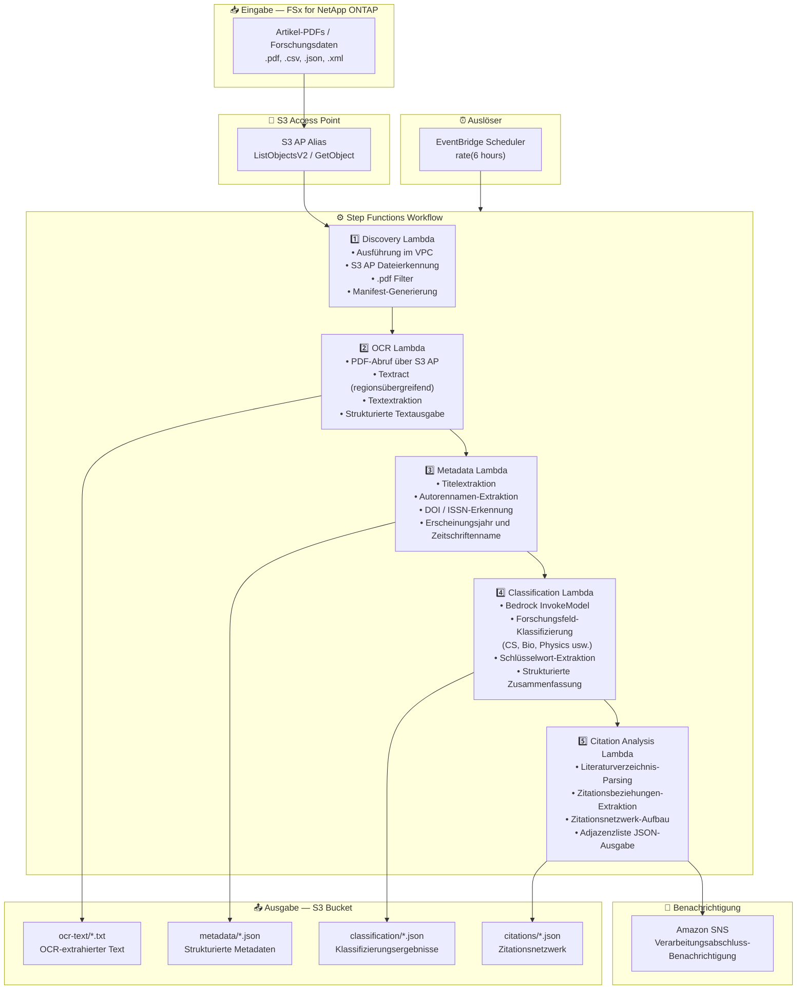

# UC13: Bildung/Forschung — Automatische PDF-Klassifizierung und Zitationsnetzwerk-Analyse

🌐 **Language / 言語**: [日本語](architecture.md) | [English](architecture.en.md) | [한국어](architecture.ko.md) | [简体中文](architecture.zh-CN.md) | [繁體中文](architecture.zh-TW.md) | [Français](architecture.fr.md) | Deutsch | [Español](architecture.es.md)

## End-to-End-Architektur (Eingabe → Ausgabe)

---

## Übergeordneter Ablauf

```
┌─────────────────────────────────────────────────────────────────────────────┐
│                         FSx for NetApp ONTAP                                 │
│                                                                              │
│  /vol/research_papers/                                                       │
│  ├── cs/deep_learning_survey_2024.pdf    (Computer science paper)            │
│  ├── bio/genome_analysis_v2.pdf          (Biology paper)                     │
│  ├── physics/quantum_computing.pdf       (Physics paper)                     │
│  └── data/experiment_results.csv         (Research data)                     │
│                                                                              │
└──────────────────────────────────┬───────────────────────────────────────────┘
                                   │
                                   ▼
┌──────────────────────────────────────────────────────────────────────────────┐
│                      S3 Access Point (Data Path)                              │
│                                                                              │
│  Alias: fsxn-research-vol-ext-s3alias                                        │
│  • ListObjectsV2 (paper PDF / research data discovery)                       │
│  • GetObject (PDF/CSV/JSON/XML retrieval)                                    │
│  • No NFS/SMB mount required from Lambda                                     │
│                                                                              │
└──────────────────────────────────┬───────────────────────────────────────────┘
                                   │
                                   ▼
┌──────────────────────────────────────────────────────────────────────────────┐
│                    EventBridge Scheduler (Trigger)                            │
│                                                                              │
│  Schedule: rate(6 hours) — configurable                                      │
│  Target: Step Functions State Machine                                        │
│                                                                              │
└──────────────────────────────────┬───────────────────────────────────────────┘
                                   │
                                   ▼
┌──────────────────────────────────────────────────────────────────────────────┐
│                    AWS Step Functions (Orchestration)                         │
│                                                                              │
│  ┌───────────┐  ┌────────┐  ┌──────────┐  ┌──────────────┐  ┌───────────┐ │
│  │ Discovery  │─▶│  OCR   │─▶│ Metadata │─▶│Classification│─▶│ Citation  │ │
│  │ Lambda     │  │ Lambda │  │ Lambda   │  │ Lambda       │  │ Analysis  │ │
│  │           │  │       │  │         │  │             │  │ Lambda    │ │
│  │ • VPC内    │  │• Textr-│  │ • Title  │  │ • Bedrock    │  │ • Citation│ │
│  │ • S3 AP   │  │  act   │  │ • Authors│  │ • Field      │  │   extract-│ │
│  │ • PDF     │  │• Text  │  │ • DOI    │  │   classifi-  │  │   ion     │ │
│  │   detect  │  │  extrac│  │ • Year   │  │   cation     │  │ • Network │ │
│  └───────────┘  │  tion  │  └──────────┘  │ • Keywords   │  │   building│ │
│                  └────────┘                 └──────────────┘  │ • Adjacency││
│                                                               │   list     ││
│                                                               └───────────┘ │
│                                                                              │
└──────────────────────────────────────────────────────────────────────────────┘
                                   │
                                   ▼
┌──────────────────────────────────────────────────────────────────────────────┐
│                         Output (S3 Bucket)                                    │
│                                                                              │
│  s3://{stack}-output-{account}/                                              │
│  ├── ocr-text/YYYY/MM/DD/                                                    │
│  │   └── deep_learning_survey_2024.txt   ← OCR extracted text               │
│  ├── metadata/YYYY/MM/DD/                                                    │
│  │   └── deep_learning_survey_2024.json  ← Structured metadata              │
│  ├── classification/YYYY/MM/DD/                                              │
│  │   └── deep_learning_survey_2024_class.json ← Field classification        │
│  └── citations/YYYY/MM/DD/                                                   │
│      └── citation_network.json           ← Citation network (adjacency list)│
│                                                                              │
└──────────────────────────────────────────────────────────────────────────────┘
```

---

## Mermaid-Diagramm



---

## Datenfluss im Detail

### Eingabe
| Element | Beschreibung |
|---------|--------------|
| **Quelle** | FSx for NetApp ONTAP Volume |
| **Dateitypen** | .pdf (Artikel-PDFs), .csv, .json, .xml (Forschungsdaten) |
| **Zugriffsmethode** | S3 Access Point (ListObjectsV2 + GetObject) |
| **Lesestrategie** | Vollständiger PDF-Abruf (erforderlich für OCR und Metadaten-Extraktion) |

### Verarbeitung
| Schritt | Service | Funktion |
|---------|---------|----------|
| Erkennung | Lambda (VPC) | Artikel-PDFs über S3 AP erkennen, Manifest generieren |
| OCR | Lambda + Textract | PDF-Textextraktion (regionsübergreifende Unterstützung) |
| Metadaten | Lambda | Artikel-Metadaten-Extraktion (Titel, Autoren, DOI, Erscheinungsjahr) |
| Klassifizierung | Lambda + Bedrock | Forschungsfeld-Klassifizierung, Schlüsselwort-Extraktion, strukturierte Zusammenfassung |
| Zitationsanalyse | Lambda | Literaturverzeichnis-Parsing, Zitationsnetzwerk-Aufbau (Adjazenzliste) |

### Ausgabe
| Artefakt | Format | Beschreibung |
|----------|--------|--------------|
| OCR-Text | `ocr-text/YYYY/MM/DD/{stem}.txt` | Textract-extrahierter Text |
| Metadaten | `metadata/YYYY/MM/DD/{stem}.json` | Strukturierte Metadaten (Titel, Autoren, DOI, Jahr) |
| Klassifizierung | `classification/YYYY/MM/DD/{stem}_class.json` | Feldklassifizierung, Schlüsselwörter, Zusammenfassung |
| Zitationsnetzwerk | `citations/YYYY/MM/DD/citation_network.json` | Zitationsnetzwerk (Adjazenzlisten-Format) |
| SNS-Benachrichtigung | Email | Verarbeitungsabschluss-Benachrichtigung (Anzahl und Klassifizierungsübersicht) |

---

## Wichtige Designentscheidungen

1. **S3 AP statt NFS** — Kein NFS-Mount von Lambda erforderlich; Artikel-PDFs werden über die S3-API abgerufen
2. **Textract regionsübergreifend** — Regionsübergreifender Aufruf für Regionen, in denen Textract nicht verfügbar ist
3. **5-Stufen-Pipeline** — OCR → Metadaten → Klassifizierung → Zitation, schrittweise Informationsakkumulation
4. **Bedrock für Feldklassifizierung** — Automatische Klassifizierung basierend auf vordefinierter Taxonomie (ACM CCS usw.)
5. **Zitationsnetzwerk (Adjazenzliste)** — Graphstruktur zur Darstellung von Zitationsbeziehungen, unterstützt nachgelagerte Analysen (PageRank, Community-Erkennung)
6. **Polling (nicht ereignisgesteuert)** — S3 AP unterstützt keine Ereignisbenachrichtigungen, daher wird eine periodische geplante Ausführung verwendet

---

## Verwendete AWS-Services

| Service | Rolle |
|---------|-------|
| FSx for NetApp ONTAP | Artikel- und Forschungsdatenspeicher |
| S3 Access Points | Serverloser Zugriff auf ONTAP-Volumes |
| EventBridge Scheduler | Periodischer Auslöser |
| Step Functions | Workflow-Orchestrierung |
| Lambda | Compute (Discovery, OCR, Metadata, Classification, Citation Analysis) |
| Amazon Textract | PDF-Textextraktion (regionsübergreifend) |
| Amazon Bedrock | Feldklassifizierung und Schlüsselwort-Extraktion (Claude / Nova) |
| SNS | Verarbeitungsabschluss-Benachrichtigung |
| Secrets Manager | ONTAP REST API Anmeldedatenverwaltung |
| CloudWatch + X-Ray | Observability |
