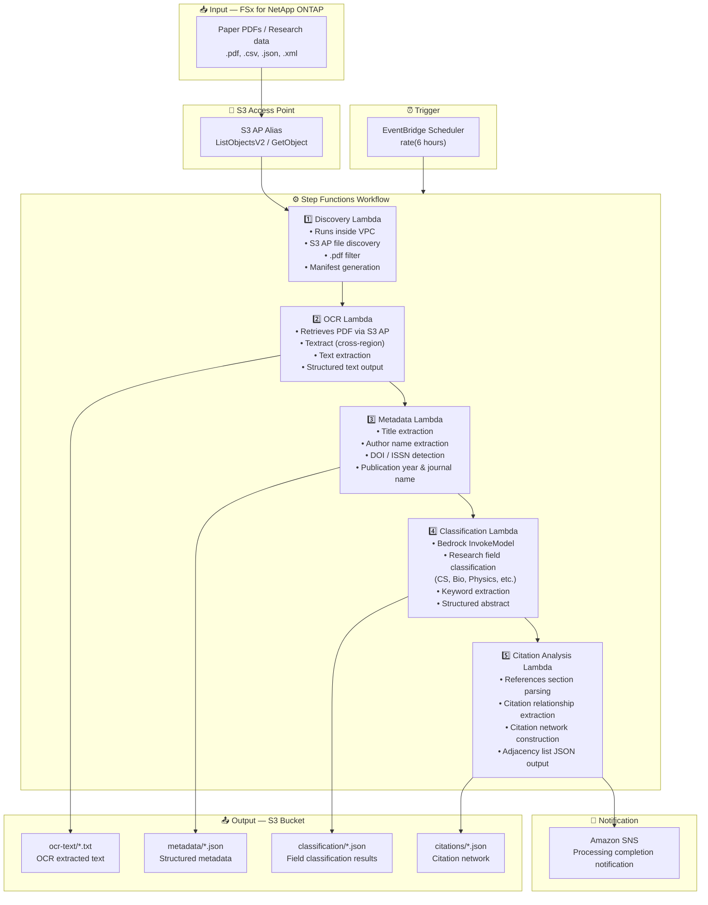

# UC13: Education / Research — Paper PDF Auto-Classification & Citation Network Analysis

🌐 **Language / 言語**: [日本語](architecture.md) | English | [한국어](architecture.ko.md) | [简体中文](architecture.zh-CN.md) | [繁體中文](architecture.zh-TW.md) | [Français](architecture.fr.md) | [Deutsch](architecture.de.md) | [Español](architecture.es.md)

## End-to-End Architecture (Input → Output)

---

## High-Level Flow

```
┌─────────────────────────────────────────────────────────────────────────────┐
│                         FSx for NetApp ONTAP                                 │
│                                                                              │
│  /vol/research_papers/                                                       │
│  ├── cs/deep_learning_survey_2024.pdf    (Computer science paper)            │
│  ├── bio/genome_analysis_v2.pdf          (Biology paper)                     │
│  ├── physics/quantum_computing.pdf       (Physics paper)                     │
│  └── data/experiment_results.csv         (Research data)                     │
│                                                                              │
└──────────────────────────────────┬───────────────────────────────────────────┘
                                   │
                                   ▼
┌──────────────────────────────────────────────────────────────────────────────┐
│                      S3 Access Point (Data Path)                              │
│                                                                              │
│  Alias: fsxn-research-vol-ext-s3alias                                        │
│  • ListObjectsV2 (paper PDF / research data discovery)                       │
│  • GetObject (PDF/CSV/JSON/XML retrieval)                                    │
│  • No NFS/SMB mount required from Lambda                                     │
│                                                                              │
└──────────────────────────────────┬───────────────────────────────────────────┘
                                   │
                                   ▼
┌──────────────────────────────────────────────────────────────────────────────┐
│                    EventBridge Scheduler (Trigger)                            │
│                                                                              │
│  Schedule: rate(6 hours) — configurable                                      │
│  Target: Step Functions State Machine                                        │
│                                                                              │
└──────────────────────────────────┬───────────────────────────────────────────┘
                                   │
                                   ▼
┌──────────────────────────────────────────────────────────────────────────────┐
│                    AWS Step Functions (Orchestration)                         │
│                                                                              │
│  ┌───────────┐  ┌────────┐  ┌──────────┐  ┌──────────────┐  ┌───────────┐ │
│  │ Discovery  │─▶│  OCR   │─▶│ Metadata │─▶│Classification│─▶│ Citation  │ │
│  │ Lambda     │  │ Lambda │  │ Lambda   │  │ Lambda       │  │ Analysis  │ │
│  │           │  │       │  │         │  │             │  │ Lambda    │ │
│  │ • VPC内    │  │• Textr-│  │ • Title  │  │ • Bedrock    │  │ • Citation│ │
│  │ • S3 AP   │  │  act   │  │ • Authors│  │ • Field      │  │   extract-│ │
│  │ • PDF     │  │• Text  │  │ • DOI    │  │   classifi-  │  │   ion     │ │
│  │   detect  │  │  extrac│  │ • Year   │  │   cation     │  │ • Network │ │
│  └───────────┘  │  tion  │  └──────────┘  │ • Keywords   │  │   building│ │
│                  └────────┘                 └──────────────┘  │ • Adjacency││
│                                                               │   list     ││
│                                                               └───────────┘ │
│                                                                              │
└──────────────────────────────────────────────────────────────────────────────┘
                                   │
                                   ▼
┌──────────────────────────────────────────────────────────────────────────────┐
│                         Output (S3 Bucket)                                    │
│                                                                              │
│  s3://{stack}-output-{account}/                                              │
│  ├── ocr-text/YYYY/MM/DD/                                                    │
│  │   └── deep_learning_survey_2024.txt   ← OCR extracted text               │
│  ├── metadata/YYYY/MM/DD/                                                    │
│  │   └── deep_learning_survey_2024.json  ← Structured metadata              │
│  ├── classification/YYYY/MM/DD/                                              │
│  │   └── deep_learning_survey_2024_class.json ← Field classification        │
│  └── citations/YYYY/MM/DD/                                                   │
│      └── citation_network.json           ← Citation network (adjacency list)│
│                                                                              │
└──────────────────────────────────────────────────────────────────────────────┘
```

---

## Mermaid Diagram



---

## Data Flow Detail

### Input
| Item | Description |
|------|-------------|
| **Source** | FSx for NetApp ONTAP volume |
| **File Types** | .pdf (paper PDFs), .csv, .json, .xml (research data) |
| **Access Method** | S3 Access Point (ListObjectsV2 + GetObject) |
| **Read Strategy** | Full PDF retrieval (required for OCR & metadata extraction) |

### Processing
| Step | Service | Function |
|------|---------|----------|
| Discovery | Lambda (VPC) | Discover paper PDFs via S3 AP, generate manifest |
| OCR | Lambda + Textract | PDF text extraction (cross-region support) |
| Metadata | Lambda | Paper metadata extraction (title, authors, DOI, publication year) |
| Classification | Lambda + Bedrock | Research field classification, keyword extraction, structured abstract generation |
| Citation Analysis | Lambda | References parsing, citation network construction (adjacency list) |

### Output
| Artifact | Format | Description |
|----------|--------|-------------|
| OCR Text | `ocr-text/YYYY/MM/DD/{stem}.txt` | Textract extracted text |
| Metadata | `metadata/YYYY/MM/DD/{stem}.json` | Structured metadata (title, authors, DOI, year) |
| Classification | `classification/YYYY/MM/DD/{stem}_class.json` | Field classification, keywords, abstract |
| Citation Network | `citations/YYYY/MM/DD/citation_network.json` | Citation network (adjacency list format) |
| SNS Notification | Email | Processing completion notification (count & classification summary) |

---

## Key Design Decisions

1. **S3 AP over NFS** — No NFS mount needed from Lambda; paper PDFs retrieved via S3 API
2. **Textract cross-region** — Cross-region invocation for regions where Textract is not available
3. **5-stage pipeline** — OCR → Metadata → Classification → Citation, progressively accumulating information
4. **Bedrock for field classification** — Automatic classification based on predefined taxonomy (ACM CCS, etc.)
5. **Citation network (adjacency list)** — Graph structure representing citation relationships, supporting downstream analysis (PageRank, community detection)
6. **Polling (not event-driven)** — S3 AP does not support event notifications, so periodic scheduled execution is used

---

## AWS Services Used

| Service | Role |
|---------|------|
| FSx for NetApp ONTAP | Paper & research data storage |
| S3 Access Points | Serverless access to ONTAP volumes |
| EventBridge Scheduler | Periodic trigger |
| Step Functions | Workflow orchestration |
| Lambda | Compute (Discovery, OCR, Metadata, Classification, Citation Analysis) |
| Amazon Textract | PDF text extraction (cross-region) |
| Amazon Bedrock | Field classification & keyword extraction (Claude / Nova) |
| SNS | Processing completion notification |
| Secrets Manager | ONTAP REST API credential management |
| CloudWatch + X-Ray | Observability |
