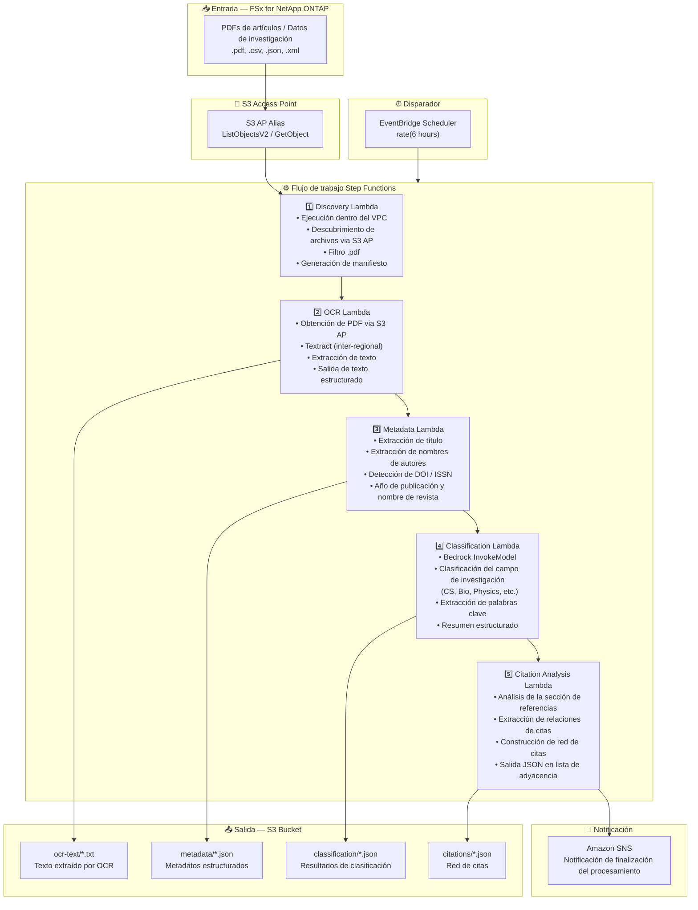

# UC13: Educación/Investigación — Clasificación automática de PDF y análisis de red de citas

🌐 **Language / 言語**: [日本語](architecture.md) | [English](architecture.en.md) | [한국어](architecture.ko.md) | [简体中文](architecture.zh-CN.md) | [繁體中文](architecture.zh-TW.md) | [Français](architecture.fr.md) | [Deutsch](architecture.de.md) | Español

## Arquitectura de extremo a extremo (Entrada → Salida)

---

## Diagrama de arquitectura

---

## Detalle del flujo de datos

### Entrada
| Elemento | Descripción |
|----------|-------------|
| **Origen** | Volumen FSx for NetApp ONTAP |
| **Tipos de archivo** | .pdf (PDFs de artículos), .csv, .json, .xml (datos de investigación) |
| **Método de acceso** | S3 Access Point (ListObjectsV2 + GetObject) |
| **Estrategia de lectura** | Obtención completa del PDF (necesaria para OCR y extracción de metadatos) |

### Procesamiento
| Paso | Servicio | Función |
|------|----------|---------|
| Descubrimiento | Lambda (VPC) | Descubrir PDFs de artículos via S3 AP, generar manifiesto |
| OCR | Lambda + Textract | Extracción de texto PDF (soporte inter-regional) |
| Metadatos | Lambda | Extracción de metadatos de artículos (título, autores, DOI, año de publicación) |
| Clasificación | Lambda + Bedrock | Clasificación del campo de investigación, extracción de palabras clave, generación de resumen estructurado |
| Análisis de citas | Lambda | Análisis de referencias, construcción de red de citas (lista de adyacencia) |

### Salida
| Artefacto | Formato | Descripción |
|-----------|---------|-------------|
| Texto OCR | `ocr-text/YYYY/MM/DD/{stem}.txt` | Texto extraído por Textract |
| Metadatos | `metadata/YYYY/MM/DD/{stem}.json` | Metadatos estructurados (título, autores, DOI, año) |
| Clasificación | `classification/YYYY/MM/DD/{stem}_class.json` | Clasificación de campo, palabras clave, resumen |
| Red de citas | `citations/YYYY/MM/DD/citation_network.json` | Red de citas (formato lista de adyacencia) |
| Notificación SNS | Email | Notificación de finalización del procesamiento (cantidad y resumen de clasificación) |

---

## Decisiones de diseño clave

1. **S3 AP en lugar de NFS** — No se requiere montaje NFS desde Lambda; los PDFs de artículos se obtienen a través de la API S3
2. **Textract inter-regional** — Invocación inter-regional para regiones donde Textract no está disponible
3. **Pipeline de 5 etapas** — OCR → Metadatos → Clasificación → Citas, acumulación progresiva de información
4. **Bedrock para clasificación de campos** — Clasificación automática basada en taxonomía predefinida (ACM CCS, etc.)
5. **Red de citas (lista de adyacencia)** — Estructura de grafo que representa relaciones de citas, soporta análisis posteriores (PageRank, detección de comunidades)
6. **Sondeo periódico (no basado en eventos)** — S3 AP no admite notificaciones de eventos, por lo que se utiliza ejecución programada periódica

---

## Servicios AWS utilizados

| Servicio | Rol |
|----------|-----|
| FSx for NetApp ONTAP | Almacenamiento de artículos y datos de investigación |
| S3 Access Points | Acceso serverless a volúmenes ONTAP |
| EventBridge Scheduler | Disparador periódico |
| Step Functions | Orquestación del flujo de trabajo |
| Lambda | Cómputo (Discovery, OCR, Metadata, Classification, Citation Analysis) |
| Amazon Textract | Extracción de texto PDF (inter-regional) |
| Amazon Bedrock | Clasificación de campos y extracción de palabras clave (Claude / Nova) |
| SNS | Notificación de finalización del procesamiento |
| Secrets Manager | Gestión de credenciales de la API REST ONTAP |
| CloudWatch + X-Ray | Observabilidad |
