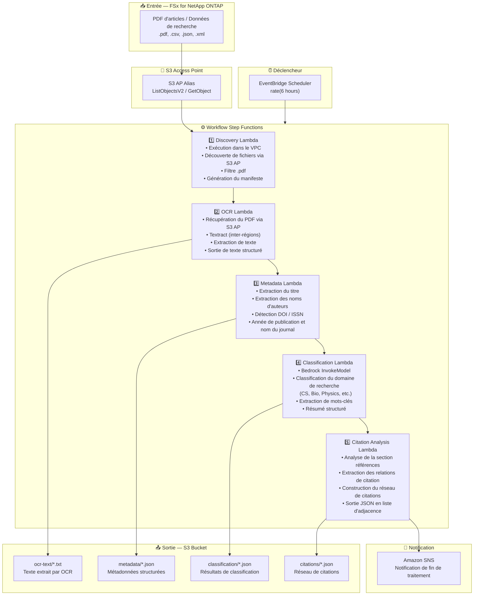

# UC13: Éducation/Recherche — Classification automatique de PDF et analyse du réseau de citations

🌐 **Language / 言語**: [日本語](architecture.md) | [English](architecture.en.md) | [한국어](architecture.ko.md) | [简体中文](architecture.zh-CN.md) | [繁體中文](architecture.zh-TW.md) | Français | [Deutsch](architecture.de.md) | [Español](architecture.es.md)

## Architecture de bout en bout (Entrée → Sortie)

---

## Flux de haut niveau

```
┌─────────────────────────────────────────────────────────────────────────────┐
│                         FSx for NetApp ONTAP                                 │
│                                                                              │
│  /vol/research_papers/                                                       │
│  ├── cs/deep_learning_survey_2024.pdf    (Computer science paper)            │
│  ├── bio/genome_analysis_v2.pdf          (Biology paper)                     │
│  ├── physics/quantum_computing.pdf       (Physics paper)                     │
│  └── data/experiment_results.csv         (Research data)                     │
│                                                                              │
└──────────────────────────────────┬───────────────────────────────────────────┘
                                   │
                                   ▼
┌──────────────────────────────────────────────────────────────────────────────┐
│                      S3 Access Point (Data Path)                              │
│                                                                              │
│  Alias: fsxn-research-vol-ext-s3alias                                        │
│  • ListObjectsV2 (paper PDF / research data discovery)                       │
│  • GetObject (PDF/CSV/JSON/XML retrieval)                                    │
│  • No NFS/SMB mount required from Lambda                                     │
│                                                                              │
└──────────────────────────────────┬───────────────────────────────────────────┘
                                   │
                                   ▼
┌──────────────────────────────────────────────────────────────────────────────┐
│                    EventBridge Scheduler (Trigger)                            │
│                                                                              │
│  Schedule: rate(6 hours) — configurable                                      │
│  Target: Step Functions State Machine                                        │
│                                                                              │
└──────────────────────────────────┬───────────────────────────────────────────┘
                                   │
                                   ▼
┌──────────────────────────────────────────────────────────────────────────────┐
│                    AWS Step Functions (Orchestration)                         │
│                                                                              │
│  ┌───────────┐  ┌────────┐  ┌──────────┐  ┌──────────────┐  ┌───────────┐ │
│  │ Discovery  │─▶│  OCR   │─▶│ Metadata │─▶│Classification│─▶│ Citation  │ │
│  │ Lambda     │  │ Lambda │  │ Lambda   │  │ Lambda       │  │ Analysis  │ │
│  │           │  │       │  │         │  │             │  │ Lambda    │ │
│  │ • VPC内    │  │• Textr-│  │ • Title  │  │ • Bedrock    │  │ • Citation│ │
│  │ • S3 AP   │  │  act   │  │ • Authors│  │ • Field      │  │   extract-│ │
│  │ • PDF     │  │• Text  │  │ • DOI    │  │   classifi-  │  │   ion     │ │
│  │   detect  │  │  extrac│  │ • Year   │  │   cation     │  │ • Network │ │
│  └───────────┘  │  tion  │  └──────────┘  │ • Keywords   │  │   building│ │
│                  └────────┘                 └──────────────┘  │ • Adjacency││
│                                                               │   list     ││
│                                                               └───────────┘ │
│                                                                              │
└──────────────────────────────────────────────────────────────────────────────┘
                                   │
                                   ▼
┌──────────────────────────────────────────────────────────────────────────────┐
│                         Output (S3 Bucket)                                    │
│                                                                              │
│  s3://{stack}-output-{account}/                                              │
│  ├── ocr-text/YYYY/MM/DD/                                                    │
│  │   └── deep_learning_survey_2024.txt   ← OCR extracted text               │
│  ├── metadata/YYYY/MM/DD/                                                    │
│  │   └── deep_learning_survey_2024.json  ← Structured metadata              │
│  ├── classification/YYYY/MM/DD/                                              │
│  │   └── deep_learning_survey_2024_class.json ← Field classification        │
│  └── citations/YYYY/MM/DD/                                                   │
│      └── citation_network.json           ← Citation network (adjacency list)│
│                                                                              │
└──────────────────────────────────────────────────────────────────────────────┘
```

---

## Diagramme Mermaid



---

## Détail du flux de données

### Entrée
| Élément | Description |
|---------|-------------|
| **Source** | Volume FSx for NetApp ONTAP |
| **Types de fichiers** | .pdf (PDF d'articles), .csv, .json, .xml (données de recherche) |
| **Méthode d'accès** | S3 Access Point (ListObjectsV2 + GetObject) |
| **Stratégie de lecture** | Récupération complète du PDF (nécessaire pour l'OCR et l'extraction de métadonnées) |

### Traitement
| Étape | Service | Fonction |
|-------|---------|----------|
| Découverte | Lambda (VPC) | Découverte des PDF d'articles via S3 AP, génération du manifeste |
| OCR | Lambda + Textract | Extraction de texte PDF (support inter-régions) |
| Métadonnées | Lambda | Extraction des métadonnées d'articles (titre, auteurs, DOI, année de publication) |
| Classification | Lambda + Bedrock | Classification du domaine de recherche, extraction de mots-clés, génération de résumé structuré |
| Analyse de citations | Lambda | Analyse des références, construction du réseau de citations (liste d'adjacence) |

### Sortie
| Artefact | Format | Description |
|----------|--------|-------------|
| Texte OCR | `ocr-text/YYYY/MM/DD/{stem}.txt` | Texte extrait par Textract |
| Métadonnées | `metadata/YYYY/MM/DD/{stem}.json` | Métadonnées structurées (titre, auteurs, DOI, année) |
| Classification | `classification/YYYY/MM/DD/{stem}_class.json` | Classification du domaine, mots-clés, résumé |
| Réseau de citations | `citations/YYYY/MM/DD/citation_network.json` | Réseau de citations (format liste d'adjacence) |
| Notification SNS | Email | Notification de fin de traitement (nombre et résumé de classification) |

---

## Décisions de conception clés

1. **S3 AP plutôt que NFS** — Pas de montage NFS nécessaire depuis Lambda ; les PDF d'articles sont récupérés via l'API S3
2. **Textract inter-régions** — Invocation inter-régions pour les régions où Textract n'est pas disponible
3. **Pipeline en 5 étapes** — OCR → Métadonnées → Classification → Citations, accumulation progressive d'informations
4. **Bedrock pour la classification** — Classification automatique basée sur une taxonomie prédéfinie (ACM CCS, etc.)
5. **Réseau de citations (liste d'adjacence)** — Structure de graphe représentant les relations de citation, supportant l'analyse en aval (PageRank, détection de communautés)
6. **Interrogation périodique (non événementielle)** — S3 AP ne prend pas en charge les notifications d'événements, donc une exécution planifiée périodique est utilisée

---

## Services AWS utilisés

| Service | Rôle |
|---------|------|
| FSx for NetApp ONTAP | Stockage des articles et données de recherche |
| S3 Access Points | Accès serverless aux volumes ONTAP |
| EventBridge Scheduler | Déclenchement périodique |
| Step Functions | Orchestration du workflow |
| Lambda | Calcul (Discovery, OCR, Metadata, Classification, Citation Analysis) |
| Amazon Textract | Extraction de texte PDF (inter-régions) |
| Amazon Bedrock | Classification de domaine et extraction de mots-clés (Claude / Nova) |
| SNS | Notification de fin de traitement |
| Secrets Manager | Gestion des identifiants de l'API REST ONTAP |
| CloudWatch + X-Ray | Observabilité |
