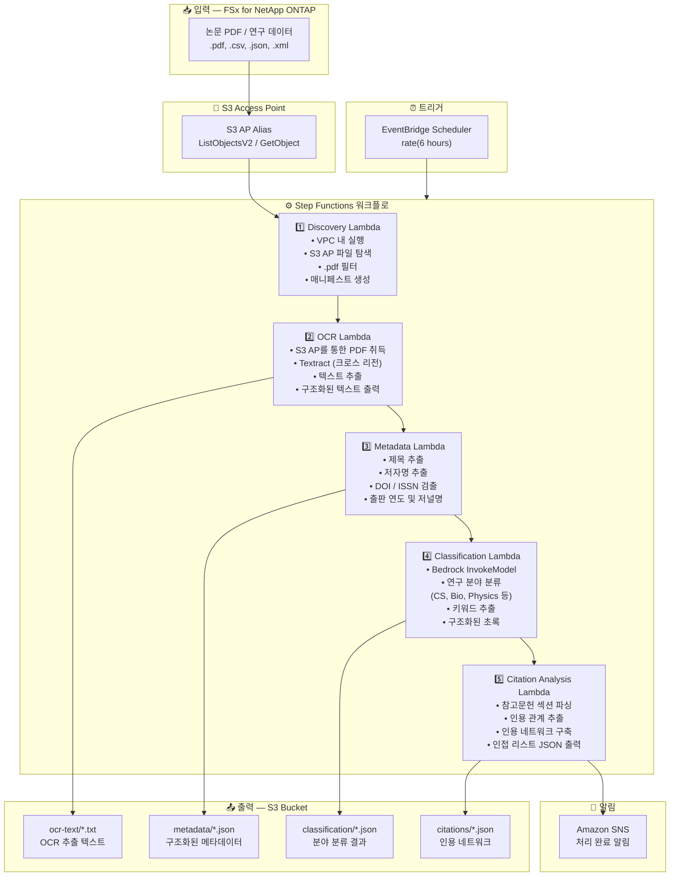

# UC13: 교육/연구 — 논문 PDF 자동 분류 및 인용 네트워크 분석

🌐 **Language / 言語**: [日本語](architecture.md) | [English](architecture.en.md) | 한국어 | [简体中文](architecture.zh-CN.md) | [繁體中文](architecture.zh-TW.md) | [Français](architecture.fr.md) | [Deutsch](architecture.de.md) | [Español](architecture.es.md)

## 엔드투엔드 아키텍처 (입력 → 출력)

---

## 상위 레벨 흐름

```
┌─────────────────────────────────────────────────────────────────────────────┐
│                         FSx for NetApp ONTAP                                 │
│                                                                              │
│  /vol/research_papers/                                                       │
│  ├── cs/deep_learning_survey_2024.pdf    (Computer science paper)            │
│  ├── bio/genome_analysis_v2.pdf          (Biology paper)                     │
│  ├── physics/quantum_computing.pdf       (Physics paper)                     │
│  └── data/experiment_results.csv         (Research data)                     │
│                                                                              │
└──────────────────────────────────┬───────────────────────────────────────────┘
                                   │
                                   ▼
┌──────────────────────────────────────────────────────────────────────────────┐
│                      S3 Access Point (Data Path)                              │
│                                                                              │
│  Alias: fsxn-research-vol-ext-s3alias                                        │
│  • ListObjectsV2 (paper PDF / research data discovery)                       │
│  • GetObject (PDF/CSV/JSON/XML retrieval)                                    │
│  • No NFS/SMB mount required from Lambda                                     │
│                                                                              │
└──────────────────────────────────┬───────────────────────────────────────────┘
                                   │
                                   ▼
┌──────────────────────────────────────────────────────────────────────────────┐
│                    EventBridge Scheduler (Trigger)                            │
│                                                                              │
│  Schedule: rate(6 hours) — configurable                                      │
│  Target: Step Functions State Machine                                        │
│                                                                              │
└──────────────────────────────────┬───────────────────────────────────────────┘
                                   │
                                   ▼
┌──────────────────────────────────────────────────────────────────────────────┐
│                    AWS Step Functions (Orchestration)                         │
│                                                                              │
│  ┌───────────┐  ┌────────┐  ┌──────────┐  ┌──────────────┐  ┌───────────┐ │
│  │ Discovery  │─▶│  OCR   │─▶│ Metadata │─▶│Classification│─▶│ Citation  │ │
│  │ Lambda     │  │ Lambda │  │ Lambda   │  │ Lambda       │  │ Analysis  │ │
│  │           │  │       │  │         │  │             │  │ Lambda    │ │
│  │ • VPC内    │  │• Textr-│  │ • Title  │  │ • Bedrock    │  │ • Citation│ │
│  │ • S3 AP   │  │  act   │  │ • Authors│  │ • Field      │  │   extract-│ │
│  │ • PDF     │  │• Text  │  │ • DOI    │  │   classifi-  │  │   ion     │ │
│  │   detect  │  │  extrac│  │ • Year   │  │   cation     │  │ • Network │ │
│  └───────────┘  │  tion  │  └──────────┘  │ • Keywords   │  │   building│ │
│                  └────────┘                 └──────────────┘  │ • Adjacency││
│                                                               │   list     ││
│                                                               └───────────┘ │
│                                                                              │
└──────────────────────────────────────────────────────────────────────────────┘
                                   │
                                   ▼
┌──────────────────────────────────────────────────────────────────────────────┐
│                         Output (S3 Bucket)                                    │
│                                                                              │
│  s3://{stack}-output-{account}/                                              │
│  ├── ocr-text/YYYY/MM/DD/                                                    │
│  │   └── deep_learning_survey_2024.txt   ← OCR extracted text               │
│  ├── metadata/YYYY/MM/DD/                                                    │
│  │   └── deep_learning_survey_2024.json  ← Structured metadata              │
│  ├── classification/YYYY/MM/DD/                                              │
│  │   └── deep_learning_survey_2024_class.json ← Field classification        │
│  └── citations/YYYY/MM/DD/                                                   │
│      └── citation_network.json           ← Citation network (adjacency list)│
│                                                                              │
└──────────────────────────────────────────────────────────────────────────────┘
```

---

## Mermaid 다이어그램



---

## 데이터 흐름 상세

### 입력
| 항목 | 설명 |
|------|------|
| **소스** | FSx for NetApp ONTAP 볼륨 |
| **파일 유형** | .pdf (논문 PDF), .csv, .json, .xml (연구 데이터) |
| **접근 방식** | S3 Access Point (ListObjectsV2 + GetObject) |
| **읽기 전략** | 전체 PDF 취득 (OCR 및 메타데이터 추출에 필요) |

### 처리
| 단계 | 서비스 | 기능 |
|------|--------|------|
| 탐색 | Lambda (VPC) | S3 AP를 통한 논문 PDF 탐색, 매니페스트 생성 |
| OCR | Lambda + Textract | PDF 텍스트 추출 (크로스 리전 지원) |
| 메타데이터 | Lambda | 논문 메타데이터 추출 (제목, 저자, DOI, 출판 연도) |
| 분류 | Lambda + Bedrock | 연구 분야 분류, 키워드 추출, 구조화된 초록 생성 |
| 인용 분석 | Lambda | 참고문헌 파싱, 인용 네트워크 구축 (인접 리스트) |

### 출력
| 산출물 | 형식 | 설명 |
|--------|------|------|
| OCR 텍스트 | `ocr-text/YYYY/MM/DD/{stem}.txt` | Textract 추출 텍스트 |
| 메타데이터 | `metadata/YYYY/MM/DD/{stem}.json` | 구조화된 메타데이터 (제목, 저자, DOI, 연도) |
| 분류 | `classification/YYYY/MM/DD/{stem}_class.json` | 분야 분류, 키워드, 초록 |
| 인용 네트워크 | `citations/YYYY/MM/DD/citation_network.json` | 인용 네트워크 (인접 리스트 형식) |
| SNS 알림 | Email | 처리 완료 알림 (건수 및 분류 요약) |

---

## 주요 설계 결정

1. **S3 AP over NFS** — Lambda에서 NFS 마운트 불필요; 논문 PDF는 S3 API를 통해 취득
2. **Textract 크로스 리전** — Textract를 사용할 수 없는 리전에서 크로스 리전 호출
3. **5단계 파이프라인** — OCR → 메타데이터 → 분류 → 인용, 점진적으로 정보를 축적
4. **Bedrock 분야 분류** — 사전 정의된 분류 체계(ACM CCS 등)에 기반한 자동 분류
5. **인용 네트워크 (인접 리스트)** — 인용 관계를 나타내는 그래프 구조, 다운스트림 분석(PageRank, 커뮤니티 검출) 지원
6. **폴링 (이벤트 기반 아님)** — S3 AP는 이벤트 알림을 지원하지 않으므로 정기적 스케줄 실행 사용

---

## 사용된 AWS 서비스

| 서비스 | 역할 |
|--------|------|
| FSx for NetApp ONTAP | 논문 및 연구 데이터 저장소 |
| S3 Access Points | ONTAP 볼륨에 대한 서버리스 접근 |
| EventBridge Scheduler | 정기 트리거 |
| Step Functions | 워크플로 오케스트레이션 |
| Lambda | 컴퓨팅 (Discovery, OCR, Metadata, Classification, Citation Analysis) |
| Amazon Textract | PDF 텍스트 추출 (크로스 리전) |
| Amazon Bedrock | 분야 분류 및 키워드 추출 (Claude / Nova) |
| SNS | 처리 완료 알림 |
| Secrets Manager | ONTAP REST API 자격 증명 관리 |
| CloudWatch + X-Ray | 관측 가능성 |
