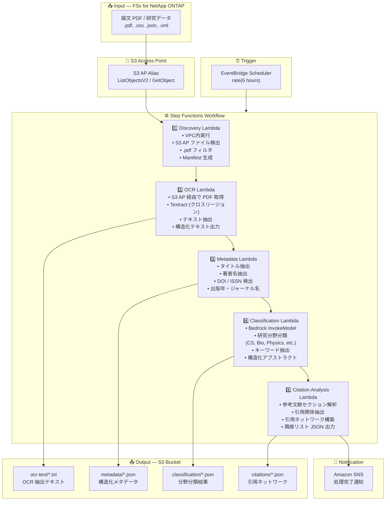

# UC13: 教育 / 研究 — 論文 PDF 自動分類・引用ネットワーク分析

🌐 **Language / 言語**: 日本語 | [English](architecture.en.md) | [한국어](architecture.ko.md) | [简体中文](architecture.zh-CN.md) | [繁體中文](architecture.zh-TW.md) | [Français](architecture.fr.md) | [Deutsch](architecture.de.md) | [Español](architecture.es.md)

## End-to-End Architecture (Input → Output)

---

## High-Level Flow

```
┌─────────────────────────────────────────────────────────────────────────────┐
│                         FSx for NetApp ONTAP                                 │
│                                                                              │
│  /vol/research_papers/                                                       │
│  ├── cs/deep_learning_survey_2024.pdf    (コンピュータサイエンス論文)         │
│  ├── bio/genome_analysis_v2.pdf          (生物学論文)                         │
│  ├── physics/quantum_computing.pdf       (物理学論文)                         │
│  └── data/experiment_results.csv         (研究データ)                        │
│                                                                              │
└──────────────────────────────────┬───────────────────────────────────────────┘
                                   │
                                   ▼
┌──────────────────────────────────────────────────────────────────────────────┐
│                      S3 Access Point (Data Path)                              │
│                                                                              │
│  Alias: fsxn-research-vol-ext-s3alias                                        │
│  • ListObjectsV2 (論文 PDF / 研究データ検出)                                 │
│  • GetObject (PDF/CSV/JSON/XML 取得)                                         │
│  • No NFS/SMB mount required from Lambda                                     │
│                                                                              │
└──────────────────────────────────┬───────────────────────────────────────────┘
                                   │
                                   ▼
┌──────────────────────────────────────────────────────────────────────────────┐
│                    EventBridge Scheduler (Trigger)                            │
│                                                                              │
│  Schedule: rate(6 hours) — configurable                                      │
│  Target: Step Functions State Machine                                        │
│                                                                              │
└──────────────────────────────────┬───────────────────────────────────────────┘
                                   │
                                   ▼
┌──────────────────────────────────────────────────────────────────────────────┐
│                    AWS Step Functions (Orchestration)                         │
│                                                                              │
│  ┌───────────┐  ┌────────┐  ┌──────────┐  ┌──────────────┐  ┌───────────┐ │
│  │ Discovery  │─▶│  OCR   │─▶│ Metadata │─▶│Classification│─▶│ Citation  │ │
│  │ Lambda     │  │ Lambda │  │ Lambda   │  │ Lambda       │  │ Analysis  │ │
│  │           │  │       │  │         │  │             │  │ Lambda    │ │
│  │ • VPC内    │  │• Textr-│  │ • タイトル│  │ • Bedrock    │  │ • 引用抽出│ │
│  │ • S3 AP   │  │  act   │  │ • 著者   │  │ • 分野分類  │  │ • ネットワ│ │
│  │ • PDF 検出 │  │• テキス│  │ • DOI    │  │ • キーワード│  │   ーク構築│ │
│  └───────────┘  │  ト抽出│  │ • 年     │  │   抽出      │  │ • 隣接リス│ │
│                  └────────┘  └──────────┘  └──────────────┘  │   ト出力  │ │
│                                                               └───────────┘ │
│                                                                              │
└──────────────────────────────────────────────────────────────────────────────┘
                                   │
                                   ▼
┌──────────────────────────────────────────────────────────────────────────────┐
│                         Output (S3 Bucket)                                    │
│                                                                              │
│  s3://{stack}-output-{account}/                                              │
│  ├── ocr-text/YYYY/MM/DD/                                                    │
│  │   └── deep_learning_survey_2024.txt   ← OCR 抽出テキスト                 │
│  ├── metadata/YYYY/MM/DD/                                                    │
│  │   └── deep_learning_survey_2024.json  ← 構造化メタデータ                 │
│  ├── classification/YYYY/MM/DD/                                              │
│  │   └── deep_learning_survey_2024_class.json ← 分野分類結果                │
│  └── citations/YYYY/MM/DD/                                                   │
│      └── citation_network.json           ← 引用ネットワーク（隣接リスト）   │
│                                                                              │
└──────────────────────────────────────────────────────────────────────────────┘
```

---

## Mermaid Diagram



---

## Data Flow Detail

### Input
| Item | Description |
|------|-------------|
| **Source** | FSx for NetApp ONTAP volume |
| **File Types** | .pdf (論文 PDF)、.csv, .json, .xml (研究データ) |
| **Access Method** | S3 Access Point (ListObjectsV2 + GetObject) |
| **Read Strategy** | PDF 全体を取得（OCR・メタデータ抽出に必要） |

### Processing
| Step | Service | Function |
|------|---------|----------|
| Discovery | Lambda (VPC) | S3 AP で論文 PDF 検出、Manifest 生成 |
| OCR | Lambda + Textract | PDF テキスト抽出（クロスリージョン対応） |
| Metadata | Lambda | 論文メタデータ抽出（タイトル、著者、DOI、出版年） |
| Classification | Lambda + Bedrock | 研究分野分類、キーワード抽出、構造化アブストラクト生成 |
| Citation Analysis | Lambda | 参考文献解析、引用ネットワーク構築（隣接リスト） |

### Output
| Artifact | Format | Description |
|----------|--------|-------------|
| OCR Text | `ocr-text/YYYY/MM/DD/{stem}.txt` | Textract 抽出テキスト |
| Metadata | `metadata/YYYY/MM/DD/{stem}.json` | 構造化メタデータ（title, authors, DOI, year） |
| Classification | `classification/YYYY/MM/DD/{stem}_class.json` | 分野分類・キーワード・アブストラクト |
| Citation Network | `citations/YYYY/MM/DD/citation_network.json` | 引用ネットワーク（隣接リスト形式） |
| SNS Notification | Email | 処理完了通知（処理件数・分類結果サマリー） |

---

## Key Design Decisions

1. **S3 AP over NFS** — Lambda から NFS マウント不要、S3 API で論文 PDF 取得
2. **Textract クロスリージョン** — Textract 非対応リージョンでもクロスリージョン呼び出しで対応
3. **5段階パイプライン** — OCR → Metadata → Classification → Citation の順序で段階的に情報を蓄積
4. **Bedrock による分野分類** — 事前定義の分類体系（ACM CCS 等）に基づく自動分類
5. **引用ネットワーク（隣接リスト）** — グラフ構造で引用関係を表現し、下流の分析（PageRank、コミュニティ検出）に対応
6. **ポーリングベース** — S3 AP はイベント通知非対応のため、定期スケジュール実行

---

## AWS Services Used

| Service | Role |
|---------|------|
| FSx for NetApp ONTAP | 論文・研究データストレージ |
| S3 Access Points | ONTAP ボリュームへのサーバーレスアクセス |
| EventBridge Scheduler | 定期トリガー |
| Step Functions | ワークフローオーケストレーション |
| Lambda | コンピュート（Discovery, OCR, Metadata, Classification, Citation Analysis） |
| Amazon Textract | PDF テキスト抽出（クロスリージョン） |
| Amazon Bedrock | 分野分類・キーワード抽出 (Claude / Nova) |
| SNS | 処理完了通知 |
| Secrets Manager | ONTAP REST API 認証情報管理 |
| CloudWatch + X-Ray | オブザーバビリティ |
