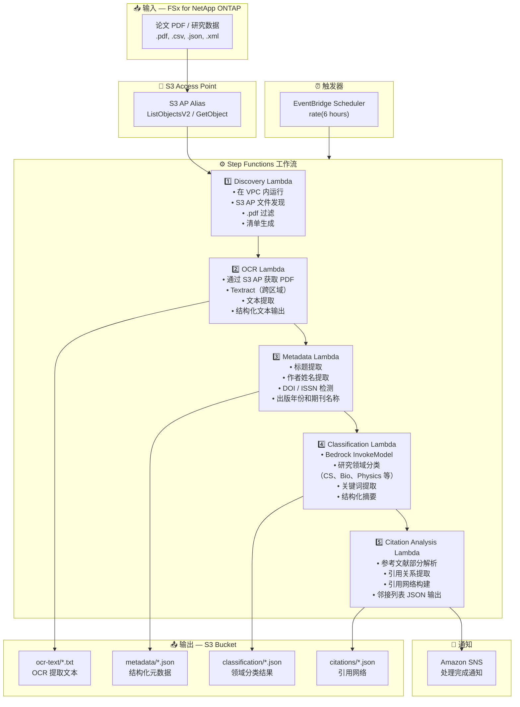

# UC13: 教育/研究 — 论文PDF自动分类与引用网络分析

🌐 **Language / 言語**: [日本語](architecture.md) | [English](architecture.en.md) | [한국어](architecture.ko.md) | 简体中文 | [繁體中文](architecture.zh-TW.md) | [Français](architecture.fr.md) | [Deutsch](architecture.de.md) | [Español](architecture.es.md)

## 端到端架构（输入 → 输出）

---

## 架构图

---

## 数据流详细说明

### 输入
| 项目 | 说明 |
|------|------|
| **来源** | FSx for NetApp ONTAP 卷 |
| **文件类型** | .pdf（论文 PDF）、.csv、.json、.xml（研究数据） |
| **访问方式** | S3 Access Point（ListObjectsV2 + GetObject） |
| **读取策略** | 完整 PDF 获取（OCR 和元数据提取所需） |

### 处理
| 步骤 | 服务 | 功能 |
|------|------|------|
| 发现 | Lambda（VPC） | 通过 S3 AP 发现论文 PDF，生成清单 |
| OCR | Lambda + Textract | PDF 文本提取（跨区域支持） |
| 元数据 | Lambda | 论文元数据提取（标题、作者、DOI、出版年份） |
| 分类 | Lambda + Bedrock | 研究领域分类、关键词提取、结构化摘要生成 |
| 引用分析 | Lambda | 参考文献解析、引用网络构建（邻接列表） |

### 输出
| 产出物 | 格式 | 说明 |
|--------|------|------|
| OCR 文本 | `ocr-text/YYYY/MM/DD/{stem}.txt` | Textract 提取文本 |
| 元数据 | `metadata/YYYY/MM/DD/{stem}.json` | 结构化元数据（标题、作者、DOI、年份） |
| 分类 | `classification/YYYY/MM/DD/{stem}_class.json` | 领域分类、关键词、摘要 |
| 引用网络 | `citations/YYYY/MM/DD/citation_network.json` | 引用网络（邻接列表格式） |
| SNS 通知 | Email | 处理完成通知（数量和分类摘要） |

---

## 关键设计决策

1. **S3 AP 优于 NFS** — Lambda 无需 NFS 挂载；论文 PDF 通过 S3 API 获取
2. **Textract 跨区域** — 在 Textract 不可用的区域进行跨区域调用
3. **5 阶段管道** — OCR → 元数据 → 分类 → 引用，逐步积累信息
4. **Bedrock 领域分类** — 基于预定义分类体系（ACM CCS 等）的自动分类
5. **引用网络（邻接列表）** — 表示引用关系的图结构，支持下游分析（PageRank、社区检测）
6. **轮询（非事件驱动）** — S3 AP 不支持事件通知，因此采用定期调度执行

---

## 使用的 AWS 服务

| 服务 | 角色 |
|------|------|
| FSx for NetApp ONTAP | 论文和研究数据存储 |
| S3 Access Points | 对 ONTAP 卷的无服务器访问 |
| EventBridge Scheduler | 定期触发 |
| Step Functions | 工作流编排 |
| Lambda | 计算（Discovery、OCR、Metadata、Classification、Citation Analysis） |
| Amazon Textract | PDF 文本提取（跨区域） |
| Amazon Bedrock | 领域分类和关键词提取（Claude / Nova） |
| SNS | 处理完成通知 |
| Secrets Manager | ONTAP REST API 凭证管理 |
| CloudWatch + X-Ray | 可观测性 |
