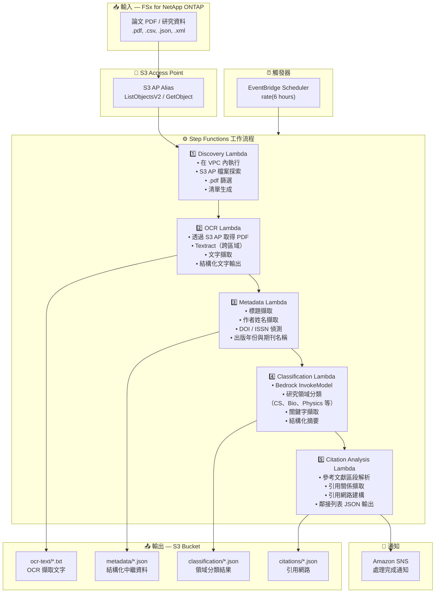

# UC13: 教育/研究 — 論文PDF自動分類與引用網路分析

🌐 **Language / 言語**: [日本語](architecture.md) | [English](architecture.en.md) | [한국어](architecture.ko.md) | [简体中文](architecture.zh-CN.md) | 繁體中文 | [Français](architecture.fr.md) | [Deutsch](architecture.de.md) | [Español](architecture.es.md)

## 端到端架構（輸入 → 輸出）

---

## 高層級流程

```
┌─────────────────────────────────────────────────────────────────────────────┐
│                         FSx for NetApp ONTAP                                 │
│                                                                              │
│  /vol/research_papers/                                                       │
│  ├── cs/deep_learning_survey_2024.pdf    (Computer science paper)            │
│  ├── bio/genome_analysis_v2.pdf          (Biology paper)                     │
│  ├── physics/quantum_computing.pdf       (Physics paper)                     │
│  └── data/experiment_results.csv         (Research data)                     │
│                                                                              │
└──────────────────────────────────┬───────────────────────────────────────────┘
                                   │
                                   ▼
┌──────────────────────────────────────────────────────────────────────────────┐
│                      S3 Access Point (Data Path)                              │
│                                                                              │
│  Alias: fsxn-research-vol-ext-s3alias                                        │
│  • ListObjectsV2 (paper PDF / research data discovery)                       │
│  • GetObject (PDF/CSV/JSON/XML retrieval)                                    │
│  • No NFS/SMB mount required from Lambda                                     │
│                                                                              │
└──────────────────────────────────┬───────────────────────────────────────────┘
                                   │
                                   ▼
┌──────────────────────────────────────────────────────────────────────────────┐
│                    EventBridge Scheduler (Trigger)                            │
│                                                                              │
│  Schedule: rate(6 hours) — configurable                                      │
│  Target: Step Functions State Machine                                        │
│                                                                              │
└──────────────────────────────────┬───────────────────────────────────────────┘
                                   │
                                   ▼
┌──────────────────────────────────────────────────────────────────────────────┐
│                    AWS Step Functions (Orchestration)                         │
│                                                                              │
│  ┌───────────┐  ┌────────┐  ┌──────────┐  ┌──────────────┐  ┌───────────┐ │
│  │ Discovery  │─▶│  OCR   │─▶│ Metadata │─▶│Classification│─▶│ Citation  │ │
│  │ Lambda     │  │ Lambda │  │ Lambda   │  │ Lambda       │  │ Analysis  │ │
│  │           │  │       │  │         │  │             │  │ Lambda    │ │
│  │ • VPC内    │  │• Textr-│  │ • Title  │  │ • Bedrock    │  │ • Citation│ │
│  │ • S3 AP   │  │  act   │  │ • Authors│  │ • Field      │  │   extract-│ │
│  │ • PDF     │  │• Text  │  │ • DOI    │  │   classifi-  │  │   ion     │ │
│  │   detect  │  │  extrac│  │ • Year   │  │   cation     │  │ • Network │ │
│  └───────────┘  │  tion  │  └──────────┘  │ • Keywords   │  │   building│ │
│                  └────────┘                 └──────────────┘  │ • Adjacency││
│                                                               │   list     ││
│                                                               └───────────┘ │
│                                                                              │
└──────────────────────────────────────────────────────────────────────────────┘
                                   │
                                   ▼
┌──────────────────────────────────────────────────────────────────────────────┐
│                         Output (S3 Bucket)                                    │
│                                                                              │
│  s3://{stack}-output-{account}/                                              │
│  ├── ocr-text/YYYY/MM/DD/                                                    │
│  │   └── deep_learning_survey_2024.txt   ← OCR extracted text               │
│  ├── metadata/YYYY/MM/DD/                                                    │
│  │   └── deep_learning_survey_2024.json  ← Structured metadata              │
│  ├── classification/YYYY/MM/DD/                                              │
│  │   └── deep_learning_survey_2024_class.json ← Field classification        │
│  └── citations/YYYY/MM/DD/                                                   │
│      └── citation_network.json           ← Citation network (adjacency list)│
│                                                                              │
└──────────────────────────────────────────────────────────────────────────────┘
```

---

## Mermaid 圖表



---

## 資料流程詳細說明

### 輸入
| 項目 | 說明 |
|------|------|
| **來源** | FSx for NetApp ONTAP 磁碟區 |
| **檔案類型** | .pdf（論文 PDF）、.csv、.json、.xml（研究資料） |
| **存取方式** | S3 Access Point（ListObjectsV2 + GetObject） |
| **讀取策略** | 完整 PDF 取得（OCR 和中繼資料擷取所需） |

### 處理
| 步驟 | 服務 | 功能 |
|------|------|------|
| 探索 | Lambda（VPC） | 透過 S3 AP 探索論文 PDF，生成清單 |
| OCR | Lambda + Textract | PDF 文字擷取（跨區域支援） |
| 中繼資料 | Lambda | 論文中繼資料擷取（標題、作者、DOI、出版年份） |
| 分類 | Lambda + Bedrock | 研究領域分類、關鍵字擷取、結構化摘要生成 |
| 引用分析 | Lambda | 參考文獻解析、引用網路建構（鄰接列表） |

### 輸出
| 產出物 | 格式 | 說明 |
|--------|------|------|
| OCR 文字 | `ocr-text/YYYY/MM/DD/{stem}.txt` | Textract 擷取文字 |
| 中繼資料 | `metadata/YYYY/MM/DD/{stem}.json` | 結構化中繼資料（標題、作者、DOI、年份） |
| 分類 | `classification/YYYY/MM/DD/{stem}_class.json` | 領域分類、關鍵字、摘要 |
| 引用網路 | `citations/YYYY/MM/DD/citation_network.json` | 引用網路（鄰接列表格式） |
| SNS 通知 | Email | 處理完成通知（數量與分類摘要） |

---

## 關鍵設計決策

1. **S3 AP 優於 NFS** — Lambda 無需 NFS 掛載；論文 PDF 透過 S3 API 取得
2. **Textract 跨區域** — 在 Textract 不可用的區域進行跨區域呼叫
3. **5 階段管線** — OCR → 中繼資料 → 分類 → 引用，逐步累積資訊
4. **Bedrock 領域分類** — 基於預定義分類體系（ACM CCS 等）的自動分類
5. **引用網路（鄰接列表）** — 表示引用關係的圖結構，支援下游分析（PageRank、社群偵測）
6. **輪詢（非事件驅動）** — S3 AP 不支援事件通知，因此採用定期排程執行

---

## 使用的 AWS 服務

| 服務 | 角色 |
|------|------|
| FSx for NetApp ONTAP | 論文與研究資料儲存 |
| S3 Access Points | 對 ONTAP 磁碟區的無伺服器存取 |
| EventBridge Scheduler | 定期觸發 |
| Step Functions | 工作流程編排 |
| Lambda | 運算（Discovery、OCR、Metadata、Classification、Citation Analysis） |
| Amazon Textract | PDF 文字擷取（跨區域） |
| Amazon Bedrock | 領域分類與關鍵字擷取（Claude / Nova） |
| SNS | 處理完成通知 |
| Secrets Manager | ONTAP REST API 憑證管理 |
| CloudWatch + X-Ray | 可觀測性 |
