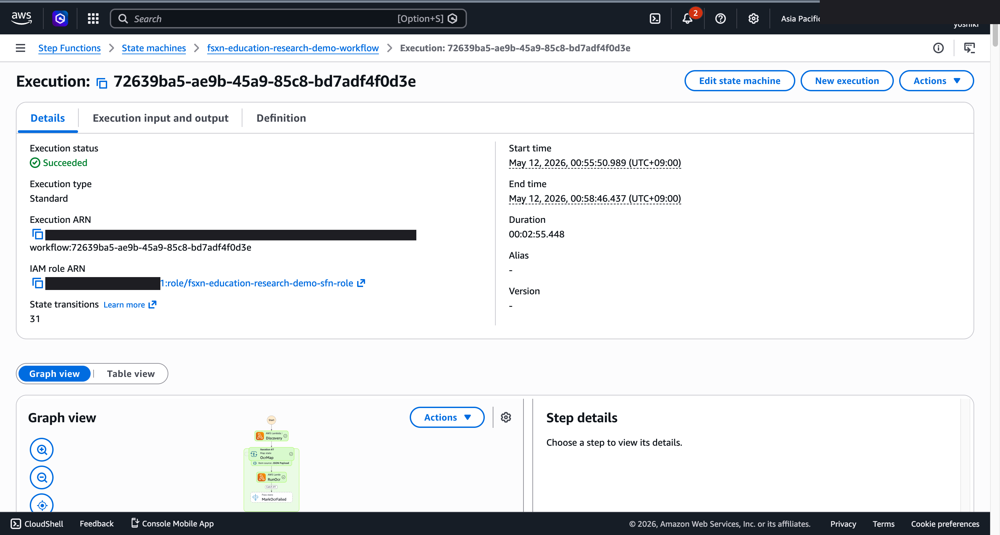
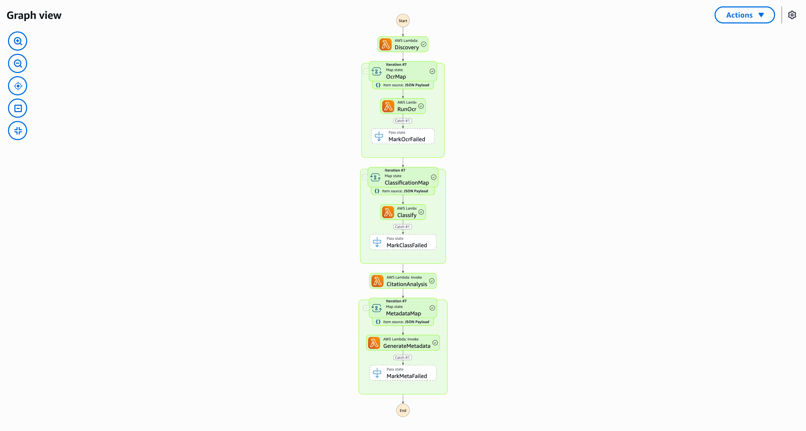

# Classification de publications et analyse de réseau de citations -- Demo Guide

🌐 **Language / 言語**: [日本語](demo-guide.md) | [English](demo-guide.en.md) | [한국어](demo-guide.ko.md) | [简体中文](demo-guide.zh-CN.md) | [繁體中文](demo-guide.zh-TW.md) | Français | [Deutsch](demo-guide.de.md) | [Español](demo-guide.es.md)

## Executive Summary

Cette démo présente un pipeline de classification automatique de publications et d'analyse de réseau de citations. Les publications sont classifiées par thème et les relations de citation visualisées.

**Message clé**: Classifier automatiquement les publications par IA et analyser le réseau de citations pour identifier instantanément les tendances de recherche.

**Durée prévue**: 3–5 min

---

## Workflow

```
Upload publications → Extraction métadonnées → Classification IA → Construction réseau citations → Rapport analyse
```

---

## Storyboard (5 Sections / 3–5 min)

### Section 1 (0:00–0:45)
> Problématique : Classifier manuellement des milliers de publications est irréaliste

### Section 2 (0:45–1:30)
> Upload : Placer les fichiers PDF pour démarrer le pipeline

### Section 3 (1:30–2:30)
> Classification IA et construction réseau : Classification thématique et extraction des citations

### Section 4 (2:30–3:45)
> Résultats : Clusters thématiques et identification des publications clés

### Section 5 (3:45–5:00)
> Rapport tendances : Analyse des tendances par domaine et liste de publications recommandées

---

## Technical Notes

| Component | Role |
|-----------|------|
| Step Functions | Orchestration du workflow |
| Lambda (PDF Parser) | Extraction métadonnées publications |
| Lambda (Topic Classifier) | Classification IA thématique |
| Lambda (Citation Analyzer) | Construction réseau de citations |
| Amazon Athena | Analyse agrégée des tendances |

---

*Ce document sert de guide de production pour les vidéos de démonstration technique.*

---

## Captures d'écran UI/UX vérifiées

Suivant la même approche que les démos Phase 7 UC15/16/17 et UC6/11/14, ciblant
**les écrans UI/UX que les utilisateurs finaux voient réellement dans leurs opérations quotidiennes**.
Les vues techniques (graphe Step Functions, événements de pile CloudFormation, etc.)
sont consolidées dans `docs/verification-results-*.md`.

### Statut de vérification pour ce cas d'utilisation

- ⚠️ **E2E**: Partial (additional verification recommended)
- 📸 **Capture UI/UX** : ✅ SFN Graph terminé (Phase 8 Theme D, commit 3c90042)

### Captures d'écran existantes (de Phase 1-6)






### Écrans UI/UX cibles pour re-vérification (liste de captures recommandées)

- Bucket S3 de sortie (papers-ocr/, citations/, reports/)
- Résultats OCR Textract des articles (Cross-Region)
- Détection d'entités Comprehend (auteurs, citations, mots-clés)
- Rapport d'analyse du réseau de recherche

### Guide de capture

1. **Préparation** : Exécuter `bash scripts/verify_phase7_prerequisites.sh` pour vérifier les prérequis
2. **Données d'exemple** : Télécharger les fichiers via S3 AP Alias, puis démarrer le workflow Step Functions
3. **Capture** (fermer CloudShell/terminal, masquer le nom d'utilisateur en haut à droite du navigateur)
4. **Masquage** : Exécuter `python3 scripts/mask_uc_demos.py <uc-dir>` pour le masquage OCR automatique
5. **Nettoyage** : Exécuter `bash scripts/cleanup_generic_ucs.sh <UC>` pour supprimer la pile
