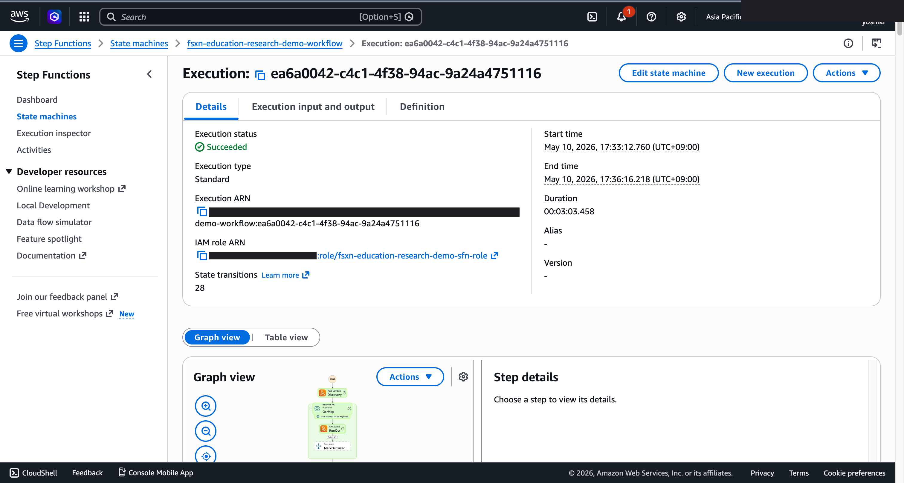

# 論文分類・引用網絡分析 — Demo Guide

🌐 **Language / 언어 / 语言 / 語言 / Langue / Sprache / Idioma**: [日本語](demo-guide.md) | [English](demo-guide.en.md) | [한국어](demo-guide.ko.md) | [简体中文](demo-guide.zh-CN.md) | 繁體中文 | [Français](demo-guide.fr.md) | [Deutsch](demo-guide.de.md) | [Español](demo-guide.es.md)

> 注意：此翻譯由 Amazon Bedrock Claude 產生。歡迎對翻譯品質提出改進建議。

## Executive Summary

本示範展示學術論文的自動分類與引用網絡分析管道。從大量論文 PDF 中提取元數據，並將研究趨勢視覺化。

**示範的核心訊息**：透過自動分類論文集合並分析引用關係，即時掌握研究領域的全貌與重要論文。

**預計時間**：3〜5 分鐘

---

## Target Audience & Persona

| 項目 | 詳細 |
|------|------|
| **職位** | 研究人員 / 圖書館資訊學專家 / 研究管理人員 |
| **日常業務** | 文獻調查、研究動向分析、論文管理 |
| **課題** | 無法從大量論文中有效率地發現相關研究 |
| **期待成果** | 研究領域的映射與重要論文的自動識別 |

### Persona：渡邊先生（研究人員）

- 正在進行新研究主題的文獻調查
- 收集了 500+ 篇論文的 PDF，但無法掌握全貌
- 「希望按領域自動分類，並識別被引用次數多的重要論文」

---

## Demo Scenario：文獻集合的自動分析

### 工作流程全貌

```
論文 PDF 群       元數據提取        分類・分析        視覺化報告
(500+ 件)    →   標題/作者     →  主題分類     →   網絡
                  引用資訊          引用解析          地圖生成
```

---

## Storyboard（5 個章節 / 3〜5 分鐘）

### Section 1: Problem Statement（0:00–0:45）

**旁白要旨**：
> 收集了 500 篇以上的論文 PDF。希望掌握按領域的分布、重要論文、研究趨勢，但不可能全部閱讀。

**Key Visual**：論文 PDF 檔案列表（大量）

### Section 2: Metadata Extraction（0:45–1:30）

**旁白要旨**：
> 從各論文 PDF 中自動提取標題、作者、摘要、引用列表。

**Key Visual**：元數據提取處理、提取結果樣本

### Section 3: Classification（1:30–2:30）

**旁白要旨**：
> AI 分析摘要，自動分類研究主題。透過聚類形成相關論文群組。

**Key Visual**：主題分類結果、各類別論文數

### Section 4: Citation Analysis（2:30–3:45）

**旁白要旨**：
> 解析引用關係，識別被引用次數多的重要論文。分析引用網絡的結構。

**Key Visual**：引用網絡統計、重要論文排名

### Section 5: Research Map（3:45–5:00）

**旁白要旨**：
> AI 生成研究領域全貌的摘要報告。呈現趨勢、缺口、未來研究方向。

**Key Visual**：研究地圖報告（趨勢分析 + 推薦文獻）

---

## Screen Capture Plan

| # | 畫面 | 章節 |
|---|------|-----------|
| 1 | 論文 PDF 集合 | Section 1 |
| 2 | 元數據提取結果 | Section 2 |
| 3 | 主題分類結果 | Section 3 |
| 4 | 引用網絡統計 | Section 4 |
| 5 | 研究地圖報告 | Section 5 |

---

## Narration Outline

| 章節 | 時間 | 關鍵訊息 |
|-----------|------|--------------|
| Problem | 0:00–0:45 | 「希望掌握 500 篇論文的全貌」 |
| Extraction | 0:45–1:30 | 「從 PDF 自動提取元數據」 |
| Classification | 1:30–2:30 | 「AI 按主題自動分類」 |
| Citation | 2:30–3:45 | 「透過引用網絡識別重要論文」 |
| Map | 3:45–5:00 | 「視覺化研究領域的全貌與趨勢」 |

---

## Sample Data Requirements

| # | 資料 | 用途 |
|---|--------|------|
| 1 | 論文 PDF（30 件、3 領域） | 主要處理對象 |
| 2 | 引用關係資料（含相互引用） | 網絡分析示範 |
| 3 | 高被引用論文（5 件） | 重要論文識別示範 |

---

## Timeline

### 1 週內可達成

| 任務 | 所需時間 |
|--------|---------|
| 準備樣本論文資料 | 3 小時 |
| 確認管道執行 | 2 小時 |
| 取得畫面截圖 | 2 小時 |
| 撰寫旁白稿 | 2 小時 |
| 影片編輯 | 4 小時 |

### Future Enhancements

- 互動式引用網絡視覺化
- 論文推薦系統
- 定期自動分類新論文

---

## Technical Notes

| 元件 | 角色 |
|--------------|------|
| Step Functions | 工作流程編排 |
| Lambda (PDF Parser) | 論文 PDF 元數據提取 |
| Lambda (Classifier) | 透過 Bedrock 進行主題分類 |
| Lambda (Citation Analyzer) | 引用網絡建構・分析 |
| Amazon Athena | 元數據彙總・搜尋 |

### 備援方案

| 情境 | 對應 |
|---------|------|
| PDF 解析失敗 | 使用預先提取的資料 |
| 分類精度不足 | 顯示預先分類的結果 |

---

*本文件為技術簡報用示範影片的製作指南。*

---

## 已驗證的 UI/UX 截圖

Phase 7 UC15/16/17 與 UC6/11/14 的示範採用相同方針，以**終端使用者在日常業務中實際
看到的 UI/UX 畫面**為對象。技術人員視圖（Step Functions 圖表、CloudFormation
堆疊事件等）集中於 `docs/verification-results-*.md`。

### 此使用案例的驗證狀態

- ✅ **E2E 執行**：Phase 1-6 已確認（參照根目錄 README）
- 📸 **UI/UX 重新拍攝**：✅ 2026-05-10 重新部署驗證時已拍攝（確認 UC13 Step Functions 圖表、Lambda 執行成功）
- 🔄 **重現方法**：參照本文件末尾的「拍攝指南」

### 2026-05-10 重新部署驗證時拍攝（以 UI/UX 為中心）

#### UC13 Step Functions Graph view（SUCCEEDED）



Step Functions Graph view 以顏色視覺化各 Lambda / Parallel / Map 狀態的執行狀況，
是終端使用者最重要的畫面。

### 既有截圖（來自 Phase 1-6 的相關部分）

*（無相關內容。重新驗證時請新拍攝）*

### 重新驗證時的 UI/UX 目標畫面（建議拍攝清單）

- S3 輸出儲存貯體（papers-ocr/、citations/、reports/）
- Textract 論文 OCR 結果（跨區域）
- Comprehend 實體偵測（作者、引用、關鍵字）
- 研究網絡分析報告

### 拍攝指南

1. **事前準備**：
   - `bash scripts/verify_phase7_prerequisites.sh` 確認前提條件（共用 VPC/S3 AP 是否存在）
   - `UC=education-research bash scripts/package_generic_uc.sh` 打包 Lambda
   - `bash scripts/deploy_generic_ucs.sh UC13` 進行部署

2. **配置樣本資料**：
   - 透過 S3 AP Alias 將樣本檔案上傳至 `papers/` 前綴
   - 啟動 Step Functions `fsxn-education-research-demo-workflow`（輸入 `{}`）

3. **拍攝**（關閉 CloudShell・終端機，將瀏覽器右上角的使用者名稱塗黑）：
   - S3 輸出儲存貯體 `fsxn-education-research-demo-output-<account>` 的俯瞰圖
   - AI/ML 輸出 JSON 的預覽（參考 `build/preview_*.html` 的格式）
   - SNS 電子郵件通知（如適用）

4. **遮罩處理**：
   - `python3 scripts/mask_uc_demos.py education-research-demo` 進行自動遮罩
   - 依照 `docs/screenshots/MASK_GUIDE.md` 進行額外遮罩（如有需要）

5. **清理**：
   - `bash scripts/cleanup_generic_ucs.sh UC13` 進行刪除
   - VPC Lambda ENI 釋放需 15-30 分鐘（AWS 規格）
