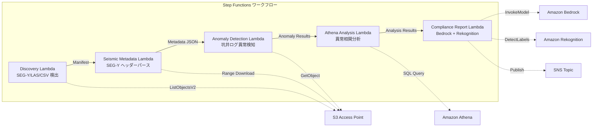

# UC8: Energie / Öl & Gas — Erdbebendaten-Verarbeitung und Anomalieerkennung in Bohrloch-Protokollen

🌐 **Language / 言語**: [日本語](README.md) | [English](README.en.md) | [한국어](README.ko.md) | [简体中文](README.zh-CN.md) | [繁體中文](README.zh-TW.md) | [Français](README.fr.md) | Deutsch | [Español](README.es.md)

## Übersicht
FSx for NetApp ONTAP nutzt S3 Access Points für einen serverlosen Workflow, der die Metadatenextraktion von SEG-Y-Seismikdaten, die Anomalieerkennung in Bohrlochlogs und die Generierung von Compliance-Berichten automatisiert.
### Fälle, für die dieses Muster geeignet ist
- SEG-Y-Seismikdaten und Bohrlochlogs sind in großen Mengen auf FSx ONTAP gespeichert
- Die Metadaten der Seismikdaten (Survey-Name, Koordinatensystem, Abtastintervall, Anzahl der Traces) sollen automatisch katalogisiert werden
- Anomalien in den Sensorablesungen der Bohrlöcher sollen automatisch erkannt werden
- Eine anomale Korrelationsanalyse zwischen Bohrlöchern und Zeitreihen ist mithilfe von Athena SQL erforderlich
- Compliance-Berichte sollen automatisch generiert werden
### Fälle, in denen dieses Muster nicht geeignet ist
- Echtzeit-Verarbeitung von seismischen Daten (HPC-Cluster geeignet)
- Vollständige Interpretation von seismischen Explorationsdaten (spezielle Software erforderlich)
- Verarbeitung großer 3D/4D-Seismikdatenmengen (EC2-basiert geeignet)
- Umgebungen, in denen keine Netzwerkverbindung zur ONTAP REST API möglich ist
### Hauptfunktionen
- Automatische Erkennung von SEG-Y/LAS/CSV-Dateien über S3 AP
- Streaming-Abruf der SEG-Y-Header (erste 3600 Bytes) mittels Range-Anfrage
- Extraktion von Metadaten (survey_name, coordinate_system, sample_interval, trace_count, data_format_code)
- Anomalieerkennung in Bohrlochlogs mittels statistischer Methoden (Standardabweichungsschwellenwert)
- Analyse von Anomalienkorrelationen zwischen Bohrlöchern und Zeitreihen mithilfe von Athena SQL
- Mustererkennung in Bohrlochlog-Visualisierungsbildern mittels Rekognition
- Generierung von Compliance-Berichten mit Amazon Bedrock
## Architektur



### Workflow-Schritte
1. **Discovery**:.segy,.sgy,.las,.csv Dateien von S3 AP entdecken
2. **Seismic Metadata**: SEG-Y-Header mit Range-Anfragen abrufen und Metadaten extrahieren
3. **Anomaly Detection**: Sensorwerte aus Bohrlochlogs mit statistischen Methoden auf Anomalien überprüfen
4. **Athena Analysis**: Inter-Well- und Zeitreihen-Korrolationsanomalien mit SQL analysieren
5. **Compliance Report**: Compliance-Berichte mit Bedrock erstellen, Bildmustererkennung mit Rekognition
## Voraussetzungen
- AWS-Konto und entsprechende IAM-Berechtigungen
- FSx for NetApp ONTAP-Dateisysteme (ONTAP 9.17.1P4D3 oder höher)
- S3 Access Point-aktivierte Volumes (zur Speicherung von Seismikdaten und Bohrlochprotokollen)
- VPC, private Subnetz
- Amazon Bedrock-Modellzugriff aktiviert (Claude / Nova)
## Bereitstellungsschritte

### 1. CloudFormation-Bereitstellung

```bash
aws cloudformation deploy \
  --template-file energy-seismic/template.yaml \
  --stack-name fsxn-energy-seismic \
  --parameter-overrides \
    S3AccessPointAlias=<your-volume-ext-s3alias> \
    S3AccessPointName=<your-s3ap-name> \
    VpcId=<your-vpc-id> \
    PrivateSubnetIds=<subnet-1>,<subnet-2> \
    ScheduleExpression="rate(1 hour)" \
    NotificationEmail=<your-email@example.com> \
    EnableVpcEndpoints=false \
    EnableCloudWatchAlarms=false \
  --capabilities CAPABILITY_IAM CAPABILITY_AUTO_EXPAND \
  --region ap-northeast-1
```

## Liste der Konfigurationsparameter

| パラメータ | 説明 | デフォルト | 必須 |
|-----------|------|----------|------|
| `S3AccessPointAlias` | FSx ONTAP S3 AP Alias（入力用） | — | ✅ |
| `S3AccessPointName` | S3 AP 名（ARN ベースの IAM 権限付与用。省略時は Alias ベースのみ） | `""` | ⚠️ 推奨 |
| `ScheduleExpression` | EventBridge Scheduler のスケジュール式 | `rate(1 hour)` | |
| `VpcId` | VPC ID | — | ✅ |
| `PrivateSubnetIds` | プライベートサブネット ID リスト | — | ✅ |
| `NotificationEmail` | SNS 通知先メールアドレス | — | ✅ |
| `AnomalyStddevThreshold` | 異常検知の標準偏差閾値 | `3.0` | |
| `MapConcurrency` | Map ステートの並列実行数 | `10` | |
| `LambdaMemorySize` | Lambda メモリサイズ (MB) | `1024` | |
| `LambdaTimeout` | Lambda タイムアウト (秒) | `300` | |
| `EnableVpcEndpoints` | Interface VPC Endpoints の有効化 | `false` | |
| `EnableCloudWatchAlarms` | CloudWatch Alarms の有効化 | `false` | |

## Bereinigung

```bash
aws s3 rm s3://fsxn-energy-seismic-output-${AWS_ACCOUNT_ID} --recursive

aws cloudformation delete-stack \
  --stack-name fsxn-energy-seismic \
  --region ap-northeast-1

aws cloudformation wait stack-delete-complete \
  --stack-name fsxn-energy-seismic \
  --region ap-northeast-1
```

## Unterstützte Regionen
UC8 verwendet die folgenden Dienste:
| サービス | リージョン制約 |
|---------|-------------|
| Amazon Athena | ほぼ全リージョンで利用可能 |
| Amazon Bedrock | 対応リージョンを確認（[Bedrock 対応リージョン](https://docs.aws.amazon.com/general/latest/gr/bedrock.html)） |
| Amazon Rekognition | ほぼ全リージョンで利用可能 |
| AWS X-Ray | ほぼ全リージョンで利用可能 |
| CloudWatch EMF | ほぼ全リージョンで利用可能 |
> Details finden Sie in der [Regionskompatibilitätsmatrix](../docs/region-compatibility.md).
## Referenzlinks
- [FSx ONTAP S3 Access Points 概要](https://docs.aws.amazon.com/fsx/latest/ONTAPGuide/accessing-data-via-s3-access-points.html)
- [SEG-Y Formatspezifikation (Rev 2.0)](https://seg.org/Portals/0/SEG/News%20and%20Resources/Technical%20Standards/seg_y_rev2_0-mar2017.pdf)
- [Amazon Athena Benutzerhandbuch](https://docs.aws.amazon.com/athena/latest/ug/what-is.html)
- [Amazon Rekognition Labels erkennen](https://docs.aws.amazon.com/rekognition/latest/dg/labels.html)