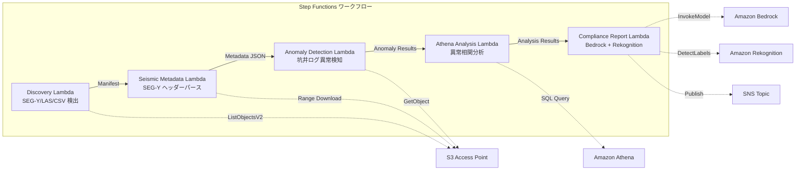

# UC8: Energy / Oil & Gas — Seismic Data Processing and Well Log Anomaly Detection

🌐 **Language / 言語**: [日本語](README.md) | English | [한국어](README.ko.md) | [简体中文](README.zh-CN.md) | [繁體中文](README.zh-TW.md) | [Français](README.fr.md) | [Deutsch](README.de.md) | [Español](README.es.md)

📚 **Documentation**: [Architecture Diagram](docs/architecture.en.md) | [Demo Guide](docs/demo-guide.en.md)

## Overview
Leveraging S3 Access Points in FSx for NetApp ONTAP, this serverless workflow automates metadata extraction for SEG-Y seismic survey data, anomaly detection in well logs, and generation of compliance reports.
### Cases where this pattern is suitable
- SEG-Y seismic exploration data and well logs are stored in large quantities on FSx for NetApp ONTAP
- We want to automatically catalog metadata of seismic exploration data (survey name, coordinate system, sample interval, trace count)
- We want to automatically detect anomalies from well log sensor readings
- We need anomaly correlation analysis between wells and over time using Athena SQL
- We want to automatically generate compliance reports
### Cases where this pattern is not suitable
- Real-time seismic data processing (HPC clusters are suitable)
- Complete seismic exploration data interpretation (requires specialized software)
- Handling large-scale 3D/4D seismic data volumes (EC2-based is suitable)
- Environments unable to provide network access to the ONTAP REST API
### Main Features
- Automatic detection of SEG-Y/LAS/CSV files via S3 AP
- Streaming retrieval of SEG-Y headers (first 3600 bytes) using Range requests
- Metadata extraction (survey_name, coordinate_system, sample_interval, trace_count, data_format_code)
- Anomaly detection in well logs using statistical methods (standard deviation threshold)
- Cross-well and time-series anomaly correlation analysis using Athena SQL
- Pattern recognition in well log visualization images using Rekognition
- Compliance report generation using Amazon Bedrock
## Architecture



### Workflow Steps
1. **Discovery**: Detect.segy,.sgy,.las, .csv files from S3 AP
2. **Seismic Metadata**: Retrieve SEG-Y headers with Range requests and extract metadata
3. **Anomaly Detection**: Detect anomalies in well log sensor values using statistical methods
4. **Athena Analysis**: Analyze inter-well and time-series anomaly correlations with SQL
5. **Compliance Report**: Generate compliance reports with Bedrock and recognize image patterns with Rekognition
## Prerequisites
- AWS account and appropriate IAM permissions
- FSx for NetApp ONTAP file system (ONTAP 9.17.1P4D3 or later)
- S3 Access Point-enabled volume (for storing seismic survey data and well logs)
- VPC, private subnets
- Amazon Bedrock model access enabled (Claude / Nova)
## Deployment steps

### 1. CloudFormation Deployment

```bash
aws cloudformation deploy \
  --template-file energy-seismic/template.yaml \
  --stack-name fsxn-energy-seismic \
  --parameter-overrides \
    S3AccessPointAlias=<your-volume-ext-s3alias> \
    S3AccessPointName=<your-s3ap-name> \
    VpcId=<your-vpc-id> \
    PrivateSubnetIds=<subnet-1>,<subnet-2> \
    ScheduleExpression="rate(1 hour)" \
    NotificationEmail=<your-email@example.com> \
    EnableVpcEndpoints=false \
    EnableCloudWatchAlarms=false \
  --capabilities CAPABILITY_IAM CAPABILITY_AUTO_EXPAND \
  --region ap-northeast-1
```

## List of Configuration Parameters

| パラメータ | 説明 | デフォルト | 必須 |
|-----------|------|----------|------|
| `S3AccessPointAlias` | FSx ONTAP S3 AP Alias（入力用） | — | ✅ |
| `S3AccessPointName` | S3 AP 名（ARN ベースの IAM 権限付与用。省略時は Alias ベースのみ） | `""` | ⚠️ 推奨 |
| `ScheduleExpression` | EventBridge Scheduler のスケジュール式 | `rate(1 hour)` | |
| `VpcId` | VPC ID | — | ✅ |
| `PrivateSubnetIds` | プライベートサブネット ID リスト | — | ✅ |
| `NotificationEmail` | SNS 通知先メールアドレス | — | ✅ |
| `AnomalyStddevThreshold` | 異常検知の標準偏差閾値 | `3.0` | |
| `MapConcurrency` | Map ステートの並列実行数 | `10` | |
| `LambdaMemorySize` | Lambda メモリサイズ (MB) | `1024` | |
| `LambdaTimeout` | Lambda タイムアウト (秒) | `300` | |
| `EnableVpcEndpoints` | Interface VPC Endpoints の有効化 | `false` | |
| `EnableCloudWatchAlarms` | CloudWatch Alarms の有効化 | `false` | |

## Cleanup

```bash
aws s3 rm s3://fsxn-energy-seismic-output-${AWS_ACCOUNT_ID} --recursive

aws cloudformation delete-stack \
  --stack-name fsxn-energy-seismic \
  --region ap-northeast-1

aws cloudformation wait stack-delete-complete \
  --stack-name fsxn-energy-seismic \
  --region ap-northeast-1
```

## Supported Regions
UC8 uses the following services:
| サービス | リージョン制約 |
|---------|-------------|
| Amazon Athena | ほぼ全リージョンで利用可能 |
| Amazon Bedrock | 対応リージョンを確認（[Bedrock 対応リージョン](https://docs.aws.amazon.com/general/latest/gr/bedrock.html)） |
| Amazon Rekognition | ほぼ全リージョンで利用可能 |
| AWS X-Ray | ほぼ全リージョンで利用可能 |
| CloudWatch EMF | ほぼ全リージョンで利用可能 |
> See the [Region Compatibility Matrix](../docs/region-compatibility.md) for more details.
## References
- [FSx for NetApp ONTAP S3 Access Points Overview](https://docs.aws.amazon.com/fsx/latest/ONTAPGuide/accessing-data-via-s3-access-points.html)
- [SEG-Y Format Specification (Rev 2.0)](https://seg.org/Portals/0/SEG/News%20and%20Resources/Technical%20Standards/seg_y_rev2_0-mar2017.pdf)
- [Amazon Athena User Guide](https://docs.aws.amazon.com/athena/latest/ug/what-is.html)
- [Amazon Rekognition Label Detection](https://docs.aws.amazon.com/rekognition/latest/dg/labels.html)