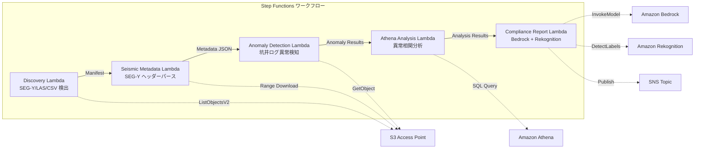

# UC8: Energía / Petróleo y Gas — Procesamiento de datos de exploración sísmica y detección de anomalías en registros de pozos

🌐 **Language / 言語**: [日本語](README.md) | [English](README.en.md) | [한국어](README.ko.md) | [简体中文](README.zh-CN.md) | [繁體中文](README.zh-TW.md) | [Français](README.fr.md) | [Deutsch](README.de.md) | Español

## Descripción general
Un flujo de trabajo sin servidor que aprovecha los Puntos de Acceso S3 de FSx for NetApp ONTAP para automatizar la extracción de metadatos de los datos sísmicos SEG-Y, la detección de anomalías en los registros de pozos y la generación de informes de cumplimiento.
### Casos en los que este patrón es adecuado
- SEG-Y Los datos de prospección sísmica y los registros de pozos se acumulan en grandes cantidades en FSx ONTAP
- Desea catalogar automáticamente los metadatos de los datos de prospección sísmica (nombre de la encuesta, sistema de coordenadas, intervalo de muestras, número de trazas)
- Desea detectar automáticamente anomalías a partir de las lecturas de sensores de registros de pozos
- Se necesita un análisis de correlación de anomalías entre pozos y temporal con Athena SQL
- Desea generar informes de cumplimiento automáticamente
### Casos en los que este patrón no es adecuado
- Procesamiento de datos sísmicos en tiempo real (un clúster HPC es adecuado)
- Interpretación completa de los datos de exploración sísmica (se necesita software especializado)
- Manejo de volúmenes de datos sísmicos 3D/4D a gran escala (una base EC2 es adecuada)
- Entornos donde no se puede garantizar el acceso a la red a la API REST de ONTAP
### Características principales
- Detección automática de archivos SEG-Y/LAS/CSV mediante S3 AP
- Obtención por streaming del encabezado SEG-Y (los primeros 3600 bytes) mediante solicitudes Range
- Extracción de metadatos (survey_name, coordinate_system, sample_interval, trace_count, data_format_code)
- Detección de anomalías en registros de pozos mediante métodos estadísticos (umbral de desviación estándar)
- Análisis de correlación anómala entre pozos y temporal mediante Athena SQL
- Reconocimiento de patrones en imágenes de visualización de registros de pozos mediante Rekognition
- Generación de informes de cumplimiento mediante Amazon Bedrock
## Arquitectura



### Paso de flujo de trabajo
1. **Discovery**: Detección de archivos.segy,.sgy,.las,.csv desde S3 AP
2. **Seismic Metadata**: Obtención de encabezados SEG-Y con solicitudes Range y extracción de metadatos
3. **Anomaly Detection**: Detección estadística de anomalías en valores de sensores de pozos
4. **Athena Analysis**: Análisis de correlaciones anormales entre pozos y series temporales con SQL
5. **Compliance Report**: Generación de informes de cumplimiento con Bedrock y reconocimiento de patrones de imágenes con Rekognition
## Requisitos previos
- Cuenta de AWS y permisos de IAM adecuados
- Sistema de archivos FSx for NetApp ONTAP (ONTAP 9.17.1P4D3 o superior)
- Punto de acceso S3 habilitado para volúmenes (almacenamiento de datos de exploración sísmica y registro de pozos)
- VPC, subredes privadas
- Acceso a modelos de Amazon Bedrock habilitado (Claude / Nova)
## Pasos de implementación

### 1. Despliegue de CloudFormation

```bash
aws cloudformation deploy \
  --template-file energy-seismic/template.yaml \
  --stack-name fsxn-energy-seismic \
  --parameter-overrides \
    S3AccessPointAlias=<your-volume-ext-s3alias> \
    S3AccessPointName=<your-s3ap-name> \
    VpcId=<your-vpc-id> \
    PrivateSubnetIds=<subnet-1>,<subnet-2> \
    ScheduleExpression="rate(1 hour)" \
    NotificationEmail=<your-email@example.com> \
    EnableVpcEndpoints=false \
    EnableCloudWatchAlarms=false \
  --capabilities CAPABILITY_IAM CAPABILITY_AUTO_EXPAND \
  --region ap-northeast-1
```

## Lista de parámetros de configuración

| パラメータ | 説明 | デフォルト | 必須 |
|-----------|------|----------|------|
| `S3AccessPointAlias` | FSx ONTAP S3 AP Alias（入力用） | — | ✅ |
| `S3AccessPointName` | S3 AP 名（ARN ベースの IAM 権限付与用。省略時は Alias ベースのみ） | `""` | ⚠️ 推奨 |
| `ScheduleExpression` | EventBridge Scheduler のスケジュール式 | `rate(1 hour)` | |
| `VpcId` | VPC ID | — | ✅ |
| `PrivateSubnetIds` | プライベートサブネット ID リスト | — | ✅ |
| `NotificationEmail` | SNS 通知先メールアドレス | — | ✅ |
| `AnomalyStddevThreshold` | 異常検知の標準偏差閾値 | `3.0` | |
| `MapConcurrency` | Map ステートの並列実行数 | `10` | |
| `LambdaMemorySize` | Lambda メモリサイズ (MB) | `1024` | |
| `LambdaTimeout` | Lambda タイムアウト (秒) | `300` | |
| `EnableVpcEndpoints` | Interface VPC Endpoints の有効化 | `false` | |
| `EnableCloudWatchAlarms` | CloudWatch Alarms の有効化 | `false` | |

## Limpieza

```bash
aws s3 rm s3://fsxn-energy-seismic-output-${AWS_ACCOUNT_ID} --recursive

aws cloudformation delete-stack \
  --stack-name fsxn-energy-seismic \
  --region ap-northeast-1

aws cloudformation wait stack-delete-complete \
  --stack-name fsxn-energy-seismic \
  --region ap-northeast-1
```

## Regiones compatibles
UC8 utiliza los siguientes servicios:
| サービス | リージョン制約 |
|---------|-------------|
| Amazon Athena | ほぼ全リージョンで利用可能 |
| Amazon Bedrock | 対応リージョンを確認（[Bedrock 対応リージョン](https://docs.aws.amazon.com/general/latest/gr/bedrock.html)） |
| Amazon Rekognition | ほぼ全リージョンで利用可能 |
| AWS X-Ray | ほぼ全リージョンで利用可能 |
| CloudWatch EMF | ほぼ全リージョンで利用可能 |
> Para más detalles, consulte la [Matriz de compatibilidad de regiones](../docs/region-compatibility.md).
## Enlaces de referencia
- [Puntos de acceso a S3 de FSx ONTAP 概要](https://docs.aws.amazon.com/fsx/latest/ONTAPGuide/accessing-data-via-s3-access-points.html)
- [Especificaciones del formato SEG-Y (Rev 2.0)](https://seg.org/Portals/0/SEG/News%20and%20Resources/Technical%20Standards/seg_y_rev2_0-mar2017.pdf)
- [Guía del usuario de Amazon Athena](https://docs.aws.amazon.com/athena/latest/ug/what-is.html)
- [Detección de etiquetas de Amazon Rekognition](https://docs.aws.amazon.com/rekognition/latest/dg/labels.html)