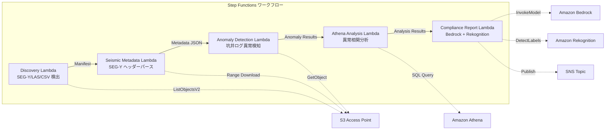

# UC8 : Énergie / Pétrole et gaz — Traitement de données de prospection sismique et détection d'anomalies dans les journaux de puits

🌐 **Language / 言語**: [日本語](README.md) | [English](README.en.md) | [한국어](README.ko.md) | [简体中文](README.zh-CN.md) | [繁體中文](README.zh-TW.md) | Français | [Deutsch](README.de.md) | [Español](README.es.md)

## Aperçu
Il s'agit d'un flux de travail sans serveur automatisé pour l'extraction de métadonnées de données sismiques SEG-Y, la détection d'anomalies de journaux de puits et la génération de rapports de conformité en utilisant les Points d'accès S3 de FSx for NetApp ONTAP.
### Cas où ce modèle est approprié
- Les données sismiques SEG-Y et les journaux de puits sont massivement stockés sur FSx ONTAP
- On souhaite cataloguer automatiquement les métadonnées des données sismiques (nom du levé, système de coordonnées, intervalle d'échantillonnage, nombre de traces)
- On souhaite détecter automatiquement les anomalies à partir des lectures de capteurs des journaux de puits
- Une analyse de corrélation d'anomalies entre puits et temporelles est nécessaire avec Athena SQL
- On souhaite générer automatiquement des rapports de conformité
### Cas où ce modèle ne convient pas
- Traitement de données sismiques en temps réel (un cluster HPC est approprié)
- Interprétation complète des données d'exploration sismique (nécessite un logiciel dédié)
- Traitement de volumes de données sismiques 3D/4D à grande échelle (une base EC2 est appropriée)
- Environnements où la connectivité réseau à l'ONTAP REST API n'est pas possible
### Principales fonctionnalités
- Détection automatique des fichiers SEG-Y/LAS/CSV via S3 AP
- Récupération en streaming de l'en-tête SEG-Y (premiers 3600 octets) par requête de plage
- Extraction des métadonnées (survey_name, coordinate_system, sample_interval, trace_count, data_format_code)
- Détection d'anomalies dans les journaux de puits par une méthode statistique (seuil de l'écart-type)
- Analyse de corrélation d'anomalies entre puits et au fil du temps avec Athena SQL
- Reconnaissance de motifs dans les images de visualisation de journaux de puits avec Rekognition
- Génération de rapports de conformité avec Amazon Bedrock
## Architecture



### Étapes du flux de travail
1. **Découverte** : Détecter les fichiers.segy,.sgy,.las, .csv depuis S3 AP
2. **Métadonnées sismiques** : Obtenir les en-têtes SEG-Y avec une requête Range et extraire les métadonnées
3. **Détection d'anomalies** : Détection d'anomalies dans les valeurs des capteurs du puits en utilisant des méthodes statistiques
4. **Analyse Athena** : Analyser la corrélation anormale entre les puits et au fil du temps avec SQL
5. **Rapport de conformité** : Générer un rapport de conformité avec Bedrock, reconnaissance de motifs d'image avec Rekognition
## Conditions préalables
- Compte AWS et autorisations IAM appropriées
- Système de fichiers FSx for NetApp ONTAP (ONTAP 9.17.1P4D3 et supérieur)
- Point d'accès S3 activé pour les volumes (stockage des données de prospection sismique et des journaux de puits)
- VPC, sous-réseaux privés
- Accès aux modèles Amazon Bedrock activé (Claude / Nova)
## Étapes de déploiement

### 1. Déploiement CloudFormation

```bash
aws cloudformation deploy \
  --template-file energy-seismic/template.yaml \
  --stack-name fsxn-energy-seismic \
  --parameter-overrides \
    S3AccessPointAlias=<your-volume-ext-s3alias> \
    S3AccessPointName=<your-s3ap-name> \
    VpcId=<your-vpc-id> \
    PrivateSubnetIds=<subnet-1>,<subnet-2> \
    ScheduleExpression="rate(1 hour)" \
    NotificationEmail=<your-email@example.com> \
    EnableVpcEndpoints=false \
    EnableCloudWatchAlarms=false \
  --capabilities CAPABILITY_IAM CAPABILITY_AUTO_EXPAND \
  --region ap-northeast-1
```

## Liste des paramètres de configuration

| パラメータ | 説明 | デフォルト | 必須 |
|-----------|------|----------|------|
| `S3AccessPointAlias` | FSx ONTAP S3 AP Alias（入力用） | — | ✅ |
| `S3AccessPointName` | S3 AP 名（ARN ベースの IAM 権限付与用。省略時は Alias ベースのみ） | `""` | ⚠️ 推奨 |
| `ScheduleExpression` | EventBridge Scheduler のスケジュール式 | `rate(1 hour)` | |
| `VpcId` | VPC ID | — | ✅ |
| `PrivateSubnetIds` | プライベートサブネット ID リスト | — | ✅ |
| `NotificationEmail` | SNS 通知先メールアドレス | — | ✅ |
| `AnomalyStddevThreshold` | 異常検知の標準偏差閾値 | `3.0` | |
| `MapConcurrency` | Map ステートの並列実行数 | `10` | |
| `LambdaMemorySize` | Lambda メモリサイズ (MB) | `1024` | |
| `LambdaTimeout` | Lambda タイムアウト (秒) | `300` | |
| `EnableVpcEndpoints` | Interface VPC Endpoints の有効化 | `false` | |
| `EnableCloudWatchAlarms` | CloudWatch Alarms の有効化 | `false` | |
| `EnableSnapStart` | Activer Lambda SnapStart (réduction du démarrage à froid) | `false` | |

## Nettoyage

```bash
aws s3 rm s3://fsxn-energy-seismic-output-${AWS_ACCOUNT_ID} --recursive

aws cloudformation delete-stack \
  --stack-name fsxn-energy-seismic \
  --region ap-northeast-1

aws cloudformation wait stack-delete-complete \
  --stack-name fsxn-energy-seismic \
  --region ap-northeast-1
```

## Régions prises en charge
UC8 utilise les services suivants :
| サービス | リージョン制約 |
|---------|-------------|
| Amazon Athena | ほぼ全リージョンで利用可能 |
| Amazon Bedrock | 対応リージョンを確認（[Bedrock 対応リージョン](https://docs.aws.amazon.com/general/latest/gr/bedrock.html)） |
| Amazon Rekognition | ほぼ全リージョンで利用可能 |
| AWS X-Ray | ほぼ全リージョンで利用可能 |
| CloudWatch EMF | ほぼ全リージョンで利用可能 |
> Pour plus de détails, consultez la [Matrice de compatibilité régionale](../docs/region-compatibility.md).
## Liens utiles
- [FSx ONTAP S3 Access Points 概要](https://docs.aws.amazon.com/fsx/latest/ONTAPGuide/accessing-data-via-s3-access-points.html)
- [SEG-Y フォーマット仕様 (Rev 2.0)](https://seg.org/Portals/0/SEG/News%20and%20Resources/Technical%20Standards/seg_y_rev2_0-mar2017.pdf)
- [Guide de l'utilisateur d'Amazon Athena](https://docs.aws.amazon.com/athena/latest/ug/what-is.html)
- [Détection de labels avec Amazon Rekognition](https://docs.aws.amazon.com/rekognition/latest/dg/labels.html)