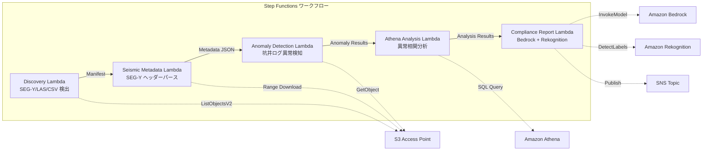

# UC8: 에너지 / 석유 및 가스 — 지진 탐사 데이터 처리 및 우물 로그 비정상 감지

🌐 **Language / 言語**: [日本語](README.md) | [English](README.en.md) | 한국어 | [简体中文](README.zh-CN.md) | [繁體中文](README.zh-TW.md) | [Français](README.fr.md) | [Deutsch](README.de.md) | [Español](README.es.md)

## 개요
FSx for NetApp ONTAP의 S3 Access Points를 활용하여 SEG-Y 지진 탐사 데이터의 메타데이터 추출, 웰 로그의 이상 탐지, 규정 준수 보고서 생성을 자동화하는 서버리스 워크플로입니다.
### 이 패턴이 적합한 경우
- SEG-Y 지진 탐사 데이터와 우물 로그가 FSx ONTAP에 대량으로 저장되어 있습니다.
- 지진 탐사 데이터의 메타데이터(측량명, 좌표계, 샘플 간격, 트레이스 수)를 자동으로 카탈로그화하고 싶습니다.
- 우물 로그의 센서 판독값에서 이상을 자동으로 감지하고 싶습니다.
- Athena SQL을 사용한 우물 간 및 시계열 이상 상관 분석이 필요합니다.
- 컴플라이언스 보고서를 자동으로 생성하고 싶습니다.
### 이 패턴이 적합하지 않은 경우
- 실시간 지진 데이터 처리(HPC 클러스터가 적합)
- 전체 지진 탐사 데이터 해석(전용 소프트웨어 필요)
- 대규모 3D/4D 지진 데이터 볼륨 처리(EC2 기반이 적합)
- ONTAP REST API에 대한 네트워크 접근성을 보장할 수 없는 환경
### 주요 기능
- S3 AP를 통해 SEG-Y/LAS/CSV 파일을 자동 검출
- Range 요청을 통한 SEG-Y 헤더(첫 3600바이트)의 스트리밍 획득
- 메타데이터 추출(survey_name, coordinate_system, sample_interval, trace_count, data_format_code)
- 통계적 방법(표준 편차 임계값)을 통한 광산 로그 이상 감지
- Athena SQL을 통한 광산 간 및 시계열의 비정상 상관 분석
- Rekognition을 통한 광산 로그 시각화 이미지의 패턴 인식
- Amazon Bedrock을 통한 컴플라이언스 보고서 생성
## 아키텍처



### 워크플로우 단계
1. **검색**: S3 AP에서.segy,.sgy,.las,.csv 파일 검색
2. **지진 메타데이터**: Range 요청으로 SEG-Y 헤더를 가져와 메타데이터 추출
3. **이상 탐지**: 통계적 방법으로 광산 로그의 센서 값 이상 탐지
4. **Athena 분석**: SQL을 사용하여 광산 간 및 시계열의 이상 상관 분석
5. **규정 준수 보고서**: Bedrock으로 규정 준수 보고서 생성, Rekognition으로 이미지 패턴 인식
## 전제 조건
- AWS 계정 및 적절한 IAM 권한
- NetApp ONTAP용 FSx 파일 시스템(ONTAP 9.17.1P4D3 이상)
- S3 액세스 포인트가 활성화된 볼륨(지진 탐사 데이터 및 우물 로그 저장)
- VPC, 프라이빗 서브넷
- Amazon Bedrock 모델 액세스 활성화(Claude / Nova)
## 배포 절차

### 1. CloudFormation 배포

```bash
aws cloudformation deploy \
  --template-file energy-seismic/template.yaml \
  --stack-name fsxn-energy-seismic \
  --parameter-overrides \
    S3AccessPointAlias=<your-volume-ext-s3alias> \
    S3AccessPointName=<your-s3ap-name> \
    VpcId=<your-vpc-id> \
    PrivateSubnetIds=<subnet-1>,<subnet-2> \
    ScheduleExpression="rate(1 hour)" \
    NotificationEmail=<your-email@example.com> \
    EnableVpcEndpoints=false \
    EnableCloudWatchAlarms=false \
  --capabilities CAPABILITY_IAM CAPABILITY_AUTO_EXPAND \
  --region ap-northeast-1
```

## 설정 매개변수 목록

| パラメータ | 説明 | デフォルト | 必須 |
|-----------|------|----------|------|
| `S3AccessPointAlias` | FSx ONTAP S3 AP Alias（入力用） | — | ✅ |
| `S3AccessPointName` | S3 AP 名（ARN ベースの IAM 権限付与用。省略時は Alias ベースのみ） | `""` | ⚠️ 推奨 |
| `ScheduleExpression` | EventBridge Scheduler のスケジュール式 | `rate(1 hour)` | |
| `VpcId` | VPC ID | — | ✅ |
| `PrivateSubnetIds` | プライベートサブネット ID リスト | — | ✅ |
| `NotificationEmail` | SNS 通知先メールアドレス | — | ✅ |
| `AnomalyStddevThreshold` | 異常検知の標準偏差閾値 | `3.0` | |
| `MapConcurrency` | Map ステートの並列実行数 | `10` | |
| `LambdaMemorySize` | Lambda メモリサイズ (MB) | `1024` | |
| `LambdaTimeout` | Lambda タイムアウト (秒) | `300` | |
| `EnableVpcEndpoints` | Interface VPC Endpoints の有効化 | `false` | |
| `EnableCloudWatchAlarms` | CloudWatch Alarms の有効化 | `false` | |
| `EnableSnapStart` | Lambda SnapStart 활성화 (콜드 스타트 단축) | `false` | |

## 정리

```bash
aws s3 rm s3://fsxn-energy-seismic-output-${AWS_ACCOUNT_ID} --recursive

aws cloudformation delete-stack \
  --stack-name fsxn-energy-seismic \
  --region ap-northeast-1

aws cloudformation wait stack-delete-complete \
  --stack-name fsxn-energy-seismic \
  --region ap-northeast-1
```

## 지원되는 리전
UC8은 다음 서비스를 사용합니다: Amazon Bedrock, AWS Step Functions, Amazon Athena, Amazon S3, AWS Lambda, Amazon FSx for NetApp ONTAP, Amazon CloudWatch, AWS CloudFormation 등.
| サービス | リージョン制約 |
|---------|-------------|
| Amazon Athena | ほぼ全リージョンで利用可能 |
| Amazon Bedrock | 対応リージョンを確認（[Bedrock 対応リージョン](https://docs.aws.amazon.com/general/latest/gr/bedrock.html)） |
| Amazon Rekognition | ほぼ全リージョンで利用可能 |
| AWS X-Ray | ほぼ全リージョンで利用可能 |
| CloudWatch EMF | ほぼ全リージョンで利用可能 |
> 자세한 내용은 [리전 호환성 매트릭스](../docs/region-compatibility.md)를 참조하세요.
## 참고 링크
- [FSx ONTAP S3 액세스 포인트 개요](https://docs.aws.amazon.com/fsx/latest/ONTAPGuide/accessing-data-via-s3-access-points.html)
- [SEG-Y 형식 사양 (Rev 2.0)](https://seg.org/Portals/0/SEG/News%20and%20Resources/Technical%20Standards/seg_y_rev2_0-mar2017.pdf)
- [Amazon Athena 사용 가이드](https://docs.aws.amazon.com/athena/latest/ug/what-is.html)
- [Amazon Rekognition 레이블 감지](https://docs.aws.amazon.com/rekognition/latest/dg/labels.html)