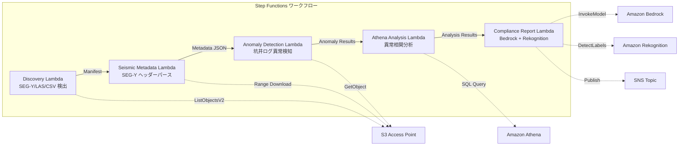

# UC8: エネルギー / 石油・ガス — 地震探査データ処理・坑井ログ異常検知

## 概要

FSx for NetApp ONTAP の S3 Access Points を活用し、SEG-Y 地震探査データのメタデータ抽出、坑井ログの異常検知、コンプライアンスレポート生成を自動化するサーバーレスワークフローです。

### このパターンが適しているケース

- SEG-Y 地震探査データや坑井ログが FSx ONTAP 上に大量に蓄積されている
- 地震探査データのメタデータ（測量名、座標系、サンプル間隔、トレース数）を自動カタログ化したい
- 坑井ログのセンサー読み取り値から異常を自動検知したい
- Athena SQL による坑井間・時系列の異常相関分析が必要
- コンプライアンスレポートを自動生成したい

### このパターンが適さないケース

- リアルタイムの地震データ処理（HPC クラスタが適切）
- 完全な地震探査データ解釈（専用ソフトウェアが必要）
- 大規模な 3D/4D 地震データボリュームの処理（EC2 ベースが適切）
- ONTAP REST API へのネットワーク到達性が確保できない環境

### 主な機能

- S3 AP 経由で SEG-Y/LAS/CSV ファイルを自動検出
- Range リクエストによる SEG-Y ヘッダー（先頭 3600 バイト）のストリーミング取得
- メタデータ抽出（survey_name, coordinate_system, sample_interval, trace_count, data_format_code）
- 統計的手法（標準偏差閾値）による坑井ログ異常検知
- Athena SQL による坑井間・時系列の異常相関分析
- Rekognition による坑井ログ可視化画像のパターン認識
- Amazon Bedrock によるコンプライアンスレポート生成

## アーキテクチャ



### ワークフローステップ

1. **Discovery**: S3 AP から .segy, .sgy, .las, .csv ファイルを検出
2. **Seismic Metadata**: Range リクエストで SEG-Y ヘッダーを取得し、メタデータを抽出
3. **Anomaly Detection**: 坑井ログのセンサー値を統計的手法で異常検知
4. **Athena Analysis**: 坑井間・時系列の異常相関を SQL で分析
5. **Compliance Report**: Bedrock でコンプライアンスレポート生成、Rekognition で画像パターン認識

## 前提条件

- AWS アカウントと適切な IAM 権限
- FSx for NetApp ONTAP ファイルシステム（ONTAP 9.17.1P4D3 以上）
- S3 Access Point が有効化されたボリューム（地震探査データ・坑井ログを格納）
- VPC、プライベートサブネット
- Amazon Bedrock モデルアクセスが有効（Claude / Nova）

## デプロイ手順

### 1. CloudFormation デプロイ

```bash
aws cloudformation deploy \
  --template-file energy-seismic/template.yaml \
  --stack-name fsxn-energy-seismic \
  --parameter-overrides \
    S3AccessPointAlias=<your-volume-ext-s3alias> \
    VpcId=<your-vpc-id> \
    PrivateSubnetIds=<subnet-1>,<subnet-2> \
    ScheduleExpression="rate(1 hour)" \
    NotificationEmail=<your-email@example.com> \
    EnableVpcEndpoints=false \
    EnableCloudWatchAlarms=false \
  --capabilities CAPABILITY_IAM CAPABILITY_AUTO_EXPAND \
  --region ap-northeast-1
```

## 設定パラメータ一覧

| パラメータ | 説明 | デフォルト | 必須 |
|-----------|------|----------|------|
| `S3AccessPointAlias` | FSx ONTAP S3 AP Alias（入力用） | — | ✅ |
| `ScheduleExpression` | EventBridge Scheduler のスケジュール式 | `rate(1 hour)` | |
| `VpcId` | VPC ID | — | ✅ |
| `PrivateSubnetIds` | プライベートサブネット ID リスト | — | ✅ |
| `NotificationEmail` | SNS 通知先メールアドレス | — | ✅ |
| `AnomalyStddevThreshold` | 異常検知の標準偏差閾値 | `3.0` | |
| `MapConcurrency` | Map ステートの並列実行数 | `10` | |
| `LambdaMemorySize` | Lambda メモリサイズ (MB) | `1024` | |
| `LambdaTimeout` | Lambda タイムアウト (秒) | `300` | |
| `EnableVpcEndpoints` | Interface VPC Endpoints の有効化 | `false` | |
| `EnableCloudWatchAlarms` | CloudWatch Alarms の有効化 | `false` | |

## クリーンアップ

```bash
aws s3 rm s3://fsxn-energy-seismic-output-${AWS_ACCOUNT_ID} --recursive

aws cloudformation delete-stack \
  --stack-name fsxn-energy-seismic \
  --region ap-northeast-1

aws cloudformation wait stack-delete-complete \
  --stack-name fsxn-energy-seismic \
  --region ap-northeast-1
```

## Supported Regions

UC8 は以下のサービスを使用します:

| サービス | リージョン制約 |
|---------|-------------|
| Amazon Athena | ほぼ全リージョンで利用可能 |
| Amazon Bedrock | 対応リージョンを確認（[Bedrock 対応リージョン](https://docs.aws.amazon.com/general/latest/gr/bedrock.html)） |
| Amazon Rekognition | ほぼ全リージョンで利用可能 |
| AWS X-Ray | ほぼ全リージョンで利用可能 |
| CloudWatch EMF | ほぼ全リージョンで利用可能 |

> 詳細は [リージョン互換性マトリックス](../docs/region-compatibility.md) を参照。

## 参考リンク

- [FSx ONTAP S3 Access Points 概要](https://docs.aws.amazon.com/fsx/latest/ONTAPGuide/accessing-data-via-s3-access-points.html)
- [SEG-Y フォーマット仕様 (Rev 2.0)](https://seg.org/Portals/0/SEG/News%20and%20Resources/Technical%20Standards/seg_y_rev2_0-mar2017.pdf)
- [Amazon Athena ユーザーガイド](https://docs.aws.amazon.com/athena/latest/ug/what-is.html)
- [Amazon Rekognition ラベル検出](https://docs.aws.amazon.com/rekognition/latest/dg/labels.html)
