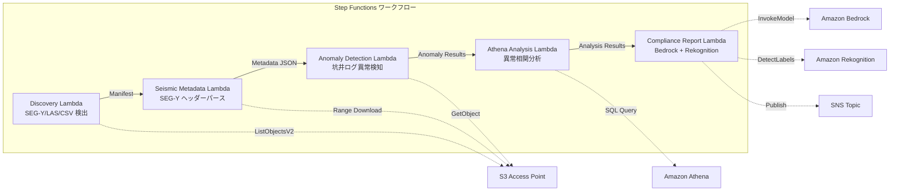

# UC8: 能源 / 石油和天然气 — 地震勘探数据处理和井日志异常检测

🌐 **Language / 言語**: [日本語](README.md) | [English](README.en.md) | [한국어](README.ko.md) | 简体中文 | [繁體中文](README.zh-TW.md) | [Français](README.fr.md) | [Deutsch](README.de.md) | [Español](README.es.md)

## 概述
利用 FSx for NetApp ONTAP 的 S3 Access Points，实现一个用于自动化 SEG-Y 地震勘探数据元数据提取、井日志异常检测和合规性报告生成的无服务器工作流。
### 适用场景
- SEG-Y 地震探测数据和井日志大量积累在 FSx ONTAP 上
- 希望自动目录化地震探测数据的元数据（测量名称、坐标系、采样间隔、迹数）
- 希望从井日志的传感器读数中自动检测异常
- 需要使用 Athena SQL 进行井间和时间序列的异常相关分析
- 希望自动生成合规性报告
### 不适用的情况

当这种模式不适用时
- 实时地震数据处理（适合使用 HPC 集群）
- 完整的地震勘探数据解释（需要专用软件）
- 大规模 3D/4D 地震数据量的处理（适合使用 EC2 基础设施）
- 无法确保对 ONTAP REST API 的网络访问环境
### 主要功能

- 保持AWS服务名称用英语（Amazon Bedrock、AWS Step Functions、Amazon Athena、Amazon S3、AWS Lambda、Amazon FSx for NetApp ONTAP、Amazon CloudWatch、AWS CloudFormation等）
- 保持技术术语不翻译（GDSII、DRC、OASIS、GDS、Lambda、tapeout等）
- 保持内联代码（`...`）不翻译
- 保持文件路径和URL不翻译
- 自然翻译，不是逐字翻译
- 仅返回翻译文本，不提供解释
- 通过 S3 AP 自动检测 SEG-Y/LAS/CSV 文件
- 使用 Range 请求流式获取 SEG-Y 头（前 3600 字节）
- 提取元数据（survey_name、coordinate_system、sample_interval、trace_count、data_format_code）
- 通过统计方法（标准偏差阈值）检测井日志异常
- 使用 Athena SQL 进行井间和时间序列异常相关性分析
- 使用 Rekognition 识别井日志可视化图像的模式
- 使用 Amazon Bedrock 生成合规性报告
## 架构



### 工作流程步骤

在使用 Amazon Bedrock 和 AWS Step Functions 时，可以创建复杂的工作流程。Amazon Athena 用于查询 Amazon S3 中的数据，而 AWS Lambda 可以执行自定义代码。确保使用 Amazon FSx for NetApp ONTAP 来管理文件系统。使用 Amazon CloudWatch 监控系统日志，并通过 AWS CloudFormation 模板来管理基础设施即代码。

注意：请确保 GDSII 文件符合 DRC 规范，并在 tapeout 阶段进行最终验证。以下是一些示例代码：

```python
import boto3

# 初始化 Amazon S3 客户端
s3 = boto3.client('s3')

# 列出所有存储桶
response = s3.list_buckets()
print("存储桶列表：", response['Buckets'])
```

请访问 [AWS 文档](https://docs.aws.amazon.com/) 以获取更多信息。
1. **发现**：从 S3 AP 检测.segy、.sgy、.las、.csv 文件
2. **地震元数据**：通过 Range 请求获取 SEG-Y 头部，并提取元数据
3. **异常检测**：使用统计方法对井日志的传感器值进行异常检测
4. **Athena 分析**：使用 SQL 分析井间和时间序列的异常相关性
5. **合规报告**：使用 Bedrock 生成合规报告，使用 Rekognition 识别图像模式
## 前提条件
- AWS 账户和适当的 IAM 权限
- FSx for NetApp ONTAP 文件系统（ONTAP 9.17.1P4D3 及以上版本）
- 已启用 S3 Access Point 的卷（存储地震勘探数据和井日志）
- VPC、私有子网
- 已启用 Amazon Bedrock 模型访问（Claude / Nova）
## 部署步骤

### 1. CloudFormation 部署

```bash
aws cloudformation deploy \
  --template-file energy-seismic/template.yaml \
  --stack-name fsxn-energy-seismic \
  --parameter-overrides \
    S3AccessPointAlias=<your-volume-ext-s3alias> \
    S3AccessPointName=<your-s3ap-name> \
    VpcId=<your-vpc-id> \
    PrivateSubnetIds=<subnet-1>,<subnet-2> \
    ScheduleExpression="rate(1 hour)" \
    NotificationEmail=<your-email@example.com> \
    EnableVpcEndpoints=false \
    EnableCloudWatchAlarms=false \
  --capabilities CAPABILITY_IAM CAPABILITY_AUTO_EXPAND \
  --region ap-northeast-1
```

## 设置参数列表

| パラメータ | 説明 | デフォルト | 必須 |
|-----------|------|----------|------|
| `S3AccessPointAlias` | FSx ONTAP S3 AP Alias（入力用） | — | ✅ |
| `S3AccessPointName` | S3 AP 名（ARN ベースの IAM 権限付与用。省略時は Alias ベースのみ） | `""` | ⚠️ 推奨 |
| `ScheduleExpression` | EventBridge Scheduler のスケジュール式 | `rate(1 hour)` | |
| `VpcId` | VPC ID | — | ✅ |
| `PrivateSubnetIds` | プライベートサブネット ID リスト | — | ✅ |
| `NotificationEmail` | SNS 通知先メールアドレス | — | ✅ |
| `AnomalyStddevThreshold` | 異常検知の標準偏差閾値 | `3.0` | |
| `MapConcurrency` | Map ステートの並列実行数 | `10` | |
| `LambdaMemorySize` | Lambda メモリサイズ (MB) | `1024` | |
| `LambdaTimeout` | Lambda タイムアウト (秒) | `300` | |
| `EnableVpcEndpoints` | Interface VPC Endpoints の有効化 | `false` | |
| `EnableCloudWatchAlarms` | CloudWatch Alarms の有効化 | `false` | |

## 清理

```bash
aws s3 rm s3://fsxn-energy-seismic-output-${AWS_ACCOUNT_ID} --recursive

aws cloudformation delete-stack \
  --stack-name fsxn-energy-seismic \
  --region ap-northeast-1

aws cloudformation wait stack-delete-complete \
  --stack-name fsxn-energy-seismic \
  --region ap-northeast-1
```

## 支持的区域
UC8 使用以下服务：
| サービス | リージョン制約 |
|---------|-------------|
| Amazon Athena | ほぼ全リージョンで利用可能 |
| Amazon Bedrock | 対応リージョンを確認（[Bedrock 対応リージョン](https://docs.aws.amazon.com/general/latest/gr/bedrock.html)） |
| Amazon Rekognition | ほぼ全リージョンで利用可能 |
| AWS X-Ray | ほぼ全リージョンで利用可能 |
| CloudWatch EMF | ほぼ全リージョンで利用可能 |
> 有关详细信息，请参阅 [区域兼容性矩阵](../docs/region-compatibility.md)。
## 参考链接
- [FSx ONTAP S3 访问点概述](https://docs.aws.amazon.com/fsx/latest/ONTAPGuide/accessing-data-via-s3-access-points.html)
- [SEG-Y 格式规范 (Rev 2.0)](https://seg.org/Portals/0/SEG/News%20and%20Resources/Technical%20Standards/seg_y_rev2_0-mar2017.pdf)
- [Amazon Athena 用户指南](https://docs.aws.amazon.com/athena/latest/ug/what-is.html)
- [Amazon Rekognition 标签检测](https://docs.aws.amazon.com/rekognition/latest/dg/labels.html)