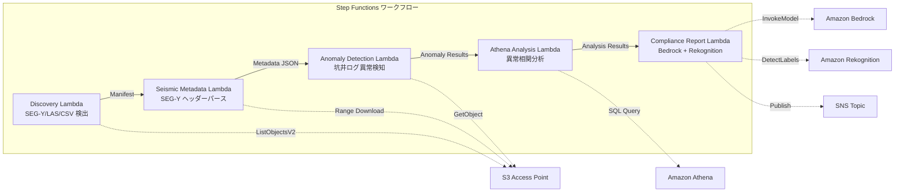

# UC8: 能源 / 石油・氣體 — 地震探測數據處理・井日誌異常檢測

🌐 **Language / 言語**: [日本語](README.md) | [English](README.en.md) | [한국어](README.ko.md) | [简体中文](README.zh-CN.md) | 繁體中文 | [Français](README.fr.md) | [Deutsch](README.de.md) | [Español](README.es.md)

## 概述
利用 FSx for NetApp ONTAP 的 S3 Access Points，自動化以伺服器端作業形式提取 SEG-Y 地震勘探數據的中繼資料、井日誌異常檢測和產生合規報告。
### 適用此模式的情況
- SEG-Y 地震探査資料和井日誌大量存儲在 FSx ONTAP 上
- 想要自動編目地震探測資料的元數據（測量名稱、坐標系、樣本間隔、道數）
- 想要從井日誌的感應器讀數自動檢測異常
- 需要使用 Athena SQL 進行井間和時間序列的異常相關分析
- 想要自動生成合規性報告
### 不適用的情況

這個模式不適用的情況
- 實時地震數據處理（HPC 叢集最適）
- 完整的地震勘探數據解讀（需要專用軟件）
- 大規模 3D/4D 地震數據量的處理（EC2 基礎最適）
- 環境中無法確保對 ONTAP REST API 的網絡訪問
### 主要功能
- 通過 S3 AP 自動檢測 SEG-Y/LAS/CSV 文件
- 使用 Range 請求流式取得 SEG-Y 標頭（前 3600 位元組）
- 提取元數據（survey_name, coordinate_system, sample_interval, trace_count, data_format_code）
- 使用統計方法（標準差閾值）檢測井日誌異常
- 使用 Athena SQL 進行井間及時間序列異常相關分析
- 使用 Rekognition 對井日誌可視化影像進行模式識別
- 使用 Amazon Bedrock 生成合規報告
## 架構



### 工作流程步驟
1. **探索**：從 S3 AP 檢測.segy,.sgy,.las,.csv 檔案
2. **地震元數據**：使用 Range 請求來獲取 SEG-Y 頭部並提取元數據
3. **異常檢測**：利用統計方法對井日誌的傳感器值進行異常檢測
4. **Athena 分析**：使用 SQL 分析井間和時間序列的異常相關性
5. **合規報告**：使用 Bedrock 生成合規報告，使用 Rekognition 識別圖像模式
## 前提條件
- AWS 帳戶和適當的 IAM 權限
- FSx for NetApp ONTAP 文件系統（ONTAP 9.17.1P4D3 以上）
- S3 Access Point 已啟用的卷（存儲地震勘探數據和井日誌）
- VPC、私有子網
- Amazon Bedrock 模型訪問已啟用（Claude / Nova）
## 部署步驟

### 1. CloudFormation 部署

```bash
aws cloudformation deploy \
  --template-file energy-seismic/template.yaml \
  --stack-name fsxn-energy-seismic \
  --parameter-overrides \
    S3AccessPointAlias=<your-volume-ext-s3alias> \
    S3AccessPointName=<your-s3ap-name> \
    VpcId=<your-vpc-id> \
    PrivateSubnetIds=<subnet-1>,<subnet-2> \
    ScheduleExpression="rate(1 hour)" \
    NotificationEmail=<your-email@example.com> \
    EnableVpcEndpoints=false \
    EnableCloudWatchAlarms=false \
  --capabilities CAPABILITY_IAM CAPABILITY_AUTO_EXPAND \
  --region ap-northeast-1
```

## 設定參數列表

| パラメータ | 説明 | デフォルト | 必須 |
|-----------|------|----------|------|
| `S3AccessPointAlias` | FSx ONTAP S3 AP Alias（入力用） | — | ✅ |
| `S3AccessPointName` | S3 AP 名（ARN ベースの IAM 権限付与用。省略時は Alias ベースのみ） | `""` | ⚠️ 推奨 |
| `ScheduleExpression` | EventBridge Scheduler のスケジュール式 | `rate(1 hour)` | |
| `VpcId` | VPC ID | — | ✅ |
| `PrivateSubnetIds` | プライベートサブネット ID リスト | — | ✅ |
| `NotificationEmail` | SNS 通知先メールアドレス | — | ✅ |
| `AnomalyStddevThreshold` | 異常検知の標準偏差閾値 | `3.0` | |
| `MapConcurrency` | Map ステートの並列実行数 | `10` | |
| `LambdaMemorySize` | Lambda メモリサイズ (MB) | `1024` | |
| `LambdaTimeout` | Lambda タイムアウト (秒) | `300` | |
| `EnableVpcEndpoints` | Interface VPC Endpoints の有効化 | `false` | |
| `EnableCloudWatchAlarms` | CloudWatch Alarms の有効化 | `false` | |
| `EnableSnapStart` | 啟用 Lambda SnapStart（冷啟動縮短） | `false` | |

## 清理

```bash
aws s3 rm s3://fsxn-energy-seismic-output-${AWS_ACCOUNT_ID} --recursive

aws cloudformation delete-stack \
  --stack-name fsxn-energy-seismic \
  --region ap-northeast-1

aws cloudformation wait stack-delete-complete \
  --stack-name fsxn-energy-seismic \
  --region ap-northeast-1
```

## 支援的地區
UC8 使用以下服務：
| サービス | リージョン制約 |
|---------|-------------|
| Amazon Athena | ほぼ全リージョンで利用可能 |
| Amazon Bedrock | 対応リージョンを確認（[Bedrock 対応リージョン](https://docs.aws.amazon.com/general/latest/gr/bedrock.html)） |
| Amazon Rekognition | ほぼ全リージョンで利用可能 |
| AWS X-Ray | ほぼ全リージョンで利用可能 |
| CloudWatch EMF | ほぼ全リージョンで利用可能 |
> 詳情請參閱 [區域互通性矩陣](../docs/region-compatibility.md)。
## 參考連結
- [FSx ONTAP S3 存取點概覽](https://docs.aws.amazon.com/fsx/latest/ONTAPGuide/accessing-data-via-s3-access-points.html)
- [SEG-Y 格式規範 (Rev 2.0)](https://seg.org/Portals/0/SEG/News%20and%20Resources/Technical%20Standards/seg_y_rev2_0-mar2017.pdf)
- [Amazon Athena 使用手冊](https://docs.aws.amazon.com/athena/latest/ug/what-is.html)
- [Amazon Rekognition 標籤檢測](https://docs.aws.amazon.com/rekognition/latest/dg/labels.html)