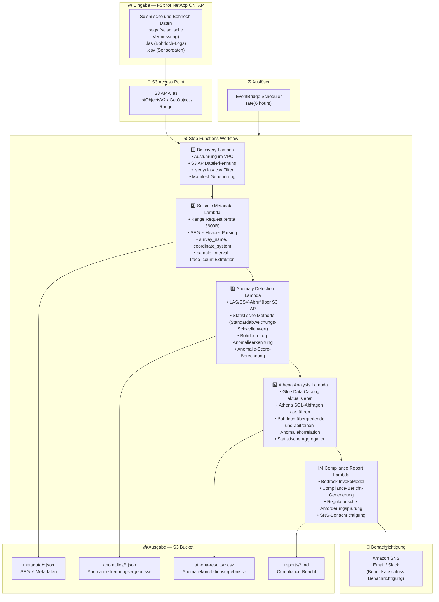

# UC8: Energie/Öl & Gas — Seismische Datenverarbeitung und Bohrloch-Anomalieerkennung

🌐 **Language / 言語**: [日本語](architecture.md) | [English](architecture.en.md) | [한국어](architecture.ko.md) | [简体中文](architecture.zh-CN.md) | [繁體中文](architecture.zh-TW.md) | [Français](architecture.fr.md) | Deutsch | [Español](architecture.es.md)

## End-to-End-Architektur (Eingabe → Ausgabe)

---

## Übergeordneter Ablauf

```
┌─────────────────────────────────────────────────────────────────────────────┐
│                         FSx for NetApp ONTAP                                 │
│                                                                              │
│  /vol/seismic_data/                                                          │
│  ├── surveys/north_field/survey_2024.segy    (SEG-Y seismic data)            │
│  ├── surveys/south_field/survey_2024.segy    (SEG-Y seismic data)            │
│  ├── well_logs/well_A/gamma_ray.las          (Well log LAS)                  │
│  ├── well_logs/well_B/resistivity.las        (Well log LAS)                  │
│  └── well_logs/well_C/sensor_data.csv        (Sensor data CSV)               │
│                                                                              │
└──────────────────────────────────┬───────────────────────────────────────────┘
                                   │
                                   ▼
┌──────────────────────────────────────────────────────────────────────────────┐
│                      S3 Access Point (Data Path)                              │
│                                                                              │
│  Alias: fsxn-seismic-vol-ext-s3alias                                         │
│  • ListObjectsV2 (SEG-Y/LAS/CSV file discovery)                             │
│  • GetObject (file retrieval)                                                │
│  • Range Request (SEG-Y header first 3600 bytes)                             │
│  • No NFS/SMB mount required from Lambda                                     │
│                                                                              │
└──────────────────────────────────┬───────────────────────────────────────────┘
                                   │
                                   ▼
┌──────────────────────────────────────────────────────────────────────────────┐
│                    EventBridge Scheduler (Trigger)                            │
│                                                                              │
│  Schedule: rate(6 hours) — configurable                                      │
│  Target: Step Functions State Machine                                        │
│                                                                              │
└──────────────────────────────────┬───────────────────────────────────────────┘
                                   │
                                   ▼
┌──────────────────────────────────────────────────────────────────────────────┐
│                    AWS Step Functions (Orchestration)                         │
│                                                                              │
│  ┌─────────────┐    ┌──────────────────────┐    ┌────────────────────┐      │
│  │  Discovery   │───▶│  Seismic Metadata    │───▶│ Anomaly Detection  │      │
│  │  Lambda      │    │  Lambda              │    │ Lambda             │      │
│  │             │    │                      │    │                   │      │
│  │  • VPC内     │    │  • Range Request     │    │  • Statistical     │      │
│  │  • S3 AP List│    │  • SEG-Y header      │    │    anomaly detect  │      │
│  │  • SEG-Y/LAS │    │  • Metadata extract  │    │  • Std dev thresh  │      │
│  └─────────────┘    └──────────────────────┘    │  • Well log analysis│     │
│                                                  └────────────────────┘      │
│                                                         │                    │
│                                                         ▼                    │
│                      ┌──────────────────────┐    ┌────────────────────┐      │
│                      │  Compliance Report   │◀───│  Athena Analysis   │      │
│                      │  Lambda              │    │  Lambda            │      │
│                      │                      │    │                   │      │
│                      │  • Bedrock           │    │  • Glue Catalog    │      │
│                      │  • Report generation │    │  • Athena SQL      │      │
│                      │  • SNS notification  │    │  • Anomaly correl  │      │
│                      └──────────────────────┘    └────────────────────┘      │
│                                                                              │
└──────────────────────────────────────────────────────────────────────────────┘
                                   │
                                   ▼
┌──────────────────────────────────────────────────────────────────────────────┐
│                         Output (S3 Bucket)                                    │
│                                                                              │
│  s3://{stack}-output-{account}/                                              │
│  ├── metadata/YYYY/MM/DD/                                                    │
│  │   ├── survey_north_field_metadata.json   ← SEG-Y metadata                │
│  │   └── survey_south_field_metadata.json                                    │
│  ├── anomalies/YYYY/MM/DD/                                                   │
│  │   ├── well_A_anomalies.json             ← Anomaly detection results      │
│  │   └── well_B_anomalies.json                                               │
│  ├── athena-results/                                                         │
│  │   └── {query-execution-id}.csv          ← Anomaly correlation results    │
│  └── reports/YYYY/MM/DD/                                                     │
│      └── compliance_report.md              ← Compliance report               │
│                                                                              │
└──────────────────────────────────────────────────────────────────────────────┘
```

---

## Mermaid-Diagramm



---

## Datenfluss im Detail

### Eingabe
| Element | Beschreibung |
|---------|--------------|
| **Quelle** | FSx for NetApp ONTAP Volume |
| **Dateitypen** | .segy (SEG-Y seismische Daten), .las (Bohrloch-Logs), .csv (Sensordaten) |
| **Zugriffsmethode** | S3 Access Point (ListObjectsV2 + GetObject + Range Request) |
| **Lesestrategie** | SEG-Y: nur erste 3600 Bytes (Range Request), LAS/CSV: vollständiger Abruf |

### Verarbeitung
| Schritt | Service | Funktion |
|---------|---------|----------|
| Erkennung | Lambda (VPC) | SEG-Y/LAS/CSV-Dateien über S3 AP erkennen, Manifest generieren |
| Seismische Metadaten | Lambda | Range Request für SEG-Y-Header, Metadaten-Extraktion (survey_name, coordinate_system, sample_interval, trace_count) |
| Anomalieerkennung | Lambda | Statistische Anomalieerkennung in Bohrloch-Logs (Standardabweichungs-Schwellenwert), Anomalie-Score-Berechnung |
| Athena-Analyse | Lambda + Glue + Athena | SQL-basierte bohrloch-übergreifende und Zeitreihen-Anomaliekorrelation, statistische Aggregation |
| Compliance-Bericht | Lambda + Bedrock | Compliance-Bericht-Generierung, regulatorische Anforderungsprüfung |

### Ausgabe
| Artefakt | Format | Beschreibung |
|----------|--------|--------------|
| Metadaten JSON | `metadata/YYYY/MM/DD/{survey}_metadata.json` | SEG-Y Metadaten (Koordinatensystem, Abtastintervall, Trace-Anzahl) |
| Anomalie-Ergebnisse | `anomalies/YYYY/MM/DD/{well}_anomalies.json` | Bohrloch-Log Anomalieerkennungsergebnisse (Anomalie-Scores, Schwellenwertüberschreitungen) |
| Athena-Ergebnisse | `athena-results/{id}.csv` | Bohrloch-übergreifende und Zeitreihen-Anomaliekorrelationsergebnisse |
| Compliance-Bericht | `reports/YYYY/MM/DD/compliance_report.md` | Von Bedrock generierter Compliance-Bericht |
| SNS-Benachrichtigung | Email | Berichtsabschluss-Benachrichtigung und Anomalieerkennungsalarm |

---

## Wichtige Designentscheidungen

1. **Range Request für SEG-Y-Header** — SEG-Y-Dateien können mehrere GB erreichen, aber Metadaten sind in den ersten 3600 Bytes konzentriert. Range Request optimiert Bandbreite und Kosten
2. **Statistische Anomalieerkennung** — Standardabweichungs-Schwellenwert-basierte Methode erkennt Bohrloch-Log-Anomalien ohne ML-Modelle. Schwellenwerte sind parametrisiert und anpassbar
3. **Athena für Korrelationsanalyse** — Flexible SQL-basierte Analyse von Anomaliemustern über mehrere Bohrlöcher und Zeitreihen
4. **Bedrock für Berichtgenerierung** — Automatische Generierung von Compliance-Berichten in natürlicher Sprache gemäß regulatorischen Anforderungen
5. **Sequenzielle Pipeline** — Step Functions verwaltet Reihenfolgeabhängigkeiten: Metadaten → Anomalieerkennung → Korrelationsanalyse → Bericht
6. **Polling (nicht ereignisgesteuert)** — S3 AP unterstützt keine Ereignisbenachrichtigungen, daher wird eine periodische geplante Ausführung verwendet

---

## Verwendete AWS-Services

| Service | Rolle |
|---------|-------|
| FSx for NetApp ONTAP | Seismische Daten- und Bohrloch-Log-Speicher |
| S3 Access Points | Serverloser Zugriff auf ONTAP-Volumes (Range Request-Unterstützung) |
| EventBridge Scheduler | Periodischer Auslöser |
| Step Functions | Workflow-Orchestrierung (sequenziell) |
| Lambda | Compute (Discovery, Seismic Metadata, Anomaly Detection, Athena Analysis, Compliance Report) |
| Glue Data Catalog | Schema-Management für Anomalieerkennungsdaten |
| Amazon Athena | SQL-basierte Anomaliekorrelation und statistische Aggregation |
| Amazon Bedrock | Compliance-Bericht-Generierung (Claude / Nova) |
| SNS | Berichtsabschluss-Benachrichtigung und Anomalieerkennungsalarm |
| Secrets Manager | ONTAP REST API Anmeldedatenverwaltung |
| CloudWatch + X-Ray | Observability |
