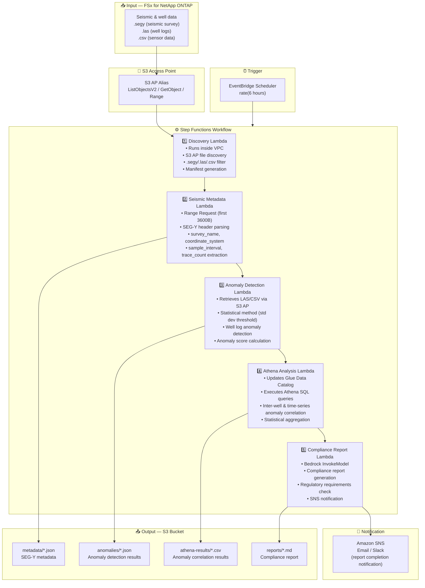

# UC8: Energy / Oil & Gas — Seismic Data Processing & Well Log Anomaly Detection

🌐 **Language / 言語**: [日本語](architecture.md) | English | [한국어](architecture.ko.md) | [简体中文](architecture.zh-CN.md) | [繁體中文](architecture.zh-TW.md) | [Français](architecture.fr.md) | [Deutsch](architecture.de.md) | [Español](architecture.es.md)

## End-to-End Architecture (Input → Output)

---

## Architecture Diagram

---

## Data Flow Detail

### Input
| Item | Description |
|------|-------------|
| **Source** | FSx for NetApp ONTAP volume |
| **File Types** | .segy (SEG-Y seismic), .las (well logs), .csv (sensor data) |
| **Access Method** | S3 Access Point (ListObjectsV2 + GetObject + Range Request) |
| **Read Strategy** | SEG-Y: first 3600 bytes only (Range Request), LAS/CSV: full retrieval |

### Processing
| Step | Service | Function |
|------|---------|----------|
| Discovery | Lambda (VPC) | Discover SEG-Y/LAS/CSV files via S3 AP, generate manifest |
| Seismic Metadata | Lambda | Range Request for SEG-Y header, metadata extraction (survey_name, coordinate_system, sample_interval, trace_count) |
| Anomaly Detection | Lambda | Statistical anomaly detection on well logs (std dev threshold), anomaly score calculation |
| Athena Analysis | Lambda + Glue + Athena | SQL-based inter-well & time-series anomaly correlation, statistical aggregation |
| Compliance Report | Lambda + Bedrock | Compliance report generation, regulatory requirements check |

### Output
| Artifact | Format | Description |
|----------|--------|-------------|
| Metadata JSON | `metadata/YYYY/MM/DD/{survey}_metadata.json` | SEG-Y metadata (coordinate system, sample interval, trace count) |
| Anomaly Results | `anomalies/YYYY/MM/DD/{well}_anomalies.json` | Well log anomaly detection results (anomaly scores, threshold exceedances) |
| Athena Results | `athena-results/{id}.csv` | Inter-well & time-series anomaly correlation results |
| Compliance Report | `reports/YYYY/MM/DD/compliance_report.md` | Bedrock-generated compliance report |
| SNS Notification | Email | Report completion notification & anomaly detection alert |

---

## Key Design Decisions

1. **Range Request for SEG-Y headers** — SEG-Y files can reach several GB, but metadata is concentrated in the first 3600 bytes. Range Request optimizes bandwidth & cost
2. **Statistical anomaly detection** — Standard deviation threshold-based method detects well log anomalies without ML models. Thresholds are parameterized for adjustment
3. **Athena for correlation analysis** — Flexible SQL-based analysis of anomaly patterns across multiple wells and time series
4. **Bedrock for report generation** — Auto-generates compliance reports in natural language conforming to regulatory requirements
5. **Sequential pipeline** — Step Functions manages order dependencies: metadata → anomaly detection → correlation analysis → report
6. **Polling (not event-driven)** — S3 AP does not support event notifications, so periodic scheduled execution is used

---

## AWS Services Used

| Service | Role |
|---------|------|
| FSx for NetApp ONTAP | Seismic data & well log storage |
| S3 Access Points | Serverless access to ONTAP volumes (Range Request support) |
| EventBridge Scheduler | Periodic trigger |
| Step Functions | Workflow orchestration (sequential) |
| Lambda | Compute (Discovery, Seismic Metadata, Anomaly Detection, Athena Analysis, Compliance Report) |
| Glue Data Catalog | Schema management for anomaly detection data |
| Amazon Athena | SQL-based anomaly correlation & statistical aggregation |
| Amazon Bedrock | Compliance report generation (Claude / Nova) |
| SNS | Report completion notification & anomaly detection alert |
| Secrets Manager | ONTAP REST API credential management |
| CloudWatch + X-Ray | Observability |
