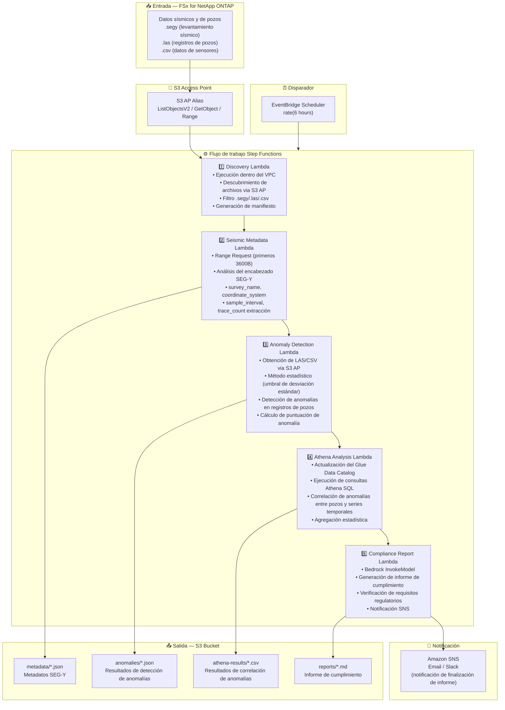

# UC8: Energía/Petróleo y Gas — Procesamiento de datos sísmicos y detección de anomalías en pozos

🌐 **Language / 言語**: [日本語](architecture.md) | [English](architecture.en.md) | [한국어](architecture.ko.md) | [简体中文](architecture.zh-CN.md) | [繁體中文](architecture.zh-TW.md) | [Français](architecture.fr.md) | [Deutsch](architecture.de.md) | Español

## Arquitectura de extremo a extremo (Entrada → Salida)

---

## Flujo de alto nivel

```
┌─────────────────────────────────────────────────────────────────────────────┐
│                         FSx for NetApp ONTAP                                 │
│                                                                              │
│  /vol/seismic_data/                                                          │
│  ├── surveys/north_field/survey_2024.segy    (SEG-Y seismic data)            │
│  ├── surveys/south_field/survey_2024.segy    (SEG-Y seismic data)            │
│  ├── well_logs/well_A/gamma_ray.las          (Well log LAS)                  │
│  ├── well_logs/well_B/resistivity.las        (Well log LAS)                  │
│  └── well_logs/well_C/sensor_data.csv        (Sensor data CSV)               │
│                                                                              │
└──────────────────────────────────┬───────────────────────────────────────────┘
                                   │
                                   ▼
┌──────────────────────────────────────────────────────────────────────────────┐
│                      S3 Access Point (Data Path)                              │
│                                                                              │
│  Alias: fsxn-seismic-vol-ext-s3alias                                         │
│  • ListObjectsV2 (SEG-Y/LAS/CSV file discovery)                             │
│  • GetObject (file retrieval)                                                │
│  • Range Request (SEG-Y header first 3600 bytes)                             │
│  • No NFS/SMB mount required from Lambda                                     │
│                                                                              │
└──────────────────────────────────┬───────────────────────────────────────────┘
                                   │
                                   ▼
┌──────────────────────────────────────────────────────────────────────────────┐
│                    EventBridge Scheduler (Trigger)                            │
│                                                                              │
│  Schedule: rate(6 hours) — configurable                                      │
│  Target: Step Functions State Machine                                        │
│                                                                              │
└──────────────────────────────────┬───────────────────────────────────────────┘
                                   │
                                   ▼
┌──────────────────────────────────────────────────────────────────────────────┐
│                    AWS Step Functions (Orchestration)                         │
│                                                                              │
│  ┌─────────────┐    ┌──────────────────────┐    ┌────────────────────┐      │
│  │  Discovery   │───▶│  Seismic Metadata    │───▶│ Anomaly Detection  │      │
│  │  Lambda      │    │  Lambda              │    │ Lambda             │      │
│  │             │    │                      │    │                   │      │
│  │  • VPC内     │    │  • Range Request     │    │  • Statistical     │      │
│  │  • S3 AP List│    │  • SEG-Y header      │    │    anomaly detect  │      │
│  │  • SEG-Y/LAS │    │  • Metadata extract  │    │  • Std dev thresh  │      │
│  └─────────────┘    └──────────────────────┘    │  • Well log analysis│     │
│                                                  └────────────────────┘      │
│                                                         │                    │
│                                                         ▼                    │
│                      ┌──────────────────────┐    ┌────────────────────┐      │
│                      │  Compliance Report   │◀───│  Athena Analysis   │      │
│                      │  Lambda              │    │  Lambda            │      │
│                      │                      │    │                   │      │
│                      │  • Bedrock           │    │  • Glue Catalog    │      │
│                      │  • Report generation │    │  • Athena SQL      │      │
│                      │  • SNS notification  │    │  • Anomaly correl  │      │
│                      └──────────────────────┘    └────────────────────┘      │
│                                                                              │
└──────────────────────────────────────────────────────────────────────────────┘
                                   │
                                   ▼
┌──────────────────────────────────────────────────────────────────────────────┐
│                         Output (S3 Bucket)                                    │
│                                                                              │
│  s3://{stack}-output-{account}/                                              │
│  ├── metadata/YYYY/MM/DD/                                                    │
│  │   ├── survey_north_field_metadata.json   ← SEG-Y metadata                │
│  │   └── survey_south_field_metadata.json                                    │
│  ├── anomalies/YYYY/MM/DD/                                                   │
│  │   ├── well_A_anomalies.json             ← Anomaly detection results      │
│  │   └── well_B_anomalies.json                                               │
│  ├── athena-results/                                                         │
│  │   └── {query-execution-id}.csv          ← Anomaly correlation results    │
│  └── reports/YYYY/MM/DD/                                                     │
│      └── compliance_report.md              ← Compliance report               │
│                                                                              │
└──────────────────────────────────────────────────────────────────────────────┘
```

---

## Diagrama Mermaid



---

## Detalle del flujo de datos

### Entrada
| Elemento | Descripción |
|----------|-------------|
| **Origen** | Volumen FSx for NetApp ONTAP |
| **Tipos de archivo** | .segy (datos sísmicos SEG-Y), .las (registros de pozos), .csv (datos de sensores) |
| **Método de acceso** | S3 Access Point (ListObjectsV2 + GetObject + Range Request) |
| **Estrategia de lectura** | SEG-Y: solo primeros 3600 bytes (Range Request), LAS/CSV: obtención completa |

### Procesamiento
| Paso | Servicio | Función |
|------|----------|---------|
| Descubrimiento | Lambda (VPC) | Descubrir archivos SEG-Y/LAS/CSV via S3 AP, generar manifiesto |
| Metadatos sísmicos | Lambda | Range Request para encabezado SEG-Y, extracción de metadatos (survey_name, coordinate_system, sample_interval, trace_count) |
| Detección de anomalías | Lambda | Detección estadística de anomalías en registros de pozos (umbral de desviación estándar), cálculo de puntuación de anomalía |
| Análisis Athena | Lambda + Glue + Athena | Correlación de anomalías entre pozos y series temporales basada en SQL, agregación estadística |
| Informe de cumplimiento | Lambda + Bedrock | Generación de informe de cumplimiento, verificación de requisitos regulatorios |

### Salida
| Artefacto | Formato | Descripción |
|-----------|---------|-------------|
| Metadatos JSON | `metadata/YYYY/MM/DD/{survey}_metadata.json` | Metadatos SEG-Y (sistema de coordenadas, intervalo de muestreo, número de trazas) |
| Resultados de anomalías | `anomalies/YYYY/MM/DD/{well}_anomalies.json` | Resultados de detección de anomalías (puntuaciones, excesos de umbral) |
| Resultados Athena | `athena-results/{id}.csv` | Resultados de correlación de anomalías entre pozos y series temporales |
| Informe de cumplimiento | `reports/YYYY/MM/DD/compliance_report.md` | Informe de cumplimiento generado por Bedrock |
| Notificación SNS | Email | Notificación de finalización de informe y alerta de detección de anomalías |

---

## Decisiones de diseño clave

1. **Range Request para encabezados SEG-Y** — Los archivos SEG-Y pueden alcanzar varios GB, pero los metadatos se concentran en los primeros 3600 bytes. Range Request optimiza ancho de banda y costos
2. **Detección estadística de anomalías** — Método basado en umbral de desviación estándar para detectar anomalías sin modelos ML. Los umbrales son parametrizados y ajustables
3. **Athena para análisis de correlación** — Análisis SQL flexible de patrones de anomalías a través de múltiples pozos y series temporales
4. **Bedrock para generación de informes** — Generación automática de informes de cumplimiento en lenguaje natural conforme a requisitos regulatorios
5. **Pipeline secuencial** — Step Functions gestiona dependencias de orden: metadatos → detección de anomalías → análisis de correlación → informe
6. **Sondeo periódico (no basado en eventos)** — S3 AP no admite notificaciones de eventos, por lo que se utiliza ejecución programada periódica

---

## Servicios AWS utilizados

| Servicio | Rol |
|----------|-----|
| FSx for NetApp ONTAP | Almacenamiento de datos sísmicos y registros de pozos |
| S3 Access Points | Acceso serverless a volúmenes ONTAP (soporte Range Request) |
| EventBridge Scheduler | Disparador periódico |
| Step Functions | Orquestación del flujo de trabajo (secuencial) |
| Lambda | Cómputo (Discovery, Seismic Metadata, Anomaly Detection, Athena Analysis, Compliance Report) |
| Glue Data Catalog | Gestión de esquemas de datos de detección de anomalías |
| Amazon Athena | Correlación de anomalías y agregación estadística basadas en SQL |
| Amazon Bedrock | Generación de informes de cumplimiento (Claude / Nova) |
| SNS | Notificación de finalización de informe y alerta de detección de anomalías |
| Secrets Manager | Gestión de credenciales de la API REST ONTAP |
| CloudWatch + X-Ray | Observabilidad |
