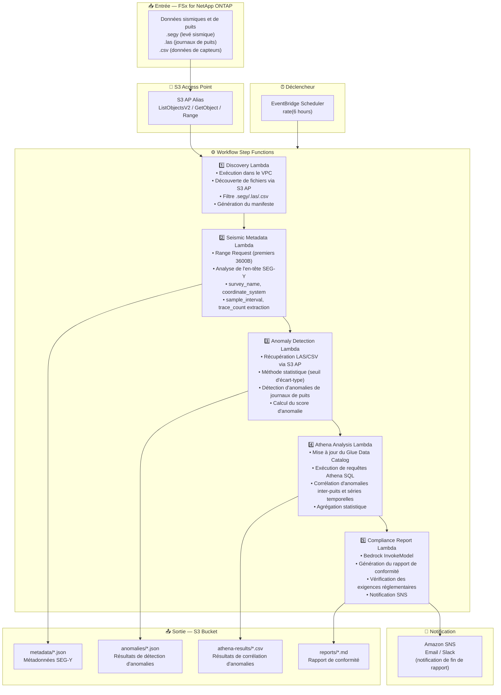

# UC8: Énergie/Pétrole & Gaz — Traitement de données sismiques et détection d'anomalies de puits

🌐 **Language / 言語**: [日本語](architecture.md) | [English](architecture.en.md) | [한국어](architecture.ko.md) | [简体中文](architecture.zh-CN.md) | [繁體中文](architecture.zh-TW.md) | Français | [Deutsch](architecture.de.md) | [Español](architecture.es.md)

## Architecture de bout en bout (Entrée → Sortie)

---

## Diagramme d'architecture

---

## Détail du flux de données

### Entrée
| Élément | Description |
|---------|-------------|
| **Source** | Volume FSx for NetApp ONTAP |
| **Types de fichiers** | .segy (données sismiques SEG-Y), .las (journaux de puits), .csv (données de capteurs) |
| **Méthode d'accès** | S3 Access Point (ListObjectsV2 + GetObject + Range Request) |
| **Stratégie de lecture** | SEG-Y : premiers 3600 octets uniquement (Range Request), LAS/CSV : récupération complète |

### Traitement
| Étape | Service | Fonction |
|-------|---------|----------|
| Découverte | Lambda (VPC) | Découverte des fichiers SEG-Y/LAS/CSV via S3 AP, génération du manifeste |
| Métadonnées sismiques | Lambda | Range Request pour l'en-tête SEG-Y, extraction de métadonnées (survey_name, coordinate_system, sample_interval, trace_count) |
| Détection d'anomalies | Lambda | Détection statistique d'anomalies sur les journaux de puits (seuil d'écart-type), calcul du score d'anomalie |
| Analyse Athena | Lambda + Glue + Athena | Corrélation d'anomalies inter-puits et séries temporelles basée sur SQL, agrégation statistique |
| Rapport de conformité | Lambda + Bedrock | Génération du rapport de conformité, vérification des exigences réglementaires |

### Sortie
| Artefact | Format | Description |
|----------|--------|-------------|
| Métadonnées JSON | `metadata/YYYY/MM/DD/{survey}_metadata.json` | Métadonnées SEG-Y (système de coordonnées, intervalle d'échantillonnage, nombre de traces) |
| Résultats d'anomalies | `anomalies/YYYY/MM/DD/{well}_anomalies.json` | Résultats de détection d'anomalies (scores, dépassements de seuil) |
| Résultats Athena | `athena-results/{id}.csv` | Résultats de corrélation d'anomalies inter-puits et séries temporelles |
| Rapport de conformité | `reports/YYYY/MM/DD/compliance_report.md` | Rapport de conformité généré par Bedrock |
| Notification SNS | Email | Notification de fin de rapport et alerte de détection d'anomalies |

---

## Décisions de conception clés

1. **Range Request pour les en-têtes SEG-Y** — Les fichiers SEG-Y peuvent atteindre plusieurs Go, mais les métadonnées sont concentrées dans les premiers 3600 octets. Le Range Request optimise la bande passante et les coûts
2. **Détection statistique d'anomalies** — Méthode basée sur le seuil d'écart-type pour détecter les anomalies sans modèles ML. Les seuils sont paramétrés et ajustables
3. **Athena pour l'analyse de corrélation** — Analyse SQL flexible des patterns d'anomalies à travers plusieurs puits et séries temporelles
4. **Bedrock pour la génération de rapports** — Génération automatique de rapports de conformité en langage naturel conformes aux exigences réglementaires
5. **Pipeline séquentiel** — Step Functions gère les dépendances d'ordre : métadonnées → détection d'anomalies → analyse de corrélation → rapport
6. **Interrogation périodique (non événementielle)** — S3 AP ne prend pas en charge les notifications d'événements, donc une exécution planifiée périodique est utilisée

---

## Services AWS utilisés

| Service | Rôle |
|---------|------|
| FSx for NetApp ONTAP | Stockage des données sismiques et journaux de puits |
| S3 Access Points | Accès serverless aux volumes ONTAP (support Range Request) |
| EventBridge Scheduler | Déclenchement périodique |
| Step Functions | Orchestration du workflow (séquentiel) |
| Lambda | Calcul (Discovery, Seismic Metadata, Anomaly Detection, Athena Analysis, Compliance Report) |
| Glue Data Catalog | Gestion des schémas de données de détection d'anomalies |
| Amazon Athena | Corrélation d'anomalies et agrégation statistique basées sur SQL |
| Amazon Bedrock | Génération de rapports de conformité (Claude / Nova) |
| SNS | Notification de fin de rapport et alerte de détection d'anomalies |
| Secrets Manager | Gestion des identifiants de l'API REST ONTAP |
| CloudWatch + X-Ray | Observabilité |
