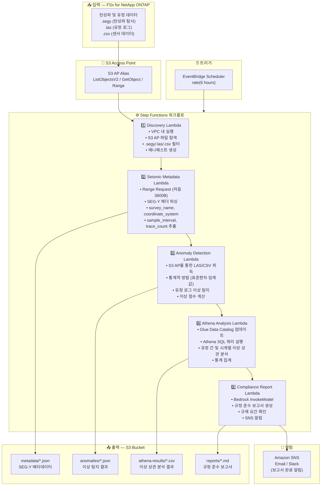

# UC8: 에너지/석유·가스 — 탄성파 탐사 데이터 처리 및 유정 로그 이상 탐지

🌐 **Language / 言語**: [日本語](architecture.md) | [English](architecture.en.md) | 한국어 | [简体中文](architecture.zh-CN.md) | [繁體中文](architecture.zh-TW.md) | [Français](architecture.fr.md) | [Deutsch](architecture.de.md) | [Español](architecture.es.md)

## 엔드투엔드 아키텍처 (입력 → 출력)

---

## 아키텍처 다이어그램

---

## 데이터 흐름 상세

### 입력
| 항목 | 설명 |
|------|------|
| **소스** | FSx for NetApp ONTAP 볼륨 |
| **파일 유형** | .segy (SEG-Y 탄성파), .las (유정 로그), .csv (센서 데이터) |
| **접근 방식** | S3 Access Point (ListObjectsV2 + GetObject + Range Request) |
| **읽기 전략** | SEG-Y: 처음 3600바이트만 (Range Request), LAS/CSV: 전체 취득 |

### 처리
| 단계 | 서비스 | 기능 |
|------|--------|------|
| 탐색 | Lambda (VPC) | S3 AP를 통한 SEG-Y/LAS/CSV 파일 탐색, 매니페스트 생성 |
| 탄성파 메타데이터 | Lambda | SEG-Y 헤더 Range Request, 메타데이터 추출 (survey_name, coordinate_system, sample_interval, trace_count) |
| 이상 탐지 | Lambda | 유정 로그 통계적 이상 탐지 (표준편차 임계값), 이상 점수 계산 |
| Athena 분석 | Lambda + Glue + Athena | SQL 기반 유정 간 및 시계열 이상 상관 분석, 통계 집계 |
| 규정 준수 보고서 | Lambda + Bedrock | 규정 준수 보고서 생성, 규제 요건 확인 |

### 출력
| 산출물 | 형식 | 설명 |
|--------|------|------|
| 메타데이터 JSON | `metadata/YYYY/MM/DD/{survey}_metadata.json` | SEG-Y 메타데이터 (좌표계, 샘플 간격, 트레이스 수) |
| 이상 결과 | `anomalies/YYYY/MM/DD/{well}_anomalies.json` | 유정 로그 이상 탐지 결과 (이상 점수, 임계값 초과) |
| Athena 결과 | `athena-results/{id}.csv` | 유정 간 및 시계열 이상 상관 분석 결과 |
| 규정 준수 보고서 | `reports/YYYY/MM/DD/compliance_report.md` | Bedrock 생성 규정 준수 보고서 |
| SNS 알림 | Email | 보고서 완료 알림 및 이상 탐지 경보 |

---

## 주요 설계 결정

1. **SEG-Y 헤더 Range Request** — SEG-Y 파일은 수 GB에 달할 수 있지만 메타데이터는 처음 3600바이트에 집중. Range Request로 대역폭 및 비용 최적화
2. **통계적 이상 탐지** — 표준편차 임계값 기반 방법으로 ML 모델 없이 유정 로그 이상 탐지. 임계값은 파라미터화하여 조정 가능
3. **Athena 상관 분석** — 여러 유정 및 시계열에 걸친 이상 패턴의 유연한 SQL 기반 분석
4. **Bedrock 보고서 생성** — 규제 요건에 부합하는 자연어 규정 준수 보고서 자동 생성
5. **순차 파이프라인** — Step Functions가 순서 의존성 관리: 메타데이터 → 이상 탐지 → 상관 분석 → 보고서
6. **폴링 (이벤트 기반 아님)** — S3 AP는 이벤트 알림을 지원하지 않으므로 정기적 스케줄 실행 사용

---

## 사용된 AWS 서비스

| 서비스 | 역할 |
|--------|------|
| FSx for NetApp ONTAP | 탄성파 데이터 및 유정 로그 저장소 |
| S3 Access Points | ONTAP 볼륨에 대한 서버리스 접근 (Range Request 지원) |
| EventBridge Scheduler | 정기 트리거 |
| Step Functions | 워크플로 오케스트레이션 (순차) |
| Lambda | 컴퓨팅 (Discovery, Seismic Metadata, Anomaly Detection, Athena Analysis, Compliance Report) |
| Glue Data Catalog | 이상 탐지 데이터 스키마 관리 |
| Amazon Athena | SQL 기반 이상 상관 분석 및 통계 집계 |
| Amazon Bedrock | 규정 준수 보고서 생성 (Claude / Nova) |
| SNS | 보고서 완료 알림 및 이상 탐지 경보 |
| Secrets Manager | ONTAP REST API 자격 증명 관리 |
| CloudWatch + X-Ray | 관측 가능성 |
