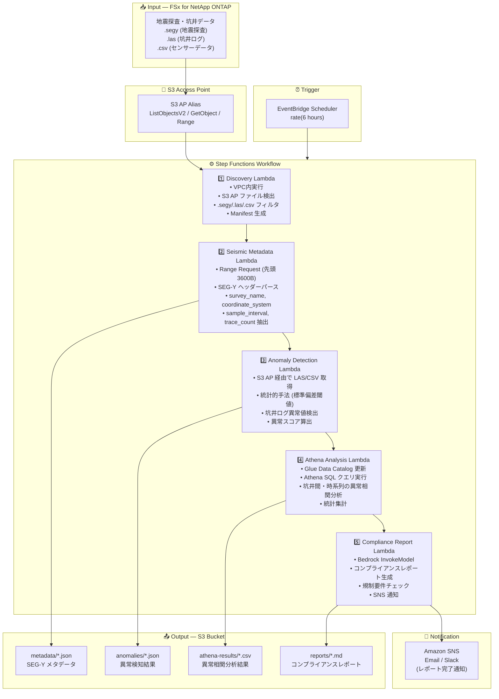

# UC8: エネルギー / 石油・ガス — 地震探査データ処理・坑井ログ異常検知

🌐 **Language / 言語**: 日本語 | [English](architecture.en.md) | [한국어](architecture.ko.md) | [简体中文](architecture.zh-CN.md) | [繁體中文](architecture.zh-TW.md) | [Français](architecture.fr.md) | [Deutsch](architecture.de.md) | [Español](architecture.es.md)

## End-to-End Architecture (Input → Output)

---

## High-Level Flow

```
┌─────────────────────────────────────────────────────────────────────────────┐
│                         FSx for NetApp ONTAP                                 │
│                                                                              │
│  /vol/seismic_data/                                                          │
│  ├── surveys/north_field/survey_2024.segy    (SEG-Y 地震探査データ)          │
│  ├── surveys/south_field/survey_2024.segy    (SEG-Y 地震探査データ)          │
│  ├── well_logs/well_A/gamma_ray.las          (坑井ログ LAS)                 │
│  ├── well_logs/well_B/resistivity.las        (坑井ログ LAS)                 │
│  └── well_logs/well_C/sensor_data.csv        (センサーデータ CSV)            │
│                                                                              │
└──────────────────────────────────┬───────────────────────────────────────────┘
                                   │
                                   ▼
┌──────────────────────────────────────────────────────────────────────────────┐
│                      S3 Access Point (Data Path)                              │
│                                                                              │
│  Alias: fsxn-seismic-vol-ext-s3alias                                         │
│  • ListObjectsV2 (SEG-Y/LAS/CSV ファイル検出)                               │
│  • GetObject (ファイル取得)                                                  │
│  • Range Request (SEG-Y ヘッダー先頭 3600 バイト取得)                        │
│  • No NFS/SMB mount required from Lambda                                     │
│                                                                              │
└──────────────────────────────────┬───────────────────────────────────────────┘
                                   │
                                   ▼
┌──────────────────────────────────────────────────────────────────────────────┐
│                    EventBridge Scheduler (Trigger)                            │
│                                                                              │
│  Schedule: rate(6 hours) — configurable                                      │
│  Target: Step Functions State Machine                                        │
│                                                                              │
└──────────────────────────────────┬───────────────────────────────────────────┘
                                   │
                                   ▼
┌──────────────────────────────────────────────────────────────────────────────┐
│                    AWS Step Functions (Orchestration)                         │
│                                                                              │
│  ┌─────────────┐    ┌──────────────────────┐    ┌────────────────────┐      │
│  │  Discovery   │───▶│  Seismic Metadata    │───▶│ Anomaly Detection  │      │
│  │  Lambda      │    │  Lambda              │    │ Lambda             │      │
│  │             │    │                      │    │                   │      │
│  │  • VPC内     │    │  • Range Request     │    │  • 統計的異常検知  │      │
│  │  • S3 AP List│    │  • SEG-Y ヘッダー    │    │  • 標準偏差閾値    │      │
│  │  • SEG-Y/LAS │    │  • メタデータ抽出    │    │  • 坑井ログ分析    │      │
│  └─────────────┘    └──────────────────────┘    └────────────────────┘      │
│                                                         │                    │
│                                                         ▼                    │
│                      ┌──────────────────────┐    ┌────────────────────┐      │
│                      │  Compliance Report   │◀───│  Athena Analysis   │      │
│                      │  Lambda              │    │  Lambda            │      │
│                      │                      │    │                   │      │
│                      │  • Bedrock           │    │  • Glue Catalog    │      │
│                      │  • レポート生成      │    │  • Athena SQL      │      │
│                      │  • SNS 通知          │    │  • 異常相関分析    │      │
│                      └──────────────────────┘    └────────────────────┘      │
│                                                                              │
└──────────────────────────────────────────────────────────────────────────────┘
                                   │
                                   ▼
┌──────────────────────────────────────────────────────────────────────────────┐
│                         Output (S3 Bucket)                                    │
│                                                                              │
│  s3://{stack}-output-{account}/                                              │
│  ├── metadata/YYYY/MM/DD/                                                    │
│  │   ├── survey_north_field_metadata.json   ← SEG-Y メタデータ              │
│  │   └── survey_south_field_metadata.json                                    │
│  ├── anomalies/YYYY/MM/DD/                                                   │
│  │   ├── well_A_anomalies.json             ← 異常検知結果                   │
│  │   └── well_B_anomalies.json                                               │
│  ├── athena-results/                                                         │
│  │   └── {query-execution-id}.csv          ← 異常相関分析結果               │
│  └── reports/YYYY/MM/DD/                                                     │
│      └── compliance_report.md              ← コンプライアンスレポート        │
│                                                                              │
└──────────────────────────────────────────────────────────────────────────────┘
```

---

## Mermaid Diagram



---

## Data Flow Detail

### Input
| Item | Description |
|------|-------------|
| **Source** | FSx for NetApp ONTAP volume |
| **File Types** | .segy (SEG-Y 地震探査), .las (坑井ログ), .csv (センサーデータ) |
| **Access Method** | S3 Access Point (ListObjectsV2 + GetObject + Range Request) |
| **Read Strategy** | SEG-Y: 先頭 3600 バイトのみ (Range Request), LAS/CSV: 全体取得 |

### Processing
| Step | Service | Function |
|------|---------|----------|
| Discovery | Lambda (VPC) | S3 AP で SEG-Y/LAS/CSV ファイル検出、Manifest 生成 |
| Seismic Metadata | Lambda | Range Request で SEG-Y ヘッダー取得、メタデータ抽出 (survey_name, coordinate_system, sample_interval, trace_count) |
| Anomaly Detection | Lambda | 坑井ログの統計的異常検知 (標準偏差閾値)、異常スコア算出 |
| Athena Analysis | Lambda + Glue + Athena | SQL で坑井間・時系列の異常相関分析、統計集計 |
| Compliance Report | Lambda + Bedrock | コンプライアンスレポート生成、規制要件チェック |

### Output
| Artifact | Format | Description |
|----------|--------|-------------|
| Metadata JSON | `metadata/YYYY/MM/DD/{survey}_metadata.json` | SEG-Y メタデータ (座標系、サンプル間隔、トレース数) |
| Anomaly Results | `anomalies/YYYY/MM/DD/{well}_anomalies.json` | 坑井ログ異常検知結果 (異常スコア、閾値超過箇所) |
| Athena Results | `athena-results/{id}.csv` | 坑井間・時系列の異常相関分析結果 |
| Compliance Report | `reports/YYYY/MM/DD/compliance_report.md` | Bedrock 生成コンプライアンスレポート |
| SNS Notification | Email | レポート完了通知・異常検出アラート |

---

## Key Design Decisions

1. **Range Request による SEG-Y ヘッダー取得** — SEG-Y ファイルは数 GB に達するが、メタデータは先頭 3600 バイトに集中。Range Request で帯域・コスト最適化
2. **統計的異常検知** — 標準偏差閾値ベースの手法により、ML モデル不要で坑井ログの異常を検出。閾値はパラメータ化して調整可能
3. **Athena による相関分析** — 複数坑井間・時系列での異常パターン相関を SQL で柔軟に分析
4. **Bedrock によるレポート生成** — 規制要件に準拠したコンプライアンスレポートを自然言語で自動生成
5. **シーケンシャルパイプライン** — メタデータ → 異常検知 → 相関分析 → レポートの順序依存性を Step Functions で管理
6. **ポーリングベース** — S3 AP はイベント通知非対応のため、定期スケジュール実行

---

## AWS Services Used

| Service | Role |
|---------|------|
| FSx for NetApp ONTAP | 地震探査データ・坑井ログストレージ |
| S3 Access Points | ONTAP ボリュームへのサーバーレスアクセス (Range Request 対応) |
| EventBridge Scheduler | 定期トリガー |
| Step Functions | ワークフローオーケストレーション (シーケンシャル) |
| Lambda | コンピュート (Discovery, Seismic Metadata, Anomaly Detection, Athena Analysis, Compliance Report) |
| Glue Data Catalog | 異常検知データのスキーマ管理 |
| Amazon Athena | SQL ベースの異常相関分析・統計集計 |
| Amazon Bedrock | コンプライアンスレポート生成 (Claude / Nova) |
| SNS | レポート完了通知・異常検出アラート |
| Secrets Manager | ONTAP REST API 認証情報管理 |
| CloudWatch + X-Ray | オブザーバビリティ |
