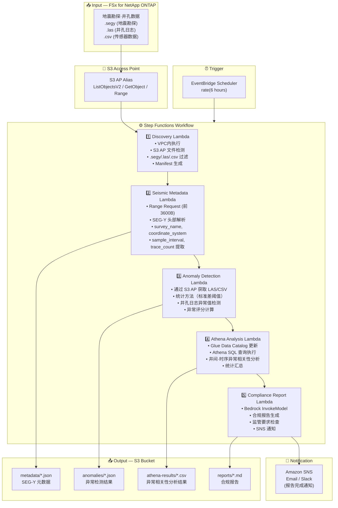

# UC8: 能源 / 石油天然气 — 地震勘探数据处理·井测日志异常检测

🌐 **Language / 언어 / 语言 / 語言 / Langue / Sprache / Idioma**: [日本語](architecture.md) | [English](architecture.en.md) | [한국어](architecture.ko.md) | 简体中文 | [繁體中文](architecture.zh-TW.md) | [Français](architecture.fr.md) | [Deutsch](architecture.de.md) | [Español](architecture.es.md)

> 注意：此翻译由 Amazon Bedrock Claude 生成。欢迎对翻译质量提出改进建议。

## 端到端架构（输入 → 输出）

---

## 架构图

---

## 数据流详情

### 输入
| 项目 | 说明 |
|------|-------------|
| **来源** | FSx for NetApp ONTAP 卷 |
| **文件类型** | .segy（SEG-Y 地震勘探）、.las（井孔日志）、.csv（传感器数据） |
| **访问方法** | S3 Access Point（ListObjectsV2 + GetObject + Range Request） |
| **读取策略** | SEG-Y：仅前 3600 字节（Range Request），LAS/CSV：完整获取 |

### 处理
| 步骤 | 服务 | 功能 |
|------|---------|----------|
| Discovery | Lambda (VPC) | 通过 S3 AP 检测 SEG-Y/LAS/CSV 文件，生成 Manifest |
| Seismic Metadata | Lambda | 通过 Range Request 获取 SEG-Y 头部，提取元数据（survey_name、coordinate_system、sample_interval、trace_count） |
| Anomaly Detection | Lambda | 井孔日志统计异常检测（标准差阈值），计算异常评分 |
| Athena Analysis | Lambda + Glue + Athena | 通过 SQL 进行井间·时序异常相关性分析、统计汇总 |
| Compliance Report | Lambda + Bedrock | 生成合规报告，检查监管要求 |

### 输出
| 产物 | 格式 | 说明 |
|----------|--------|-------------|
| Metadata JSON | `metadata/YYYY/MM/DD/{survey}_metadata.json` | SEG-Y 元数据（坐标系、采样间隔、道数） |
| Anomaly Results | `anomalies/YYYY/MM/DD/{well}_anomalies.json` | 井孔日志异常检测结果（异常评分、超阈值位置） |
| Athena Results | `athena-results/{id}.csv` | 井间·时序异常相关性分析结果 |
| Compliance Report | `reports/YYYY/MM/DD/compliance_report.md` | Bedrock 生成的合规报告 |
| SNS Notification | Email | 报告完成通知·异常检测告警 |

---

## 关键设计决策

1. **通过 Range Request 获取 SEG-Y 头部** — SEG-Y 文件可达数 GB，但元数据集中在前 3600 字节。通过 Range Request 优化带宽和成本
2. **统计异常检测** — 基于标准差阈值的方法，无需 ML 模型即可检测井孔日志异常。阈值参数化可调整
3. **通过 Athena 进行相关性分析** — 使用 SQL 灵活分析多井间·时序的异常模式相关性
4. **通过 Bedrock 生成报告** — 自动生成符合监管要求的自然语言合规报告
5. **顺序流水线** — 通过 Step Functions 管理元数据 → 异常检测 → 相关性分析 → 报告的顺序依赖性
6. **基于轮询** — 由于 S3 AP 不支持事件通知，采用定期调度执行

---

## 使用的 AWS 服务

| 服务 | 角色 |
|---------|------|
| FSx for NetApp ONTAP | 地震勘探数据·井孔日志存储 |
| S3 Access Points | 对 ONTAP 卷的无服务器访问（支持 Range Request） |
| EventBridge Scheduler | 定期触发器 |
| Step Functions | 工作流编排（顺序） |
| Lambda | 计算（Discovery、Seismic Metadata、Anomaly Detection、Athena Analysis、Compliance Report） |
| Glue Data Catalog | 异常检测数据的架构管理 |
| Amazon Athena | 基于 SQL 的异常相关性分析·统计汇总 |
| Amazon Bedrock | 合规报告生成（Claude / Nova） |
| SNS | 报告完成通知·异常检测告警 |
| Secrets Manager | ONTAP REST API 凭证管理 |
| CloudWatch + X-Ray | 可观测性 |
