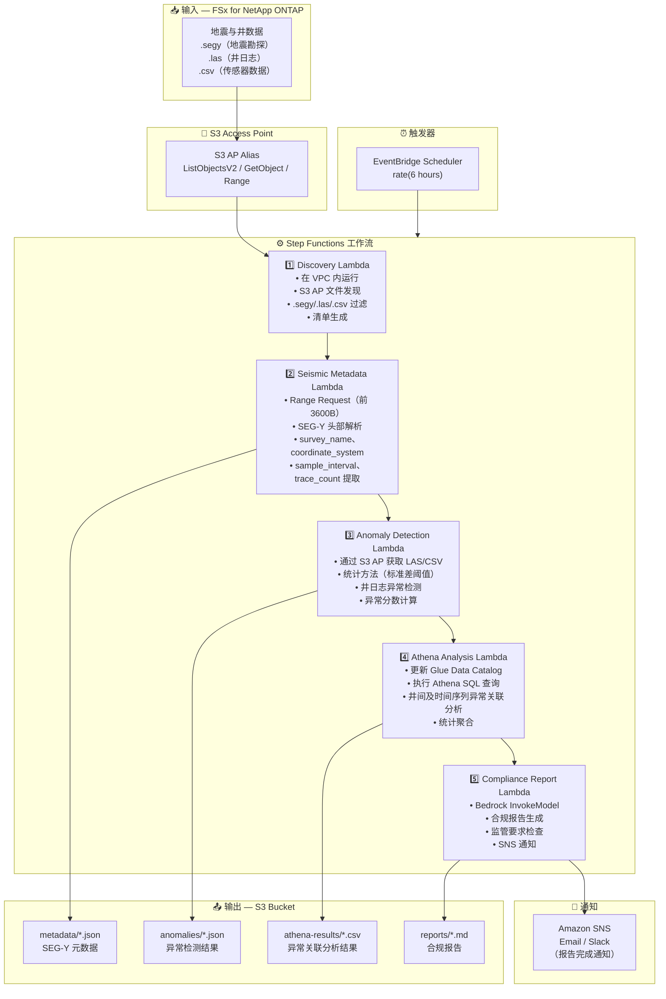

# UC8: 能源/石油天然气 — 地震勘探数据处理与井日志异常检测

🌐 **Language / 言語**: [日本語](architecture.md) | [English](architecture.en.md) | [한국어](architecture.ko.md) | 简体中文 | [繁體中文](architecture.zh-TW.md) | [Français](architecture.fr.md) | [Deutsch](architecture.de.md) | [Español](architecture.es.md)

## 端到端架构（输入 → 输出）

---

## 架构图

---

## 数据流详细说明

### 输入
| 项目 | 说明 |
|------|------|
| **来源** | FSx for NetApp ONTAP 卷 |
| **文件类型** | .segy（SEG-Y 地震数据）、.las（井日志）、.csv（传感器数据） |
| **访问方式** | S3 Access Point（ListObjectsV2 + GetObject + Range Request） |
| **读取策略** | SEG-Y：仅前 3600 字节（Range Request），LAS/CSV：完整获取 |

### 处理
| 步骤 | 服务 | 功能 |
|------|------|------|
| 发现 | Lambda（VPC） | 通过 S3 AP 发现 SEG-Y/LAS/CSV 文件，生成清单 |
| 地震元数据 | Lambda | SEG-Y 头部 Range Request，元数据提取（survey_name、coordinate_system、sample_interval、trace_count） |
| 异常检测 | Lambda | 井日志统计异常检测（标准差阈值），异常分数计算 |
| Athena 分析 | Lambda + Glue + Athena | 基于 SQL 的井间及时间序列异常关联分析，统计聚合 |
| 合规报告 | Lambda + Bedrock | 合规报告生成，监管要求检查 |

### 输出
| 产出物 | 格式 | 说明 |
|--------|------|------|
| 元数据 JSON | `metadata/YYYY/MM/DD/{survey}_metadata.json` | SEG-Y 元数据（坐标系、采样间隔、道数） |
| 异常结果 | `anomalies/YYYY/MM/DD/{well}_anomalies.json` | 井日志异常检测结果（异常分数、阈值超出） |
| Athena 结果 | `athena-results/{id}.csv` | 井间及时间序列异常关联分析结果 |
| 合规报告 | `reports/YYYY/MM/DD/compliance_report.md` | Bedrock 生成的合规报告 |
| SNS 通知 | Email | 报告完成通知及异常检测警报 |

---

## 关键设计决策

1. **SEG-Y 头部 Range Request** — SEG-Y 文件可达数 GB，但元数据集中在前 3600 字节。Range Request 优化带宽和成本
2. **统计异常检测** — 基于标准差阈值的方法，无需 ML 模型即可检测井日志异常。阈值参数化可调
3. **Athena 关联分析** — 跨多口井和时间序列的异常模式灵活 SQL 分析
4. **Bedrock 报告生成** — 自动生成符合监管要求的自然语言合规报告
5. **顺序管道** — Step Functions 管理顺序依赖：元数据 → 异常检测 → 关联分析 → 报告
6. **轮询（非事件驱动）** — S3 AP 不支持事件通知，因此采用定期调度执行

---

## 使用的 AWS 服务

| 服务 | 角色 |
|------|------|
| FSx for NetApp ONTAP | 地震数据及井日志存储 |
| S3 Access Points | 对 ONTAP 卷的无服务器访问（Range Request 支持） |
| EventBridge Scheduler | 定期触发 |
| Step Functions | 工作流编排（顺序） |
| Lambda | 计算（Discovery、Seismic Metadata、Anomaly Detection、Athena Analysis、Compliance Report） |
| Glue Data Catalog | 异常检测数据模式管理 |
| Amazon Athena | 基于 SQL 的异常关联分析及统计聚合 |
| Amazon Bedrock | 合规报告生成（Claude / Nova） |
| SNS | 报告完成通知及异常检测警报 |
| Secrets Manager | ONTAP REST API 凭证管理 |
| CloudWatch + X-Ray | 可观测性 |
